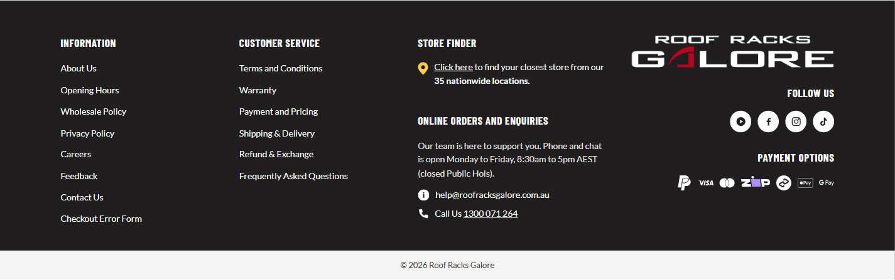
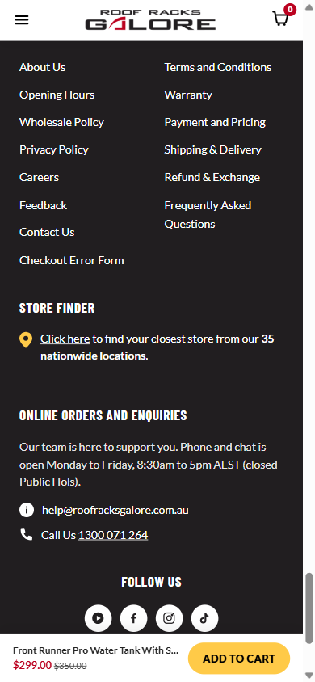
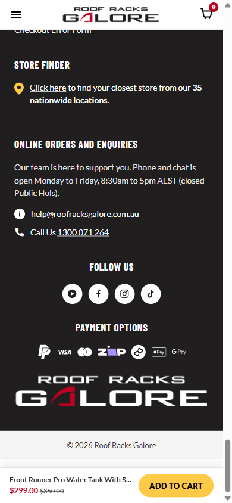
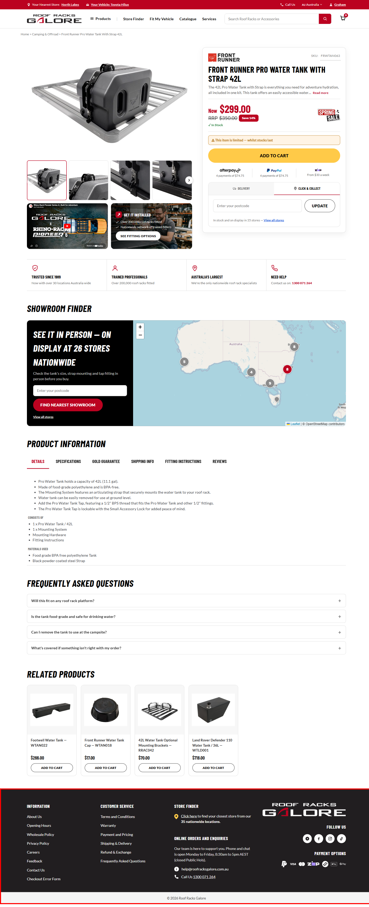
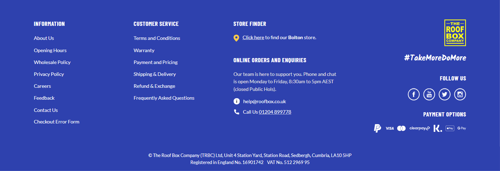

# Footer — Developer Brief

## 1. Project context

**Audience:** for Marc, same as `DEVELOPER-BRIEF.md` and `HEADER-DEVELOPER-BRIEF.md` — detailed information on the footer build so implementation decisions in Magento stay consistent with the intent, even where the exact prototype code can't be lifted verbatim.

**Scope:** this brief covers the global footer only — the four-column desktop layout (Information, Customer Service, Store Finder/Enquiries, Brand), its mobile stacked equivalent, and the copyright bar. Everything **above** the footer is `DEVELOPER-BRIEF.md`'s (page content) or `HEADER-DEVELOPER-BRIEF.md`'s (header/mega menu) domain.

**Companion documents:** `footer-spec.md` is this project's full engineering spec/build log (every decision, in chronological detail) — this brief is the handover summary distilled from it. `spec.md` and `header-spec.md` are the equivalent specs for the page content and header this footer sits below.

**Build status:** built directly into all 5 PDP templates (`prototypes/{simple,config-variant,sibling-color,vehicle-specific,grouped-bundle}/index.html`) — unlike the header, there was no separate isolated prototype stage (`footer-spec.md` Section 0 explains why). Playwright-verified on all 5 templates, desktop + mobile, plus a region round-trip (AU → UK → AU). Not yet pushed — gated on Brenton's sign-off, same as the other two briefs.

---

## 2. Typography & colour reference

Same type scale as `DEVELOPER-BRIEF.md` Section 2 (Barlow Condensed for headings, Lato for body text) — not repeated here. Footer-specific colours, sampled directly from the client's Figma export:

| Token | Value | Used for |
|---|---|---|
| Footer background | `#211E20` | The whole footer block |
| Footer text | `#FFFFFF` | Headings and links |
| Store Finder pin | `#FFCA48` | The map-pin icon only |
| Copyright bar background | `#F5F5F5` | The strip below the four columns (AU/NZ only — UK is blue, see below) |
| Copyright bar text | `#3A3A3A` | The copyright line (AU/NZ only) |
| UK footer background | `#2E41AE` | Whole footer block + bottom bar, UK region only — matches the real roofbox.co.uk footer and this project's existing UK brand-blue token (`body.region-uk{--rrg-red:#2E41AE}`, also used for the header skin) |
| UK bottom bar text | `#FFFFFF` | UK's legal text (Section 4.7) — the bottom bar is part of the same continuous blue block for UK, not a separate light strip |

---

## 3. Page Layout — footer shell

One block, present at the bottom of every page: four columns on desktop (Information / Customer Service / Store Finder+Enquiries / Brand), collapsing to a single stacked column on mobile (Information and Customer Service stay side-by-side even on mobile — see Section 4.1), followed by a full-width copyright bar.

**Screenshots:**
- Desktop (1440px), default state: 
- Mobile (390px), default state (top half — Information/Customer Service/Store Finder/Enquiries): 
- Mobile (390px), default state (bottom half — Follow Us/Payment Options/logo/copyright): 
- Whole-page location (desktop, footer outlined in red): 

---

## 4. Component Library

### 4.1 Information / Customer Service columns

**Name:** Information & Customer Service link columns

**Location:** the two left-most columns of the footer, every page. Stay side-by-side even on mobile (the only part of the footer that doesn't go full-width when the layout stacks).

**Purpose:** standard footer utility links.

**Contents:**
- **Information:** About Us, Opening Hours, Wholesale Policy, Privacy Policy, Careers, Feedback, Contact Us, Checkout Error Form.
- **Customer Service:** Terms and Conditions, Warranty, Payment and Pricing, Shipping & Delivery, Refund & Exchange, Frequently Asked Questions.

**Click actions:** all placeholder (`href="#"`) — real URLs pending, see Section 6.

**Not region-specific** — identical link set and copy for AU/NZ/UK.

---

### 4.2 Store Finder

**Name:** Footer Store Finder

**Location:** third column, above Online Orders and Enquiries (Section 4.3).

**Purpose:** a one-line prompt into the store locator, echoing the same real store-count claim the client uses elsewhere on the site.

**Contents:** a yellow pin icon + "Click here to find your closest store from our **35 nationwide locations**." — "Click here" links out (placeholder URL, pending).

**Region-aware (reuses `REGION_SINGLE_STORES`, already the source of truth for this store data elsewhere in the prototype, e.g. the Showroom Finder heading):** AU shows the real "35 nationwide locations" claim; NZ/UK — which each trade from a single real store — instead read "Click here to find our **[Store Name]** store." (NZ: Auckland; UK: Bolton).

**States:**
- AU (default): 
- UK (single-store wording): 

---

### 4.3 Online Orders and Enquiries

**Name:** Online Orders and Enquiries

**Location:** third column, below Store Finder.

**Purpose:** support contact details and hours.

**Contents:** a support-hours paragraph (static, not region-specific — "Monday to Friday, 8:30am to 5pm AEST, closed Public Hols"), an email row (info icon + address), a phone row (phone icon + "Call Us" + number).

**Region-aware:**
- **Email** — swaps to the equivalent domain per region: `help@roofracksgalore.com.au` (AU/NZ... see data-gap note below) / `help@roofbox.co.uk` (UK).
- **Phone** — reuses the same real per-region numbers already used elsewhere in the prototype (`REGION_PHONE`): AU 1300 071 264, NZ 09 481 1910, UK 01204 899778.

> **Data gap (footer-spec.md Section 4):** the NZ/UK support email addresses are a placeholder — built as the equivalent domain (`help@roofracksgalore.co.nz`, `help@roofbox.co.uk`) since no real address exists anywhere in this project yet. **Needs Brenton to confirm the real addresses before this leaves prototype stage.**

---

### 4.4 Brand column — logo, Follow Us, Payment Options

**Name:** Footer Brand Column

**Location:** right-most column, right-aligned on desktop, centered on mobile (and reordered — see below).

**Purpose:** brand sign-off, social links, and payment-method trust signals.

**Contents, top to bottom on desktop:**
1. **Logo** — the full stacked "Roof Racks Galore" lockup, larger than the header's horizontal version.
2. **Tagline — UK only** — "#TakeMoreDoMore", shown directly under the logo (Section 4.4a below). Hidden entirely for AU/NZ, which have no equivalent brand line.
3. **Follow Us** — heading + 4 icon buttons, region-aware (Section 4.6).
4. **Payment Options** — heading + a row of payment-method icons (see Section 4.5).

**Mobile order is reversed from desktop** (tagline/Follow Us → Payment Options → logo, matching the Figma's Follow-Us-first mobile stack) via a CSS `order` override — same visual content, no different markup.

**Region-aware — logo:** the header's existing brand-swap logic (`applyRegionBrand()`, already built for the header's UK "The Roof Box Company" skin) now also drives the footer logo, since it targets every `.rrg-logo img` on the page. One addition made this session: the header's own logo asset (`headerlogo.png`) is black text built for a white background, unreadable on the footer's dark background, so a white recolour (`headerlogo-white.png`, pixel-identical apart from colour) was generated and is used for the footer's AU/NZ logo specifically; UK continues to use the existing self-contained badge logo (`brand-roofbox-uk-logo.svg`) unchanged, since it already carries its own background box and works on both light and dark surfaces as-is.

**Region-aware — background:** UK's whole brand column (and the entire footer) sits on blue (`#2E41AE`) instead of AU/NZ's near-black, matching the real roofbox.co.uk footer (Section 2).

**States:**
- AU logo, dark background: 
- UK logo, blue background, tagline: 

---

#### 4.4a "#TakeMoreDoMore" tagline (UK only)

**Name:** Footer Tagline

**Location:** Brand column, directly below the logo. UK region only.

**Purpose:** real TRBC brand tagline, carried over from the live roofbox.co.uk footer.

**Typography:** set in **Kalam** (a Google Font), bold — confirmed by reading the live site's own computed `font-family`/`font-weight` directly (not guessed from appearance; it reads as a bold italic script but Kalam is actually an upright typeface — the slant is the letterforms' own handwriting style, not an applied italic). Added to each template's existing Google Fonts `<link>` alongside Barlow Condensed/Lato.

**Region-aware:** hidden entirely for AU/NZ (no equivalent tagline exists) via the `hidden` attribute, toggled by `applyRegionFooter()` — not a CSS-only show/hide.

**States:**
- UK (visible): 

---

### 4.5 Payment Options icon row

**Name:** Footer Payment Options

**Location:** bottom of the Brand column (Section 4.4).

**Purpose:** payment-method trust signals — same real per-region provider logic already built for the Decision Panel's payment badges (`DEVELOPER-BRIEF.md`), reused here rather than duplicated.

**Contents — every region shows PayPal + the card networks/wallets (Visa, MasterCard, Apple Pay, Google Pay), which are not region-specific; only the "buy now, pay later" providers change:**

| Region | BNPL providers shown |
|---|---|
| AU | Zip, Afterpay |
| NZ | Afterpay only (matches the existing Decision Panel behaviour — Zip isn't offered in NZ) |
| UK | Clearpay, Klarna (matches the existing Decision Panel behaviour — UK's real provider set) |

**Design note:** the icons sit directly on the footer's dark background with no added chip/pill behind them, per Brenton's explicit direction — the Figma itself shows most of these on a white/light chip, but this was a deliberate deviation from the Figma on this one element, not a fidelity miss.

> **Data gap (footer-spec.md Section 4):** `payment-logos/` has two asset sets — plain versions (`paypal.svg`, `zip.svg`, etc.) used elsewhere for a light background, and `*-dark.svg` versions used here, built for a dark background. Visa, MasterCard, PayPal, Apple Pay, Google Pay and Klarna's `-dark` versions are real CC0-licensed monochrome marks from Simple Icons (cdn.simpleicons.org); Zip and Clearpay's `-dark` versions are hand-recoloured from this project's own existing assets (Zip: dark wordmark → white, purple accent kept; Clearpay: solid black → solid white). None of these are each brand's own official "on dark" press-kit asset. **Should be swapped for official brand-kit assets before this leaves prototype stage**, though this is a smaller gap now than a hand-drawn placeholder would be.

**States:**
- AU set: 
- UK set: 

---

### 4.6 Follow Us social icons

**Name:** Footer Social Icons

**Location:** Brand column, above Payment Options.

**Purpose:** links out to the brand's social profiles. Genuinely region-specific, not just a reskin — driven by `renderFooterSocial(region)` + a `REGION_FOOTER_SOCIAL` map in `shared.js` (same data-driven pattern as the Payment Options row, Section 4.5).

**AU/NZ:** no real RRG social accounts exist yet — YouTube, Facebook, Instagram, TikTok shown as generic glyphs in solid white circle buttons, all `href="#"` placeholders.

> **Data gap (footer-spec.md Section 4):** no official brand-kit assets or real account links exist anywhere in this project for RRG's 4 platforms. **Should be swapped for real accounts + official brand assets before this leaves prototype stage.**

**UK — real accounts, not a gap:** Facebook, YouTube, Twitter, Instagram (a different platform set — no TikTok), each linking to TRBC's actual profile (`facebook.com/The-Roof-Box-Company-160612236596`, `youtube.com/user/RoofBoxCompany`, `twitter.com/roofbox_company`, `instagram.com/roofboxcompany`), opening in a new tab. Icons are the real assets fetched live from roofbox.co.uk (`/mobile/{platform}.svg`) and vendored into `prototypes/_shared/social-icons/trbc-*.svg` — a thin white ring outline with the platform glyph inside (the ring is drawn into the SVG geometry itself, two opposite-wound circle paths in one shape, not a CSS border), so the button itself has a transparent background rather than AU/NZ's solid white circle.

**States:**
- AU (solid white buttons, placeholder links): 
- UK (outline buttons, real links): 

---

### 4.7 Copyright bar

**Name:** Footer Copyright Bar

**Location:** full-width strip directly below the four-column layout, every page.

**Purpose:** legal sign-off line — AU/NZ get a simple copyright line, UK gets TRBC's real registered-company details (not a copyright placeholder).

**Region-aware:**
- **AU/NZ:** "© 2026 Roof Racks Galore" on the light bar (`#F5F5F5` background, `#3A3A3A` text).
- **UK:** real company/legal text, two lines — "© The Roof Box Company (TRBC) Ltd, Unit 4 Station Yard, Station Road, Sedbergh, Cumbria, LA10 5HP" / "Registered in England No. 16901742    VAT No. 512 2969 95" — given directly by Brenton, not a placeholder. The bar itself also switches to the same blue as the rest of the UK footer (`#2E41AE`, white text) rather than staying the light AU/NZ bar — on the live site this is one continuous blue block, not a separate strip.

Driven by `REGION_FOOTER_LEGAL` in `shared.js`, rendered via `innerHTML` (not `textContent`) so the UK block can include a line break.

**States:**
- AU/NZ (light bar, single line): 
- UK (blue bar, two-line legal text): 

---

## 5. Region behaviour — implementation note

All footer region logic lives in one function, `applyRegionFooter()` in `prototypes/_shared/shared.js`, called from the existing `applyRegion()` sweep (the same function that already drives the header/utility-bar/Decision-Panel region behaviour) — there's no separate "footer region switch" to test independently; switching the header's Region Selector updates the footer automatically. The footer's "Call Us" row also reuses the existing `[data-trust="phone"]` phone-swap sweep directly rather than a footer-specific one.

---

## 6. Known gaps before production

1. **All footer links are placeholders** (`href="#"`) — About Us, Opening Hours, Wholesale Policy, Privacy Policy, Careers, Feedback, Contact Us, Checkout Error Form, Terms and Conditions, Warranty, Payment and Pricing, Shipping & Delivery, Refund & Exchange, Frequently Asked Questions, and the Store Finder "Click here" link. Real URLs to be supplied by Brenton.
2. **NZ/UK support email addresses** are a placeholder domain-swap, not confirmed real addresses (Section 4.3).
3. **Payment icons for the dark footer background** (Visa, MasterCard, PayPal, Apple Pay, Google Pay, Klarna via Simple Icons; Zip/Clearpay hand-recoloured) are real but not each brand's own official press-kit asset (Section 4.5).
4. **Social icons — AU/NZ only** (YouTube, Facebook, Instagram, TikTok) are placeholder glyphs, not official brand-kit assets, and their links are unset (Section 4.6). UK is real — real accounts, real vendored icon assets — not a gap.
