# Header & Mega Menu — Developer Brief

## 1. Project context

**Audience:** for Marc, same as `DEVELOPER-BRIEF.md` — detailed information on the header/mega-menu build so implementation decisions in Magento stay consistent with the intent, even where the exact prototype code can't be lifted verbatim.

**Scope:** this brief covers the global header only — utility bar, main header (logo/nav/search/cart), the "Products" mega menu (desktop) and full-screen takeover (mobile), the sticky condensed mobile header, and the Site Admin Panel. Everything **below** the header (breadcrumbs onward) is `DEVELOPER-BRIEF.md`'s domain — that brief explicitly excludes the header, this one explicitly excludes everything else. Shared reference material (typography scale, colour tokens) isn't repeated here — see Section 2 below for where to find it.

**Companion documents:** `header-spec.md` is this project's full engineering spec/build log (every decision, every session, in chronological detail) — this brief is the handover summary distilled from it. `spec.md` is the equivalent spec for the PDP page content this header sits above.

**Build status:** the header is built and Playwright-verified as an **isolated prototype** — `prototypes/header/index.html`, opened directly, not yet wired into the 5 PDP templates. Integration into those templates is a separate, later, explicitly-approved step (`header-spec.md` Section 0) — until then, the 5 PDP templates keep using their existing placeholder header, unrelated to everything in this brief.

---

## 2. Typography & colour reference

Same type scale and colour tokens as `DEVELOPER-BRIEF.md` Section 2 (Barlow Condensed for headings/prices/buttons, Lato for everything else, the full `--rrg-*` custom-property table) — not repeated here. Two header-specific notes on top of that shared scale:

- **Mega menu column heads** (the red "ROOF RACKS" / "AWNINGS & ROOF TOP TENTS" bars) use Barlow Condensed, bold, uppercase, `letter-spacing:.02em` — same treatment as the shared section-heading style, just recoloured white-on-red.
- **Category names** (Level 1 sidebar rows, both desktop and the mobile takeover's root screen) use the plain body font (Lato, 14px, 700) — including **"Shop By Brand"**, which was originally given the same Barlow-Condensed/uppercase treatment as the column heads, then corrected 2026-09-13 to match the other category rows instead. Only its yellow background sets it apart now, not its type.

---

## 3. Page Layout — header shell

Three stacked pieces, top to bottom, present on every page that includes this header:

1. **Utility bar** — red band, session-aware account/vehicle/store info left+right (Section 4.1).
2. **Main header** — white, logo/nav/search/cart in one row (Section 4.2), containing the "Products" mega-menu trigger (Section 4.3).
3. **Sticky condensed header** — hidden until the main header's search row scrolls out of view, then fades in at the top of the viewport (Section 4.8). Mobile only — desktop has no equivalent condensed state.

**Screenshots:**
- Desktop (1440px), default state: 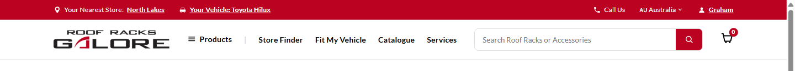
- Mobile (390px), default state: 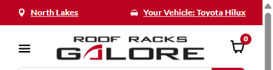

---

## 4. Component Library

### 4.1 Utility Bar

**Name:** Utility Bar

**Location:** the red band above the main header, full width, on every page. Left: nearest store, saved vehicle. Right: Call Us, Region Selector, account.

**Purpose:** persistent account/session context above the main nav — where the shopper is shopping from, what vehicle they've saved, whether they're logged in.

> The **Region Selector** (flag + country dropdown, AU/NZ/UK) living in this bar is already fully documented in `DEVELOPER-BRIEF.md` Section 4.1 — same component, not repeated here. Everything below is what's new to the header project specifically: the other 3 utility-bar items are no longer hardcoded-always-on content.

**Session state (new, 2026-09-13):** "Your Nearest Store," "Your Vehicle," and the account name are each driven by an independent admin-toggleable boolean (`prototypes/_shared/session-state.js`, Site Admin Panel toggles — Section 4.7) rather than always showing real data:

| Item | On (default) | Off |
|---|---|---|
| Nearest Store | "Your Nearest Store: North Lakes" (or the current region's store — see the Region Selector cascade in `DEVELOPER-BRIEF.md` 4.1) | "Find A Store" |
| Vehicle | "Your Vehicle: Toyota Hilux" | "Select Your Vehicle" |
| Account | "Graham" | "Log In" |

The "off" state isn't a separate designed component — it's the same link, same position, different text/CTA. Toggling **Nearest Store Set** interacts correctly with the Region Selector: switching region while the store is "off" doesn't silently turn it back "on" with a stale name, and switching it back "on" shows the correct name for whatever region is currently selected (re-verified via Playwright, not just asserted).

**States:**
- All 3 "on" (default): 
- All 3 "off": 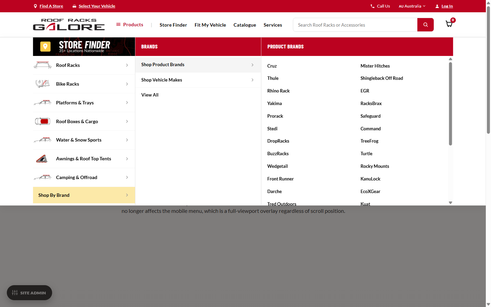

**Click actions:** Nearest Store and Account are plain links (`href="#"`, real URLs pending — see Section 6). Nearest Store also doubles as the Site Admin Panel's mobile trigger (`data-admin-trigger`) below 900px, where the panel's own FAB is hidden.

---

### 4.2 Main Header

**Name:** Main Header — logo, nav, search, cart

**Location:** the white row directly below the Utility Bar, on every page.

**Purpose:** primary navigation row — brand identity, category browsing (Section 4.3), search, cart.

**Contents, left to right:**
- **Hamburger** (mobile only, ≤900px) — opens the mobile takeover (Section 4.6), not a slide-down drawer.
- **Logo** — links home (`index.html` in this prototype; a real Magento URL at integration time). Same logo asset and link behaviour reused as the mobile takeover's own logo (Section 4.6).
- **"Products"** — opens the mega menu (Section 4.3) on desktop. **Hidden entirely below 900px** (`display:none`) — on mobile, the category list is the takeover's own root screen, not a separate tappable item (see Section 4.6's note on why).
- **Store Finder / Fit My Vehicle / Catalogue / Services** — plain links, `href="#"`, real URLs pending (Section 6). Stay as flat links on desktop; render again inside the mobile takeover's root screen, below the categories (Section 4.6) — not duplicated in the main header on mobile, since the header itself is reduced to hamburger/logo/cart there.
- **Search bar** — has a clear button that appears once text is entered, plus a typeahead/focus-state dropdown (Section 4.9) — mostly cosmetic, but its "View All Results" link is real navigation.
- **Cart icon** — visual only, static `0` badge.

**Click actions:** logo → home. "Products" → opens/closes the mega menu drawer (click, not hover — see Section 4.3). Plain nav links → their real URL once supplied. Search clear button → clears the input, refocuses it. Search box focus/typing → Section 4.9.

---

### 4.3 Products Mega Menu — Desktop

**Name:** Products Mega Menu (desktop 3-level cascade)

**Location:** triggered by the "Products" button in the Main Header, desktop only (≥901px).

**Purpose:** the primary product-category navigation — real taxonomy crawled from the live site (`header-spec.md` Section 3.2), restructured into a 3-level drill-down matching the client's Figma (`Mega Menu Designs/`).

**Click action — opening/closing:** click "Products" to open; click it again, click anywhere outside the drawer, or click the backdrop (below) to close. **Not a hover-to-open control** — this is deliberate, matching the Figma and avoiding accidental opens from a stray mouse pass.

**Structure, once open:** one full-viewport-width drawer directly below the header (edge-to-edge, not constrained to the header's content width), fixed height (pinned to the Level 1 sidebar's own natural height — see the row-height note below), three columns:

- **Level 1** (always visible once open) — the sidebar: icon + category name + chevron per row, 8 real categories + a distinct yellow "Shop By Brand" bar for Brands (same row underneath, just visually set apart — Section 4.3's Brands note below).
- **Level 2** — a red-headed column showing that category's real sub-groupings ("Shop " + column name, e.g. "Shop Roof Bars"), plus a bold "View All" row.
- **Level 3** — that grouping's real leaf links, split into 2 CSS columns so long lists don't need to scroll (one real exception — see Section 6).

**Hover effect:** hovering (or focusing, for keyboard users) a Level 1 row swaps what's showing in Level 2 to that category's content; hovering a Level 2 row swaps Level 3 to that grouping's leaf links. **Level 2 and Level 3 are independent columns whose content swaps — not per-row flyouts** — so whichever category you hover, Level 2 always starts at the very top of the drawer and uses its full height, regardless of that row's position in the sidebar. The currently-hovered Level 1 row and Level 2 row both get a highlighted background so the active path stays visible.

**Row-height alignment:** the Level 1 sale banner, the Level 2 head, and the Level 3 head are all pinned to the exact same height (measured live from one real Level 1 row, not hardcoded) — so all three line up as one continuous strip across the top of the drawer.

**Icons:** real line-art icons for 5 of the 8 categories (Roof Racks, Bike Racks, Platforms & Trays, Roof Boxes & Cargo, Awnings & Roof Top Tents); Water & Snow Sports and Camping & Offroad fall back to a generic roof-bars icon (no specific asset sourced yet — Section 6). Brands gets no icon at all, just its yellow bar.

**Backdrop:** the rest of the page darkens while the drawer is open, so focus stays on the header + drawer — the header itself and the drawer stay fully bright. Desktop only (see Section 4.6 for why mobile doesn't get this).

**Brands:** follows the identical Level 2/3 pattern as every other category, using the live site's own already-crawled Brands content — Level 2 = "Shop Product Brands" / "Shop Vehicle Makes" + View All, Level 3 = the real ~30 brand names / ~70 vehicle makes. Vehicle Makes is long enough (~70 entries) that it's the one column that still scrolls even across 2 sub-columns (Section 6).

**States:**
- Closed (default main header): 
- Open, Level 1 only, nothing hovered yet: 
- Roof Racks hovered — Level 2 + Level 3, both with a merchandising promo tile (Section 4.4): 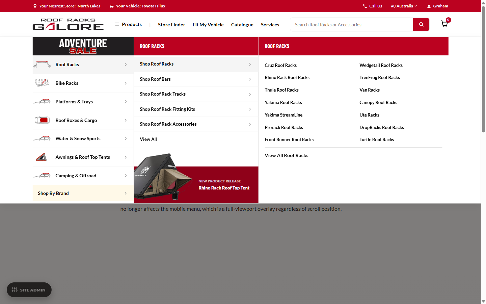
- Bike Racks hovered — no promo tile anywhere (this category has none configured — the bar simply doesn't render, not a bug): 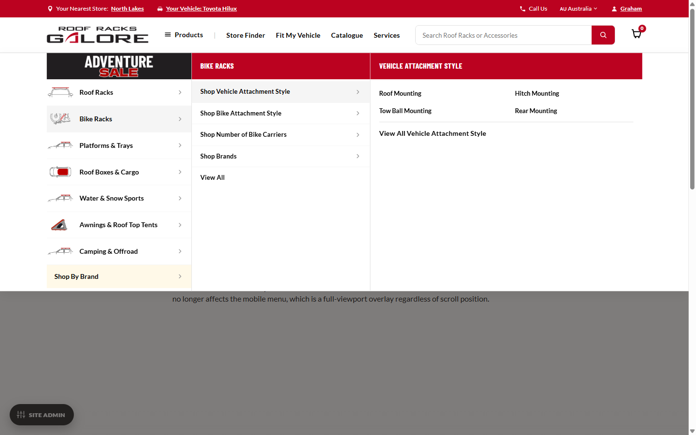
- Brands hovered — yellow Level 1 row, real Product Brands/Vehicle Makes content: 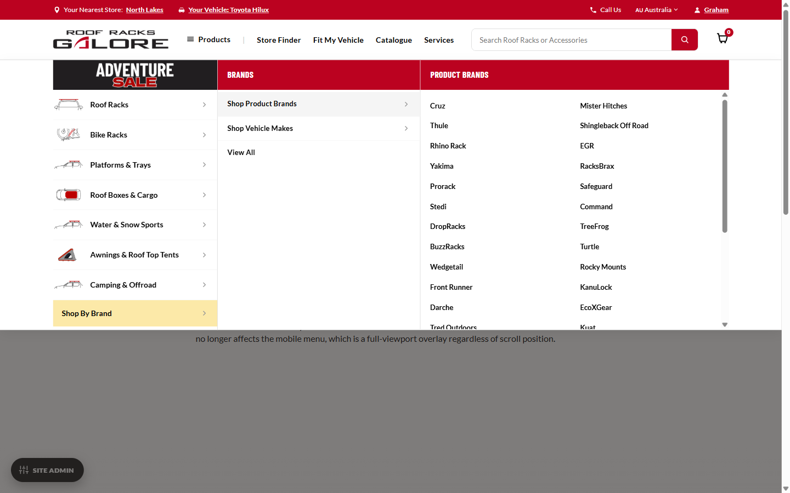

---

### 4.4 Merchandising Promo Tile — how the image + CTA work

**Name:** Merchandising Promo Tile

**Location:** pinned to the bottom of the Level 2 and Level 3 columns (Section 4.3) — one tile per column, shown independently.

**Purpose:** cross-sell a featured/new product directly inside category browsing, without a separate promo unit competing for attention elsewhere on the page.

**Close-up, showing the image bleed described below:**
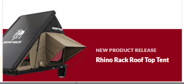

#### Data shape

```js
promoTile: { image: '...', eyebrow: 'New Product Release', label: 'Rhino Rack Roof Top Tent', href: '#' }
```

Four fields: a product photo, a short eyebrow label (defaults to "New Product Release" if omitted), the product name, and a link. **The entire tile — photo and text together — is one clickable link** (`href`); there's no separate "Shop Now" button inside it.

#### Independently assignable per level — this is the important part for Magento

A category's tile (shown in **Level 2**) and a specific column's tile (shown in **Level 3** when that column is hovered) are **two separate fields, not one inherited value**:

- The category entity needs its own `promoTile` (image/eyebrow/label/link) — shown whenever that category's Level 2 column is open.
- Each column/grouping entity *within* that category **also** needs its own, independently editable `promoTile` — shown when that specific column's Level 3 is open. It is not automatically the same as the category's.

Proven in the prototype on Roof Racks: the category's Level 2 tile reads "New Product Release — Rhino Rack Roof Top Tent"; hovering into its "Roof Rack Accessories" column, Level 3 shows a **different** tile — "Now In Stock — Rhino Rack Low Profile Roof Top Tent." Both are real, independently configured entries in `nav-data.js`, not a coincidence of shared code.

#### No fallback — this is a deliberate rule, not a gap

If a category or column has no `promoTile` configured, **the entire red bar does not render at all** for that level — no default image, no "coming soon" placeholder, no inherited content from the level above. Confirmed on Bike Racks (no category tile, no column tiles anywhere in it — neither Level 2 nor Level 3 shows a bar) and on every column of Roof Racks except "Roof Rack Accessories" (Level 3 shows no bar for those, even though the category above it has one).

**Magento build note:** this means the admin needs an image + eyebrow + name + link field on **both** the Level 1 category entity and the Level 2 column/grouping entity, each independently optional — not a single "featured product" field per category that Level 3 just inherits.

#### The image bleed effect

The photo is deliberately **taller than the red bar itself** and overlaps upward into the white list area above it — not contained neatly inside the bar. This is a genuine Figma-matched effect, not a bug: the bar's own box stays a fixed height (so it lines up with the head/banner strip above it per Section 4.3), while the photo — positioned independently — extends past its top edge. Two build notes worth carrying into Magento's front-end implementation:

1. **The list above needs reserved space** when a promo tile is present, so the image's overlap doesn't cover the last real row ("View All") once scrolled to the end — the amount of extra space needed equals roughly the difference between the image height and the bar height.
2. **The image needs a transparent background**, not a solid/white one — the bar's dark red shows through around the product in the lower portion, and the white list background shows through in the portion that overlaps upward. A non-transparent product photo would show its own background colour as a visible box instead of blending in.

The photo itself uses `object-fit:contain` (never crops, regardless of a future photo's aspect ratio) and is flush against the tile's left and bottom edges with zero padding — the only padding in the whole tile is the gap between the photo and the text.

---

### 4.5 Clearance Sale Banner

**Name:** Clearance Sale Banner

**Location:** the top strip of the Level 1 sidebar (desktop drawer) and the top of the mobile takeover's root screen (Section 4.6) — same image, same toggle, both places.

**Purpose:** promotes whatever sale is currently running, directly above the category list where every shopper browsing products will see it.

**How it works:** a real image, not styled text — swapped between two creatives via one Site Admin Panel toggle ("Clearance Sale Banner," Section 4.7), never blank:

- **On** (default): the real sale creative (currently "Adventure Sale").
- **Off**: an evergreen fallback creative (currently a Store Finder promo) — for whenever no sale is actually running.

**States:**
- On: 
- Off (fallback creative), shown here alongside the session-state "off" states: 

---

### 4.6 Mobile Menu — full-screen takeover

**Name:** Mobile Menu Takeover

**Location:** opened by the hamburger icon (Main Header or sticky condensed header, Section 4.8), below 900px.

**Purpose:** the mobile equivalent of the desktop mega menu — but built as its own self-contained full-screen overlay, not a drawer nested inside the scrolling page.

**Why it's a full-screen takeover and not a drawer:** an earlier build lived inside the page's own slide-down nav drawer, positioned relative to the real header. Scrolling afterward left the two visibly detached, since the drawer didn't track the sticky condensed header once it took over. The takeover fixes this at the root: it's `position:fixed` to the entire viewport with its **own** logo/login/vehicle/search built in, so it never depends on the real header's position or scroll state at all.

**"Products" isn't its own tab here — this is deliberate.** On desktop, "Products" is a button that opens the category list. On mobile, the category list simply **is** the takeover's root screen — there's no separate "Products" row to tap through first. Internally this root screen is called **Level 0** (not "Level 1," to avoid confusion with desktop's Level 1, which sits *behind* a Products trigger that mobile doesn't have) — content-wise, mobile Level 0/1/2 correspond to desktop Level 1/2/3.

**Screen 1 — Level 0 (root):**
- Own mini header: logo (links home), account (Graham/Log In), vehicle (Your Vehicle: .../Select Your Vehicle) — same session-state toggles as the Utility Bar (Section 4.1), a close button.
- Search bar (same typeahead/focus-state dropdown as desktop's — Section 4.9).
- Sale banner (Section 4.5).
- The 8 categories, Brands styled as a yellow bar (same treatment as desktop).
- The 4 plain nav links (Store Finder etc.) below the categories, in their own section.

**Screen 2 — Level 1 (tap a category):** replaces the whole screen — a back+title bar (category name, back arrow to Level 0, a close button), that category's real "Shop X" rows, its promo tile if one's configured.

**Screen 3 — Level 2 (tap a Level 1 row):** replaces the screen again — same back+title bar pattern, that column's real leaf links (single column on mobile, unlike desktop's 2), a secondary row showing the current grouping's name (currently decorative only — Section 6), its promo tile if configured.

**Click actions:** tap a category/row to drill in; tap the back arrow to go up one level; tap the close button (present on every screen, not just the root) to exit fully, from any depth — you don't have to back out level by level first. The hamburger also toggles closed if tapped again while open.

**States:**
- Level 0 (root): 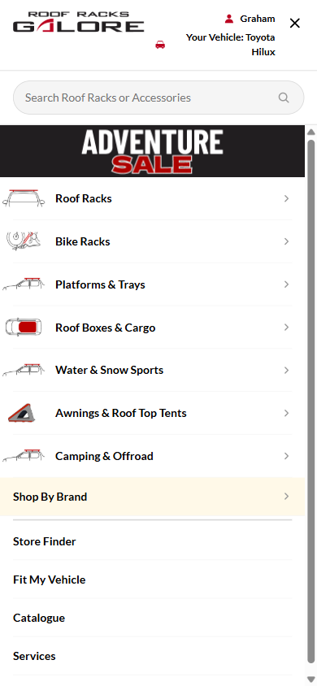
- Mini header close-up (logo/account/vehicle/close): 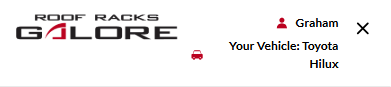
- Level 1 (Roof Racks → Shop X list): 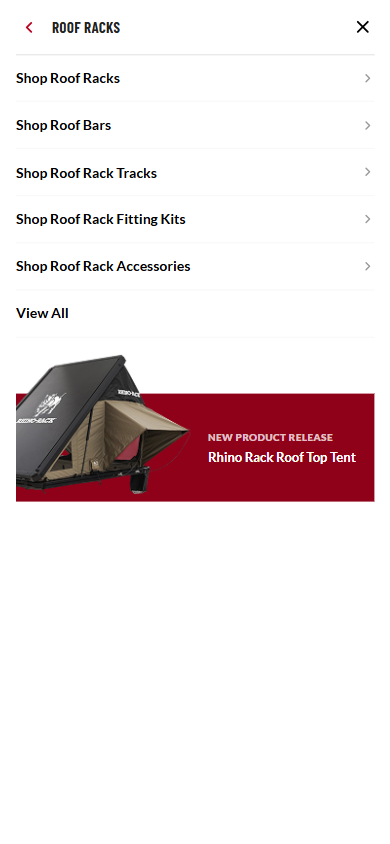
- Level 2 (leaf links), scrolled to show the promo tile: 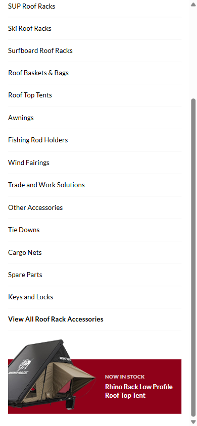

**No backdrop on mobile:** the desktop drawer dims the rest of the page (Section 4.3); the mobile takeover doesn't need this, since it already covers the entire viewport itself.

---

### 4.7 Site Admin Panel

**Name:** Site Admin Panel

**Location:** a floating FAB, bottom-left of every page this header is on (desktop ≥901px only — below that, the Utility Bar's "Nearest Store" link doubles as the trigger instead, since the FAB would crowd an already-tight mobile viewport).

**Purpose:** internal reviewer tooling for demoing every state covered in this brief without needing separate page builds — **not part of the shipped site**, same convention as the PDP prototypes' Demo State Panel (`DEVELOPER-BRIEF.md` — flag this explicitly wherever the header is integrated, same as that panel already is).

**Contents:**
- **Prototype Templates** — jumps between the 5 PDP prototype templates + this header build.
- **Developer Briefs** — links to this brief and `DEVELOPER-BRIEF.md`.
- **Header Promotions** — the Clearance Sale Banner toggle (Section 4.5).
- **Session State** — Logged In / Vehicle Set / Nearest Store Set (Section 4.1).
- **Demo State Panel** — a visibility toggle for the *other*, PDP-only admin panel, in case both ever coexist on the same page post-integration.

**Screenshot:**
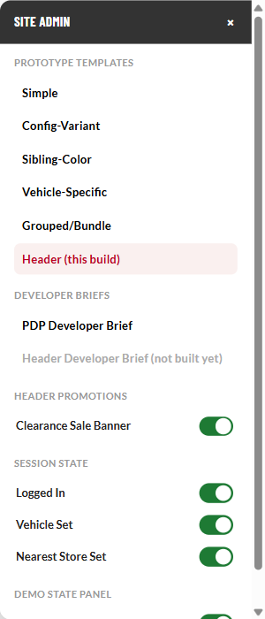

---

### 4.8 Sticky Condensed Header (mobile)

**Name:** Sticky Condensed Header

**Location:** fixed to the top of the viewport, mobile only (≤900px) — fades in once the main header's search row scrolls out of view.

**Purpose:** keeps the hamburger, logo, and cart reachable while scrolled, without permanently occupying screen space the way a fully persistent header would.

**Contents:** hamburger, logo, cart — no utility bar, no search row (those already scrolled away; this is a deliberately condensed stand-in, not a shrunk copy of the full header).

**Screenshot (scrolled state):**
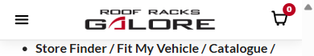

---

### 4.9 Search Typeahead / Recent & Trending Searches

**Name:** Header Search Typeahead

**Location:** a dropdown panel anchored below the search input — desktop's Main Header search bar (4.2) and the mobile takeover's own search bar (4.6, Level 0). Added 2026-09-22, well after the rest of this brief was written — Section 6 used to flag search as "visual only, no real search wired up"; that's now only partly true (see below).

**Purpose:** demonstrates the interaction a real predictive search box would have, without any real search/relevance logic behind it — added at Brenton's request specifically to make the search box feel alive in reviews, not just a static input with a clear button.

**Contents/behaviour — two states, depending on the input:**
- **Focused, empty** — a "Recent Searches" section (canned list, not real per-browser history/localStorage — same cosmetic-demo treatment as the rest of this dropdown) with a "Clear" action that hides that section for the rest of the page view only (not persisted; resets on reload), then "Trending Searches" and "Popular Categories," all as pill-style chip rows. Every term/category here was checked against the live site's real product catalogue before being used (2026-09-22 correction, after an internal review caught invented terms — see the note below) — don't add a new one without the same check.
- **1+ characters typed** — swaps entirely to a "Popular Products" list: 5-6 real catalogue products (name/price/thumbnail), rotating through a few canned batches as more characters are typed so the list visibly "changes." **Doesn't match what's actually typed** — this is deliberately cosmetic, not real search relevance.
- **"View All Results" link**, at the bottom of the product list — **the one part of this dropdown that is real navigation**, not cosmetic: it links to the search-results page (`SEARCH-RESULTS-DEVELOPER-BRIEF.md`) with the typed query carried through via `?q=`, which that page's engine reads and actually filters against.
- Recent/Trending chips and Popular Category chips are also real links — the search terms go to the same search-results page (`?q=<term>`), the categories go to their real category page.

**Why the dropdown isn't a child of `.rrg-search`:** that box has `overflow:hidden` (needed to clip the search button's rounded pill corners), which would clip the dropdown too. It's appended to `<body>` instead, `position:fixed`, with its position computed from the search box's own bounding rect in JS.

**Implementation note:** lives entirely in `shared.js` (`initHeaderSearchSuggest()`) — duplicated into `header-standalone.js` for this isolated prototype rather than shared via a new script tag, matching how this prototype already duplicates `initSearchClear()`/`initPersistentBar()` rather than depending on shared.js.

**A note on the demo content itself:** the first pass at Trending Searches named products RRG doesn't actually sell (snorkels, dual battery kits) or mislabeled ones it does (camping fridges — the real category is fridge slides/accessories, not the fridge itself) — caught by the client's team reviewing literally, fixed by crawling the live site's real category nav before choosing terms. Worth remembering for anyone extending this list later.

**Screenshots:**
- Focus state (Recent/Trending Searches + Popular Categories), desktop: 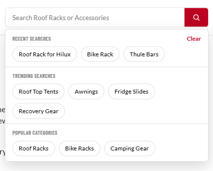
- Typing state (Popular Products + View All Results), desktop: 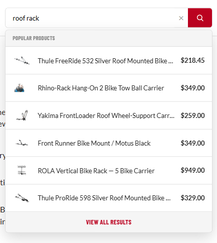
- Focus state, mobile takeover: 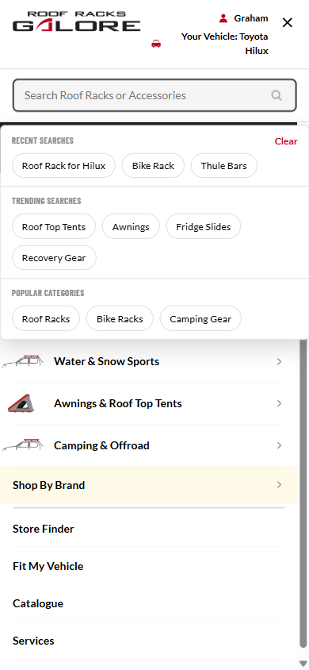

---

## 5. Interactions quick reference

Every hover effect and click action from Sections 4.1–4.8, gathered in one place.

**Hover effects (desktop only — nothing in this table applies on touch):**

| Element | Hover effect |
|---|---|
| Level 1 category row | Highlights; Level 2 column swaps to that category's content |
| Level 2 "Shop X" row | Highlights; Level 3 column swaps to that grouping's leaf links |
| Level 3 leaf link | Highlights, colour shifts to brand red |
| Level 1/2 row generally | Light grey background on hover/keyboard-focus |

**Click actions:**

| Element | Click action |
|---|---|
| "Products" button | Opens/closes the desktop mega-menu drawer |
| Backdrop (desktop, menu open) | Closes the menu |
| Hamburger icon | Opens/closes the mobile takeover |
| Mobile takeover close button | Closes the takeover fully, from any screen depth |
| Mobile category/row | Drills into the next screen |
| Mobile back arrow | Returns one screen |
| Merchandising promo tile (anywhere it appears) | Navigates to its configured link — the whole tile is one link |
| Sale banner | Navigates to its configured link |
| Region Selector | See `DEVELOPER-BRIEF.md` 4.1 |
| Site Admin FAB | Opens/closes the admin panel |
| Any Site Admin toggle | Immediately applies (no save button) and persists across reloads until changed again |
| Search box, focused + empty | Shows Recent/Trending Searches + Popular Categories (Section 4.9) |
| Search box, 1+ characters typed | Shows a rotating Popular Products list (Section 4.9) |
| Search dropdown's "Clear" (Recent Searches) | Hides that section for this page view only, not persisted |
| Search dropdown's "View All Results" / any chip | Real navigation to the search-results page (or category page, for a Popular Category chip) — Section 4.9 |

---

## 6. Known gaps — not yet built or sourced

- **2 of 8 category icons** (Water & Snow Sports, Camping & Offroad) have no specific line-art asset yet — falls back to a generic roof-bars icon. Swap in once sourced.
- **Merchandising promo tiles** are only configured on 3 real entities so far (Roof Racks category, its Roof Rack Accessories column, Awnings & Roof Top Tents category) — enough to prove the independent-assignment and no-fallback behaviour (Section 4.4), not a claim that every category/column has real merchandising content lined up.
- **Every leaf link, plain nav link (Store Finder etc.), and promo-tile link is `href="#"`** — labels/hierarchy are real (crawled from the live site), but per-link destination URLs haven't been supplied yet.
- **Brands' Vehicle Makes column** (~70 entries) still scrolls even across 2 sub-columns — there's no way to fit that many rows in the drawer's fixed height without either more columns, smaller type, or accepting the scroll. Undecided.
- **Mobile Level 2's secondary dropdown row** (shows the current grouping's name with a chevron) is decorative only — tapping it does nothing yet. May be intended as a same-level jump between sibling groupings without backing out a full screen; unconfirmed.
- **Mobile mini header's vehicle text wraps to 2 lines** at common phone widths when a vehicle is set — a content-length issue (the "off" state's shorter text fits on one line), not fixed yet.
- **Search is mostly still cosmetic** (Section 4.9) — the product-suggestions dropdown and Recent/Trending Searches don't reflect real relevance/history, only "View All Results" and the chip links are genuine navigation. No real search/autocomplete backend is wired up.
- **Cart is visual only** — static `0` badge, no real cart logic.

---

## 7. Data model reference

The nav content itself (`prototypes/_shared/nav-data.js`) and the confirmed `HEADER_NAV` shape (category → columns → links, plus the `promoTile` fields from Section 4.4) are documented in full in `header-spec.md` Section 7 — not duplicated here, since that file is the source of truth for the data shape and this brief is about behaviour or presentation of it.
