# Header & Mega Menu — Developer Brief

> **Updated 2026-09-29 for the cross-template consistency pass** (`spec.md` §15). Text only — screenshots are deliberately held until final handover, so some images below may predate this pass (e.g. the Site Admin Panel).

## 1. Project context

**Audience:** for Marc, same as `DEVELOPER-BRIEF.md` — detailed information on the header/mega-menu build so implementation decisions in Magento stay consistent with the intent, even where the exact prototype code can't be lifted verbatim.

**Scope:** this brief covers the global header only — utility bar, main header (logo/nav/search/cart), the "Products" mega menu (desktop) and full-screen takeover (mobile), the sticky condensed mobile header, and the Site Admin Panel. Everything **below** the header (breadcrumbs onward) is `DEVELOPER-BRIEF.md`'s domain — that brief explicitly excludes the header, this one explicitly excludes everything else. Shared reference material (typography scale, colour tokens) isn't repeated here — see Section 2 below for where to find it.

**Companion documents:** `header-spec.md` is this project's full engineering spec/build log (every decision, every session, in chronological detail) — this brief is the handover summary distilled from it. `spec.md` is the equivalent spec for the PDP page content this header sits above.

**Build status:** the header is built and Playwright-verified, and is now the real header on every template — the 5 PDPs, VCLP, PLP (Bike Racks), PLP (Camping), VPLP, Search Results and the root template index (`prototypes/index.html`). Since 2026-10-01 the header markup (utility bar, main header, sticky mobile header, mobile takeover) lives in one place, `prototypes/_shared/widgets.js` (`rrgWidgetHeaderHTML()`). Each of the 21 template pages (all but checkout, which has its own header) has only a `<div data-widget="header"></div>` placeholder, which widgets.js replaces with the header as the page loads (`docs/widgets/widgets-spec.md`). The markup and class names in this brief are unchanged. The root template index (`prototypes/index.html`) still has its own copy, with root-relative paths. `prototypes/header/index.html` is the standalone Header & Footer page (`noindex`). Every page loads the same shared scripts in the same order: `nav-data.js` → `session-state.js` → `widgets.js` → `mega-menu.js` → `admin-panel.js` → `shared.js`. The old duplicated `header/header-standalone.js` has been deleted (§15 G3).

**Prototype paths:** every shared asset/page URL the shared JS builds (category icons, sale banner, promo tiles, template links, brief links) is built from `RRG_PROTO` — the prototypes root, defined first thing in `nav-data.js` from that script's own URL — rather than a hardcoded `../`, so the same scripts work from a template folder and from the root index. Magento will use its own asset URLs; this is prototype plumbing only.

---

## 2. Typography & colour reference

Same type scale and colour tokens as `DEVELOPER-BRIEF.md` Section 2 (Barlow Condensed for headings/prices/buttons, Lato for everything else, the full `--rrg-*` custom-property table) — not repeated here. Since the 2026-09-29 consistency pass the header CSS uses the shared tokens in `shared.css :root` instead of hardcoded values — e.g. the grey scale (`--rrg-grey-700/600/500/400`), `--rrg-charcoal`, `--overlay` (every backdrop, including the mega menu's), `--shadow-pop` (dropdowns such as the search typeahead), `--radius` (6px) and the transition tokens (`--t-fast`/`--t-fade`/`--t-slide`). Header-specific notes on top of that shared scale:

- **Mega menu column heads** (the red "ROOF RACKS" / "AWNINGS & ROOF TOP TENTS" bars) use Barlow Condensed, bold, uppercase, `letter-spacing:.02em` — same treatment as the shared section-heading style, just recoloured white-on-red.
- **Category names** (Level 1 sidebar rows, both desktop and the mobile takeover's root screen) use the plain body font (Lato, 14px, 700) — including **"Shop By Brand"**, which was originally given the same Barlow-Condensed/uppercase treatment as the column heads, then corrected 2026-09-13 to match the other category rows instead. Only its yellow background sets it apart now, not its type.
- **Level 2 rows and the mobile rows/leaf links** are 14px, weight 700 (were 13.5px and weight 600 before the 2026-09-29 pass, which moved every size onto the shared scale and every 600 weight to 700, since 600 isn't a loaded weight).

---

## 3. Page Layout — header shell

Three stacked pieces, top to bottom, present on every page that includes this header:

1. **Utility bar** — red band, session-aware account/vehicle/store info left+right (Section 4.1).
2. **Main header** — white, logo/nav/search/cart in one row (Section 4.2), containing the "Products" mega-menu trigger (Section 4.3).
3. **Sticky condensed header** — hidden until the main header's search row scrolls out of view, then fades in at the top of the viewport (Section 4.8). Mobile only — desktop has no equivalent condensed state.

**Screenshots:**
- Desktop (1440px), default state: 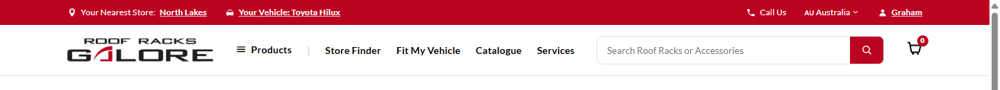
- Mobile (390px), default state: 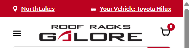

---

## 4. Component Library

### 4.1 Utility Bar

**Name:** Utility Bar

**Location:** the red band above the main header, full width, on every page. Left: nearest store, saved vehicle. Right: Call Us, Region Selector, account.

**Purpose:** persistent account/session context above the main nav — where the shopper is shopping from, what vehicle they've saved, whether they're logged in.

> The **Region Selector** (flag + country dropdown, AU/NZ/UK) living in this bar is already fully documented in `DEVELOPER-BRIEF.md` Section 4.1 — same component, not repeated here. Everything below is what's new to the header project specifically: the other 3 utility-bar items are no longer hardcoded-always-on content.

**Session state (new 2026-09-13, vehicle reworked 2026-09-29):** "Your Nearest Store," "Your Vehicle," and the account name are each driven by the Site Admin Panel's Shopper Session controls (`prototypes/_shared/session-state.js`, Section 4.7) rather than always showing real data. Logged In and Nearest Store are on/off; the vehicle is **one session vehicle** — None / Toyota Hilux / Ford Ranger (`spec.md` §15 P4) — the same value that drives fitment on the Vehicle-Specific PDP, the PLP-family pages and search, so the header can no longer contradict the page below it:

| Item | Default | Other states |
|---|---|---|
| Nearest Store | "Your Nearest Store: North Lakes" (or the current region's store — see the Region Selector cascade in `DEVELOPER-BRIEF.md` 4.1) | Off: "Find A Store" |
| Vehicle | "Your Vehicle: Toyota Hilux" (mobile: just "Toyota Hilux") | "Your Vehicle: Ford Ranger"; None: "Select Your Vehicle" |
| Account | "Graham" | Off: "Log In" |

**Implementation note:** `rrgVehicleGet()` returns `'none' | 'hilux' | 'ranger'`, `rrgVehicle()` returns that vehicle's record (or `null`), and `window.rrgSetVehicle(key)` sets it; `rrgApplySessionState()` writes the header text as "Your Vehicle: <name>". The older `rrgSetSession('vehicleSet', true/false)` still works for callers that only know "a vehicle is set" (the Fit Finder drawer, Section 4.10, calls `rrgSetVehicle(key)` with the picked vehicle since 2026-10-02) — it keeps the current vehicle, or picks the Toyota Hilux if none is set. Every change fires an `rrg-session-change` event that the rest of the page listens for.

The "off" state isn't a separate designed component — it's the same link, same position, different text/CTA. Toggling **Nearest Store Set** interacts correctly with the Region Selector: switching region while the store is "off" doesn't silently turn it back "on" with a stale name, and switching it back "on" shows the correct name for whatever region is currently selected (re-verified via Playwright, not just asserted).

**States:**
- All 3 "on" (default): 
- All 3 "off": 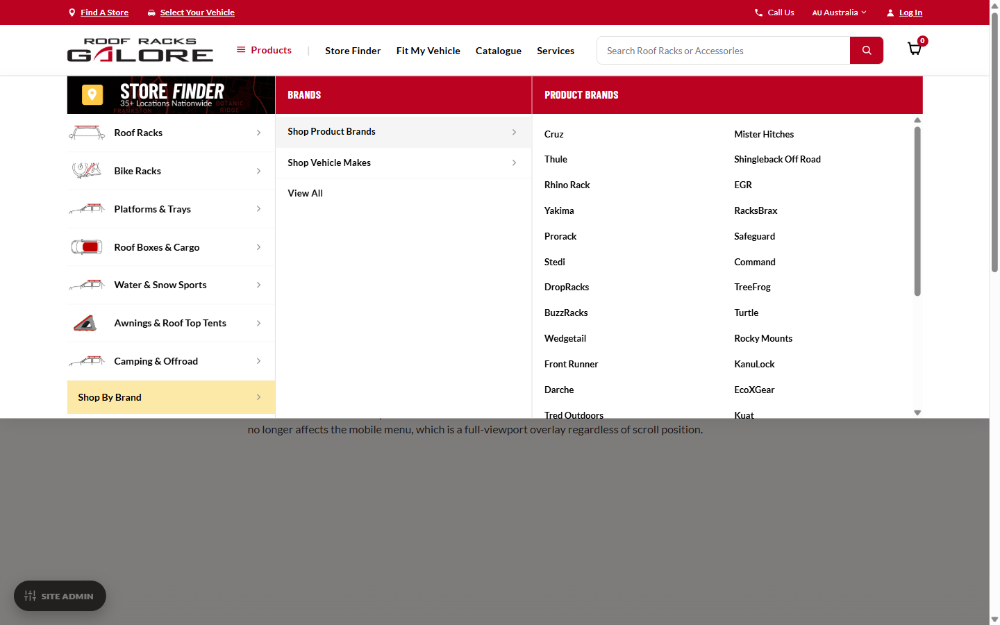

**Click actions:** Nearest Store and Account are plain links (`href="#"`, real URLs pending — see Section 6). The vehicle link opens the Fit Finder drawer (Section 4.10). Nearest Store is **no longer** used as a prototype panel's mobile trigger (the old `data-admin-trigger` hook was removed 2026-09-29) — it is only the store link, which keeps it free for the Phase 2 store picker; the panels have their own mobile buttons instead (Section 4.7).

---

### 4.2 Main Header

**Name:** Main Header — logo, nav, search, cart

**Location:** the white row directly below the Utility Bar, on every page.

**Purpose:** primary navigation row — brand identity, category browsing (Section 4.3), search, cart.

**Contents, left to right:**
- **Hamburger** (mobile only, ≤900px) — opens the mobile takeover (Section 4.6), not a slide-down drawer.
- **Logo** — links home. In the prototype the main-header, sticky-header and mobile-takeover logos all link to the Home Page template (`prototypes/home/`, since 2026-09-29; `docs/home/home-spec.md`). The template index is still reachable from Site Admin → "All templates".
- **"Products"** — opens the mega menu (Section 4.3) on desktop. **Hidden entirely below 900px** (`display:none`) — on mobile, the category list is the takeover's own root screen, not a separate tappable item (see Section 4.6's note on why).
- **Store Finder / Fit My Vehicle / Clearance / Fitting** — plain links. Store Finder → the Store Finder page. **Its label follows the region's open-store count** (2026-09-30, spec.md §16 item 13): with one open store it reads "Visit Our {Bolton|Auckland} Store" and goes to that store's page; with two or more it reads "Store Finder". Opening-soon stores don't count. Same rule in the mobile takeover. Fit My Vehicle → the Fit My Vehicle page, **Fitting** → the Installation page (renamed from "Services", Brenton 2026-09-30); Clearance `href="#"`, URL pending (Section 6). Stay as flat links on desktop; render again inside the mobile takeover's root screen, below the categories (Section 4.6) — not duplicated in the main header on mobile, since the header itself is reduced to hamburger/logo/cart there.
- **Search bar** — has a clear button that appears once text is entered, plus a typeahead/focus-state dropdown (Section 4.9) — mostly cosmetic, but its "View All Results" link is real navigation.
- **Cart icon** — visual only, static `0` badge.

**Click actions:** logo → home (the Home Page template in the prototype). "Products" → opens/closes the mega menu drawer (click, not hover — see Section 4.3). "Fit My Vehicle" → the Fit My Vehicle page (`prototypes/fit-my-vehicle/`, since 2026-09-30; it used to open the Fit My Vehicle drawer, which the utility-bar vehicle link still does). "Store Finder" → the Store Finder page. Other plain nav links → their real URL once supplied. Search clear button → clears the input, refocuses it. Search box focus/typing → Section 4.9.

---

### 4.3 Products Mega Menu — Desktop

**Name:** Products Mega Menu (desktop 3-level cascade)

**Location:** triggered by the "Products" button in the Main Header, desktop only (≥901px).

**Purpose:** the primary product-category navigation — real taxonomy crawled from the live site (`header-spec.md` Section 3.2), restructured into a 3-level drill-down matching the client's Figma (`Mega Menu Designs/`).

**Click action — opening/closing:** click "Products" to open; click it again, click anywhere outside the drawer, or click the backdrop (below) to close. **Not a hover-to-open control** — this is deliberate, matching the Figma and avoiding accidental opens from a stray mouse pass.

**Structure, once open:** one full-viewport-width drawer directly below the header (edge-to-edge, not constrained to the header's content width), fixed height (pinned to the Level 1 sidebar's own natural height — see the row-height note below), three columns:

- **Level 1** (always visible once open) — the sidebar: icon + category name + chevron per row, 8 real categories + a distinct yellow "Shop By Brand" bar for Brands (same row underneath, just visually set apart — Section 4.3's Brands note below).
- **Level 2** — a red-headed column showing that category's real sub-groupings ("Shop " + column name, e.g. "Shop Roof Bars"), plus a bold "View All" row.
- **Level 3** — that grouping's real leaf links, split into 2 CSS columns so long lists don't need to scroll (one real exception — see Section 6).

**Hover effect:** hovering (or focusing, for keyboard users) a Level 1 row swaps what's showing in Level 2 to that category's content; hovering a Level 2 row swaps Level 3 to that grouping's leaf links. **Level 2 and Level 3 are independent columns whose content swaps — not per-row flyouts** — so whichever category you hover, Level 2 always starts at the very top of the drawer and uses its full height, regardless of that row's position in the sidebar. The currently-hovered Level 1 row and Level 2 row both get a highlighted background so the active path stays visible.

**Row-height alignment:** the Level 1 sale banner, the Level 2 head, and the Level 3 head are all pinned to the exact same height (measured live from one real Level 1 row, not hardcoded) — so all three line up as one continuous strip across the top of the drawer.

**Icons:** real line-art icons for 5 of the 8 categories (Roof Racks, Bike Racks, Platforms & Trays, Roof Boxes & Cargo, Awnings & Roof Top Tents); Water & Snow Sports and Camping & Offroad fall back to a generic roof-bars icon (no specific asset sourced yet — Section 6). Brands gets no icon at all, just its yellow bar.

**Backdrop:** the rest of the page darkens (the shared `--overlay` colour, `rgba(0,0,0,.45)` — the same dimming as every drawer/modal backdrop since 2026-09-29) while the drawer is open, so focus stays on the header + drawer — the header itself and the drawer stay fully bright. Desktop only (see Section 4.6 for why mobile doesn't get this).

**Brands:** follows the identical Level 2/3 pattern as every other category, using the live site's own already-crawled Brands content — Level 2 = "Shop Product Brands" / "Shop Vehicle Makes" + View All, Level 3 = the real ~30 brand names / ~70 vehicle makes. Vehicle Makes is long enough (~70 entries) that it's the one column that still scrolls even across 2 sub-columns (Section 6).

**States:**
- Closed (default main header): 
- Open, Level 1 only, nothing hovered yet: 
- Roof Racks hovered — Level 2 + Level 3, both with a merchandising promo tile (Section 4.4): 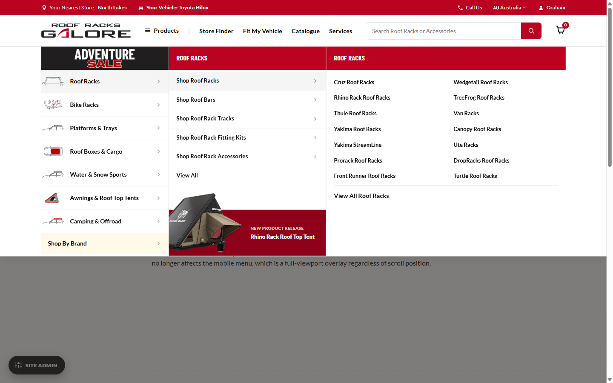
- Bike Racks hovered — no promo tile anywhere (this category has none configured — the bar simply doesn't render, not a bug): 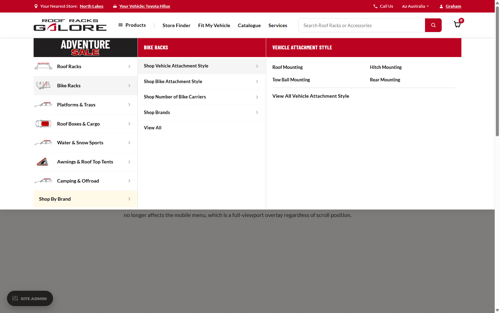
- Brands hovered — yellow Level 1 row, real Product Brands/Vehicle Makes content: 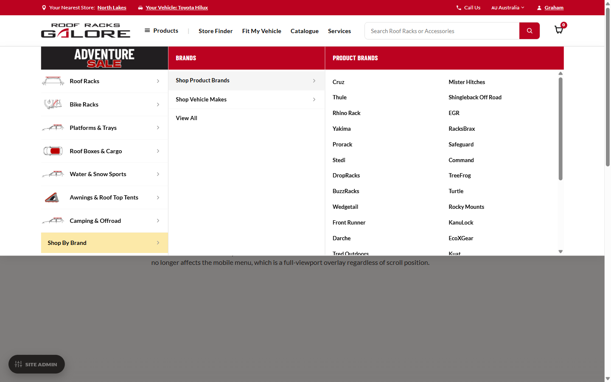

---

### 4.4 Merchandising Promo Tile — how the image + CTA work

**Name:** Merchandising Promo Tile

**Location:** pinned to the bottom of the Level 2 and Level 3 columns (Section 4.3) — one tile per column, shown independently.

**Purpose:** cross-sell a featured/new product directly inside category browsing, without a separate promo unit competing for attention elsewhere on the page.

**Close-up, showing the image bleed described below:**
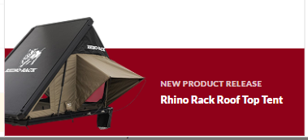

#### Data shape

```js
promoTile: { image: '...', eyebrow: 'New Product Release', label: 'Rhino Rack Roof Top Tent', href: '#' }
```

Four fields: a product photo, a short eyebrow label (defaults to "New Product Release" if omitted), the product name, and a link. **The entire tile — photo and text together — is one clickable link** (`href`); there's no separate "Shop Now" button inside it.

#### Independently assignable per level — this is the important part for Magento

A category's tile (shown in **Level 2**) and a specific column's tile (shown in **Level 3** when that column is hovered) are **two separate fields, not one inherited value**:

- The category entity needs its own `promoTile` (image/eyebrow/label/link) — shown whenever that category's Level 2 column is open.
- Each column/grouping entity *within* that category **also** needs its own, independently editable `promoTile` — shown when that specific column's Level 3 is open. It is not automatically the same as the category's.

Proven in the prototype on Roof Racks: the category's Level 2 tile reads "New Product Release — Rhino Rack Roof Top Tent"; hovering into its "Roof Rack Accessories" column, Level 3 shows a **different** tile — "Now In Stock — Rhino Rack Low Profile Roof Top Tent." Both are real, independently configured entries in `nav-data.js`, not a coincidence of shared code.

#### No fallback — this is a deliberate rule, not a gap

If a category or column has no `promoTile` configured, **the entire red bar does not render at all** for that level — no default image, no "coming soon" placeholder, no inherited content from the level above. Confirmed on Bike Racks (no category tile, no column tiles anywhere in it — neither Level 2 nor Level 3 shows a bar) and on every column of Roof Racks except "Roof Rack Accessories" (Level 3 shows no bar for those, even though the category above it has one).

**Magento build note:** this means the admin needs an image + eyebrow + name + link field on **both** the Level 1 category entity and the Level 2 column/grouping entity, each independently optional — not a single "featured product" field per category that Level 3 just inherits.

#### The image bleed effect

The photo is deliberately **taller than the red bar itself** and overlaps upward into the white list area above it — not contained neatly inside the bar. This is a genuine Figma-matched effect, not a bug: the bar's own box stays a fixed height (so it lines up with the head/banner strip above it per Section 4.3), while the photo — positioned independently — extends past its top edge. Two build notes worth carrying into Magento's front-end implementation:

1. **The list above needs reserved space** when a promo tile is present, so the image's overlap doesn't cover the last real row ("View All") once scrolled to the end — the amount of extra space needed equals roughly the difference between the image height and the bar height.
2. **The image needs a transparent background**, not a solid/white one — the bar's dark red shows through around the product in the lower portion, and the white list background shows through in the portion that overlaps upward. A non-transparent product photo would show its own background colour as a visible box instead of blending in.

The photo itself uses `object-fit:contain` (never crops, regardless of a future photo's aspect ratio) and is flush against the tile's left and bottom edges with zero padding — the only padding in the whole tile is the gap between the photo and the text.

---

### 4.5 Clearance Sale Banner

**Name:** Clearance Sale Banner

**Location:** the top strip of the Level 1 sidebar (desktop drawer) and the top of the mobile takeover's root screen (Section 4.6) — same image, same toggle, both places.

**Purpose:** promotes whatever sale is currently running, directly above the category list where every shopper browsing products will see it.

**How it works:** a real image, not styled text — swapped between two creatives via one Site Admin Panel toggle ("Clearance sale banner," under Site Promotions — Section 4.7), never blank:

- **On** (default): the real sale creative (currently "Adventure Sale").
- **Off**: an evergreen fallback creative (currently a Store Finder promo) — for whenever no sale is actually running.

**States:**
- On: 
- Off (fallback creative), shown here alongside the session-state "off" states: 

---

### 4.6 Mobile Menu — full-screen takeover

**Name:** Mobile Menu Takeover

**Location:** opened by the hamburger icon (Main Header or sticky condensed header, Section 4.8), below 900px.

**Purpose:** the mobile equivalent of the desktop mega menu — but built as its own self-contained full-screen overlay, not a drawer nested inside the scrolling page.

**Why it's a full-screen takeover and not a drawer:** an earlier build lived inside the page's own slide-down nav drawer, positioned relative to the real header. Scrolling afterward left the two visibly detached, since the drawer didn't track the sticky condensed header once it took over. The takeover fixes this at the root: it's `position:fixed` to the entire viewport with its **own** logo/login/vehicle/search built in, so it never depends on the real header's position or scroll state at all.

**"Products" isn't its own tab here — this is deliberate.** On desktop, "Products" is a button that opens the category list. On mobile, the category list simply **is** the takeover's root screen — there's no separate "Products" row to tap through first. Internally this root screen is called **Level 0** (not "Level 1," to avoid confusion with desktop's Level 1, which sits *behind* a Products trigger that mobile doesn't have) — content-wise, mobile Level 0/1/2 correspond to desktop Level 1/2/3.

**Screen 1 — Level 0 (root):**
- Own mini header: logo (links to the Home Page template, `prototypes/home/`, from every template since 2026-09-29 — it used to point at the template index; the home page in Magento), account (Graham/Log In), vehicle (just the vehicle name, e.g. "Toyota Hilux", without the "Your Vehicle:" prefix so it fits on one line beside the logo — 2026-10-02; or Select Your Vehicle — opens the Fit Finder drawer, Section 4.10) — same session state as the Utility Bar (Section 4.1), a close button.
- Search bar (same typeahead/focus-state dropdown as desktop's — Section 4.9).
- Sale banner (Section 4.5).
- The 8 categories, Brands styled as a yellow bar (same treatment as desktop).
- The 4 plain nav links (Store Finder etc.) below the categories, in their own section.

**Screen 2 — Level 1 (tap a category):** replaces the whole screen — a back+title bar (category name, back arrow to Level 0, a close button), that category's real "Shop X" rows, its promo tile if one's configured.

**Screen 3 — Level 2 (tap a Level 1 row):** replaces the screen again — same back+title bar pattern, that column's real leaf links (single column on mobile, unlike desktop's 2), a secondary row showing the current grouping's name (currently decorative only — Section 6), its promo tile if configured.

**Click actions:** tap a category/row to drill in; tap the back arrow to go up one level; tap the close button (present on every screen, not just the root) to exit fully, from any depth — you don't have to back out level by level first. The hamburger also toggles closed if tapped again while open.

**States:**
- Level 0 (root): 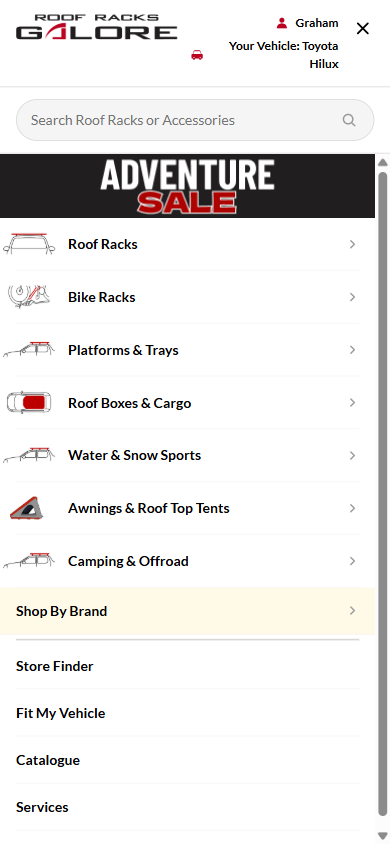
- Mini header close-up (logo/account/vehicle/close): 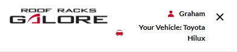
- Level 1 (Roof Racks → Shop X list): 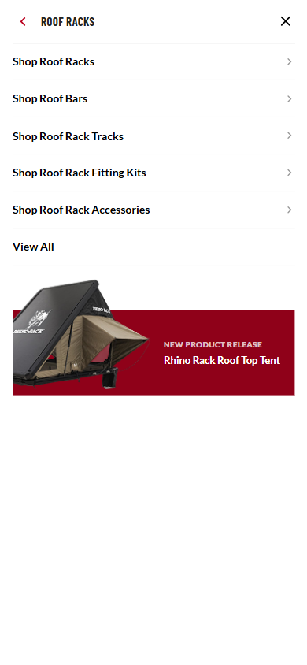
- Level 2 (leaf links), scrolled to show the promo tile: 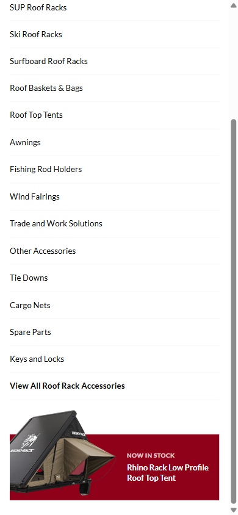

**No backdrop on mobile:** the desktop drawer dims the rest of the page (Section 4.3); the mobile takeover doesn't need this, since it already covers the entire viewport itself.

---

### 4.7 Site Admin Panel

**Name:** Site Admin Panel

**Location:** a floating button, bottom-left of every page this header is on. Desktop: a "Site Admin" pill. Below 900px: a small icon-only button, raised above the sticky mobile Add to Cart bar (2026-09-29, `spec.md` §15 P5) — it no longer borrows the Utility Bar's "Nearest Store" link as its mobile trigger. The Demo State Panel's button (bottom-right, on pages that have one) gets the same icon-only mobile treatment, so both panels can be opened on a phone.

**Purpose:** internal reviewer tooling for demoing every state covered in this brief without needing separate page builds — **not part of the shipped site**, same convention as the PDP prototypes' Demo State Panel (`DEVELOPER-BRIEF.md` — flag this explicitly wherever the header is integrated, same as that panel already is). Rebuilt 2026-09-29 (§15 P2–P11) for **global controls only**; anything that applies only to the page you're on lives in that page's Demo State Panel instead.

**Contents:**
- **Templates** — all 12 prototype pages, grouped: Product pages (Simple, Config-Variant, Sibling-Colour, Vehicle-Specific, Grouped/Bundle), Category & listing (Vehicle Landing (VCLP), PLP — Bike Racks, PLP — Camping, VPLP — Roof Racks), Other (Search Results, Header (standalone), All templates). The current page is highlighted.
- **Developer Briefs** — all 6: Product Pages (PDP), PLP / VPLP, Search Results, Vehicle Landing (VCLP), Header, Footer.
- **Shopper Session** — Logged in (on/off), Vehicle (None / Toyota Hilux / Ford Ranger), Nearest store set (on/off) (Section 4.1).
- **Build Phase** — Phase 1 (launch build) / Phase 2 (future features), with a one-line explainer: Phase 2 adds store-level stock, product ribbons and Compare Products.
- **Site Promotions** — the Clearance sale banner toggle (Section 4.5).
- **Prototype Tools** — "Show Demo State panel" (only offered on pages that have a Demo State Panel — not the standalone header page or the root index), and **Reset all demo settings**, which, after a confirm, clears every saved prototype setting (session, build phase, promotions and each template's Demo State choices) and reloads.

**Screenshot:**
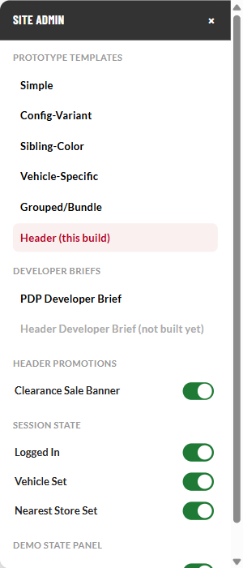

---

### 4.8 Sticky Condensed Header (mobile)

**Name:** Sticky Condensed Header

**Location:** fixed to the top of the viewport, mobile only (≤900px) — fades in once the main header's search row scrolls out of view.

**Purpose:** keeps the hamburger, logo, and cart reachable while scrolled, without permanently occupying screen space the way a fully persistent header would.

**Contents:** hamburger, logo, cart — no utility bar, no search row (those already scrolled away; this is a deliberately condensed stand-in, not a shrunk copy of the full header).

**Screenshot (scrolled state):**
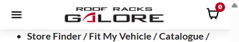

---

### 4.9 Search Typeahead / Recent & Popular Searches

**Name:** Header Search Typeahead

**Location:** a dropdown panel anchored below the search input — desktop's Main Header search bar (4.2) and the mobile takeover's own search bar (4.6, Level 0). Added 2026-09-22, well after the rest of this brief was written — Section 6 used to flag search as "visual only, no real search wired up"; that's now only partly true (see below).

**Purpose:** gets shoppers to the right thing while they're still typing — a query, a brand, a page or a product — and into the search-results page when they press Enter. The typing state was rebuilt 2026-09-29 (from the 2026-09-24 meeting, with Supercheap Auto's search as the reference Brenton pointed to) and now genuinely matches what's typed.

**Contents/behaviour — two states, depending on the input:**
- **Both states use the same two-column layout** (2026-10-02, Brenton — the focus state used to be chip rows, so the panel changed shape on the first keystroke): link groups on the left, products on the right, in a panel wider than the search box (up to 760px, growing leftwards so its right edge lines up with the box), with the `--shadow-pop` shadow. Column titles are Barlow Condensed 16px bold, black, sentence case, with an 18px inset.
- **Focused, empty:**
  - **left column:** **Recent searches** (canned list in the prototype; **session-based per shopper in production**) with a "Clear" action beside the title that hides the group for the rest of the page view only; **Popular searches** — the real top searches from RRG's Algolia analytics (2026-09-24 meeting): U-Bolts, Roof Boxes, Light Bars, Rhino Rack Tie Downs; **Pages that might be interesting** — Fit My Vehicle, Find a Store, the installation-service help article, Shipping & Delivery.
  - **right column: Suggested products** — five products RRG wants to push (thumbnail, brand, name, price). No View All Results here, as there's no query yet.
  - **Popular searches, pages and suggested products are merchandiser-controlled in production.** Every term here was checked against the live site before being used (see the note below) — don't add a new one without the same check.
- **1+ characters typed** — everything filters to the typed text:
  - top row, full width: **"Search for '\<query\>'"** — same as pressing Enter.
  - **left column**, each group only shown when it has matches: **Popular searches** (up to 5 — real category names and top searches containing the typed words, each linking to the search-results page for that term), **Looking for these brands?** (up to 3 — brands whose name matches first, then brands that sell the searched category, linking to the brand page), **Pages that might be interesting** (up to 5 — Fit My Vehicle, vehicle landing pages, category pages, Find a Store, info pages and help-centre buying guides).
  - **right column: Products** (up to 5 — thumbnail, brand, name clamped to 2 lines, price), then **View All Results**, pinned to the bottom of the panel (2026-10-02 — it sat straight under the last product, leaving a gap below it whenever the left column was taller). If no product matches, it shows "Popular right now" instead of an empty column.
  - Vehicle-specific pages (e.g. "Toyota Hilux Roof Racks") only appear once a vehicle is set in session, or when the typed text names that vehicle.
  - Under 640px wide (mobile), the two columns stack: searches / brands / pages, then products.
- **Enter / the search button** go to the search-results page with `?q=<query>` (added 2026-09-29 — the results page no longer has its own search box, so this is the only way in). On the search-results page itself, the box is pre-filled with the current query.

**Matching (prototype):** every typed word has to prefix-match a word in the entry ("roo" finds "roof", "rack" finds "racks"; filler words like "for" are ignored). The queries, brands, pages and products it matches against are a hardcoded demo list in `shared.js` (`RRG_SEARCH_*`), all real — crawled from the live site and its help centre on 2026-09-29. **In production all four groups should come from the search index** (Algolia's query suggestions + product/page/brand indices), not hand-maintained lists. The same data drives the search-results page's Pages/Articles/Brands views, so the dropdown and results page always agree.

**Why the dropdown isn't a child of `.rrg-search`:** that box has `overflow:hidden` (needed to clip the search button's rounded pill corners), which would clip the dropdown too. It's appended to `<body>` instead, `position:fixed`, with its position computed from the search box's own bounding rect in JS.

**Implementation note:** lives in `shared.js` (`initHeaderSearchSuggest()`, `headerSearchTypingHTML()`, and the `RRG_SEARCH_*` data + `rrgSearch*For()` matchers). There is one copy only — the standalone header page loads `shared.js` like every other template.

**Pending:** Jack has a predictive-search example he rates that hasn't been shared yet — worth comparing against once it arrives.

**A note on the demo content itself:** the first pass at the popular (then "Trending") searches named products RRG doesn't actually sell (snorkels, dual battery kits) or mislabeled ones it does (camping fridges — the real category is fridge slides/accessories, not the fridge itself) — caught by the client's team reviewing literally, fixed by crawling the live site's real category nav before choosing terms. Worth remembering for anyone extending this list later.

**Screenshots:**
- Focus state, desktop (*screenshot predates the 2026-10-02 two-column focus state — recapture at final handover*): 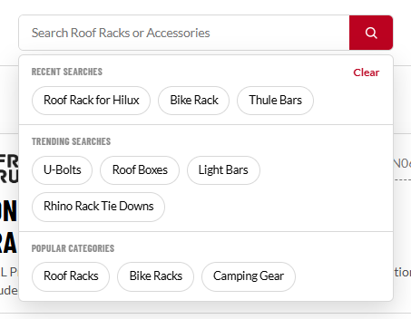
- Typing state (two columns — searches/brands/pages + products), desktop: 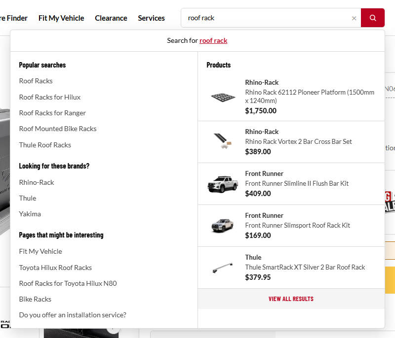
- Typing state, mobile (stacked): 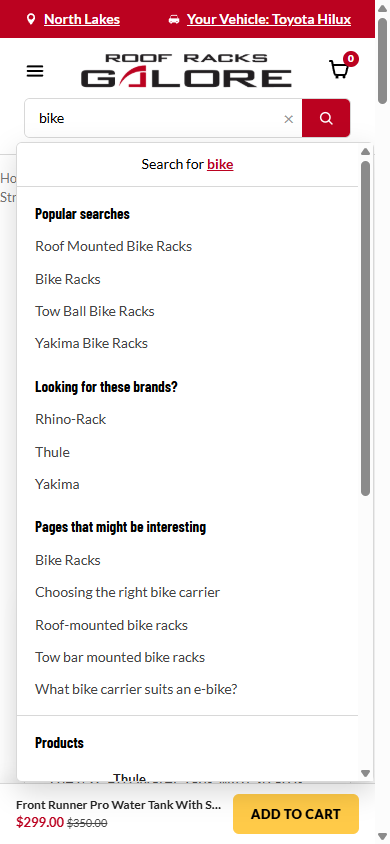
- Focus state, mobile takeover (*predates 2026-10-02 too*): 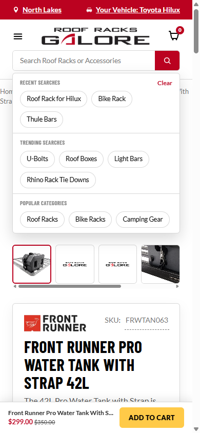

---

### 4.10 Fit Finder Drawer (site-wide)

**Name:** Fit Finder Drawer (added 2026-09-29)

**Location:** a right-edge slide-out, available on every page (same backdrop/drawer convention as the Store slide-out).

**Purpose:** answer "set your vehicle" wherever it's asked, without sending the shopper to another page. Since 2026-10-02 the drawer holds the one shared Vehicle Finder widget (`rrgWidgetVehicleFinderHTML({ inline: false, submit: 'Set My Vehicle' })` from `_shared/widgets.js`, the same widget inline on Home, Fit My Vehicle, Cart, Brand and the Vehicle Category Landing Page) instead of its old copied grey/dark block. The widget is used as-is — car-and-rack badge icon, "Fit Finder" heading at the same size as inline (the old 22px drawer override on the widget heading was removed) and the intro "Select your vehicle to find the perfect fit." — with the fields stacked one per row for the drawer's width. It follows the same Site Admin → Design options light/dark setting as the inline widget (default light; light vs dark not yet confirmed internally, light likely). (2026-10-02, Brenton)

**Drawer:** built on the one shared drawer base (2026-09-29, `spec.md` §15 C1) — 420px standard width, drawer title "Set Your Vehicle" at 22px, the shared 48px grey circle close button, `role="dialog"`.

**Contents:** always the no-vehicle cascade, even when a vehicle is already set (the drawer only opens to set or change one) — no "Shopping for your …?" vehicle bar and no "Shop without a vehicle" link. Make, Model, Year, Body Style, Roof Type, then a full-width "Set My Vehicle" button (disabled until every field is chosen). Make → Model is a real cascade, the same as inline (`initFitFinderCascade()`): in the prototype over the two vehicles the demo session knows, Toyota Hilux and Ford Ranger (`FIT_FINDER_VEHICLES`); production needs every make/model. The button is the shared gold CTA (`.btn-cta`), so it turns green in the UK region like every other CTA.

**Opens from:** the header's "Your Vehicle / Select Your Vehicle" link (desktop and mobile takeover); the PLP, VPLP and Camping pages' Set Your Vehicle / Change Vehicle buttons; the vehicle-specific PDP fitment card's "Select your vehicle" / "Change vehicle" buttons; the search page's fitment strip button; the product-card fitment tooltip's "Set your vehicle" / "Change your vehicle" link; the Add to Cart vehicle notice; the Vehicle Category Landing Page's Change Vehicle button, now in its breadcrumb row as the red outline button (its own on-page Fit Finder is the shared inline widget, Toyota / Hilux pre-filled). Anything carrying `data-open-fit-finder` opens it, so new triggers need no extra code. The standalone header page gets it from `shared.js` like every other template.

**Behaviour:** "Set My Vehicle" sets the session vehicle to the picked one (`window.rrgSetVehicle(key)`) and closes the drawer; opened from a header trigger it then lands on that vehicle's VLP, from anywhere else it stays on the page — the header text and every fitment status on the page update immediately. Closes on ×, backdrop click or Escape (the one shared Escape handler, which closes the topmost open drawer).

---

## 5. Interactions quick reference

Every hover effect and click action from Sections 4.1–4.10, gathered in one place.

**Hover effects (desktop only — nothing in this table applies on touch):**

| Element | Hover effect |
|---|---|
| Level 1 category row | Highlights; Level 2 column swaps to that category's content |
| Level 2 "Shop X" row | Highlights; Level 3 column swaps to that grouping's leaf links |
| Level 3 leaf link | Highlights, colour shifts to brand red |
| Level 1/2 row generally | Light grey background on hover/keyboard-focus |

**Click actions:**

| Element | Click action |
|---|---|
| "Products" button | Opens/closes the desktop mega-menu drawer |
| Backdrop (desktop, menu open) | Closes the menu |
| Hamburger icon | Opens/closes the mobile takeover |
| Mobile takeover close button | Closes the takeover fully, from any screen depth |
| Mobile category/row | Drills into the next screen |
| Mobile back arrow | Returns one screen |
| Merchandising promo tile (anywhere it appears) | Navigates to its configured link — the whole tile is one link |
| Sale banner | Navigates to its configured link |
| Region Selector | See `DEVELOPER-BRIEF.md` 4.1 |
| Utility bar / mobile takeover vehicle link | Opens the Fit Finder drawer (Section 4.10) |
| Fit Finder "Set My Vehicle" | Sets the session vehicle, closes the drawer |
| Fit Finder ×, backdrop, Escape | Closes the drawer |
| Site Admin button (pill on desktop, icon-only below 900px) | Opens/closes the admin panel |
| Any Site Admin toggle/select | Immediately applies (no save button) and persists across reloads until changed again |
| Site Admin "Reset all demo settings" | After a confirm, clears every saved prototype setting and reloads |
| Search box, focused + empty | Shows the two-column dropdown — recent searches, popular searches, pages, suggested products (Section 4.9) |
| Search box, 1+ characters typed | Shows the two-column matched dropdown — searches, brands, pages, products (Section 4.9) |
| Search box, Enter / search button | Goes to the search-results page for the typed query |
| Search dropdown's "Clear" (Recent Searches) | Hides that section for this page view only, not persisted |
| Search dropdown's "Search for…" / "View All Results" / any recent or popular search | Search-results page for that term |
| Search dropdown's brand / page link | That brand page or site page (live-site and help-centre links open in a new tab in the prototype) |

---

## 6. Known gaps — not yet built or sourced

- **2 of 8 category icons** (Water & Snow Sports, Camping & Offroad) have no specific line-art asset yet — falls back to a generic roof-bars icon. Swap in once sourced.
- **Merchandising promo tiles** are only configured on 3 real entities so far (Roof Racks category, its Roof Rack Accessories column, Awnings & Roof Top Tents category) — enough to prove the independent-assignment and no-fallback behaviour (Section 4.4), not a claim that every category/column has real merchandising content lined up.
- **Every leaf link, plain nav link (Store Finder etc.), and promo-tile link is `href="#"`** — labels/hierarchy are real (crawled from the live site), but per-link destination URLs haven't been supplied yet.
- **Brands' Vehicle Makes column** (~70 entries) still scrolls even across 2 sub-columns — there's no way to fit that many rows in the drawer's fixed height without either more columns, smaller type, or accepting the scroll. Undecided.
- **Mobile Level 2's secondary dropdown row** (shows the current grouping's name with a chevron) is decorative only — tapping it does nothing yet. May be intended as a same-level jump between sibling groupings without backing out a full screen; unconfirmed.
- **Mobile mini header's vehicle text wraps to 2 lines** at common phone widths when a vehicle is set — a content-length issue (the "off" state's shorter text fits on one line), not fixed yet.
- **Search matching is prototype-only** (Section 4.9) — the dropdown genuinely matches what's typed, but against a small hardcoded list of real queries/brands/pages/products, not a search index; Recent Searches is a canned list, not per-shopper history. No real search/autocomplete backend is wired up.
- **Cart is visual only** — static `0` badge, no real cart logic.

---

## 7. Data model reference

The nav content itself (`prototypes/_shared/nav-data.js`) and the confirmed `HEADER_NAV` shape (category → columns → links, plus the `promoTile` fields from Section 4.4) are documented in full in `header-spec.md` Section 7 — not duplicated here, since that file is the source of truth for the data shape and this brief is about behaviour or presentation of it.
