# Developer Brief — PDP Rebuild Handover


## 1. Project context

**Audience:** Designed to provide Marc with detailed information regarding the individual layouts, sections, and widgets scross the new PDP page designs.
**design:** This brief is the bridge between "what the prototype does" and "what to build in Magento" — it trys to explains *why* each piece works the way it does, not just what it looks like, so implementation decisions in Magento can stay consistent with the intent even where the exact code can't be lifted verbatim.

RRG's current live PDP is being rebuilt from scratch for conversion (not a re-skin) across four product-type templates: Simple, Config-Variant, Sibling/Color, Vehicle-Specific, plus a fifth Grouped/Bundle variant. Full rationale is in `spec.md` Section 0. The prototypes are plain HTML/CSS/JS specifically so they're fast to iterate on visually before committing to the real Magento 2 template work — they are **not** the production codebase, but every visual/behavioral decision in them is final unless `spec.md` flags it as still open.

---

## 2. Typography & colour reference

A quick reference for the page's real type scale and colour tokens, pulled from `prototypes/_shared/shared.css`'s base rules — so every Component Library section from here on can just say "uses the shared heading style" instead of repeating the same font spec 20+ times. Only bespoke deviations from this scale are called out on a widget's own entry.

**Standing rule (2026-09-16, Brenton):** all heading and body-text typography (font-family/size/weight/style/transform/letter-spacing/colour/line-height) is defined once in `shared.css` and shared sitewide by default — a template's own `<style>` block should never re-declare it, even identically, unless there's an explicit, documented reason it must differ on that one page. This was prompted by an audit that found real drift: `.details-sub h3` (Details/Gold Guarantee/Shipping Info sub-headings — "Consists Of," "Key Features and Benefits," "About Rhino-Rack," etc.) was silently rendering two different ways, because Simple and Grouped-Bundle had each locally overridden the shared rule while the other three templates used it as-is. Fixed by consolidating onto one style (uppercase Barlow Condensed, matching what Simple/Grouped-Bundle already had) and deleting the local overrides. Several other byte-identical duplicates (`.variant-label-row h3`/`.swatch-label-row h3`, `.short-desc`, `.sku-row`, `.variant-help`, `.variant-option .v-note`) were the same underlying problem without visible drift yet, and were consolidated the same way. The Vehicle Landing Page's fitment-education content heading/body tier (`.vlp-content`, VLP-only) was likewise renamed to a generic `.content-block` and moved into `shared.css`, so any future PDP content needing that same "sub-heading → paragraph → list" tier reuses it instead of a new page-local rule (see `PAGE-GLOSSARY.md`'s "Fitment education content" entry, and the Vehicle Landing brief's Section 2).

**2026-09-16 sitewide size pass** (Brenton's request): every `12.5px` → `14px`, `15px` → `16px`, `19px` → `18px`, and the shared section-heading `37px` → `40px`, applied across every template and `shared.css` (including the mobile floor-bump `!important` overrides). Two deliberate exceptions kept off this blanket rule, both Brenton's explicit call: `.price-was`/`.price-line-was .price-label` went to `20px` instead of `18px` (was originally Playwright-measured to visually match the Save-badge pill's height at 19px; 20px is the closest value in the new scale, no longer an exact pixel match); `.ff-badge` (VLP Fit Finder icon badge, previously matched the heading's font-size 1:1) was left at `37px` rather than following the heading to `40px`, so it's now decoupled from the heading size. The table below reflects the post-pass values.

**Fonts:** two families only, loaded via Google Fonts `<link>` tags in every page's `<head>` (not `@import` — that blocks font discovery until the whole stylesheet parses, a real mobile performance cost, fixed 2026-09-11).
- **Barlow Condensed** — every heading, price, and button. Bold (700) by default; the shared section-heading style below also uses italic.
- **Lato** — everything else (body copy, labels, form fields). Falls back to Arial/Helvetica/sans-serif.

| Element | Font | Size | Weight/style | Colour | Notes |
|---|---|---|---|---|---|
| Product title (`h1`, Decision Panel) | Barlow Condensed | ~23–26px (varies slightly per template, longest titles set smaller) | 700, uppercase | `--rrg-black` (`#000`) | line-height ~1.05–1.12 |
| Shared section heading (Related Products, Showroom Finder, Fitment Gallery, FAQ, Tabs, VLP Fit Finder/Trust banner) | Barlow Condensed | 40px | 700, *italic*, uppercase | `--rrg-black` | One shared rule (`.related-heading, .showroom-widget h3, .fit-gallery-title h2, .faq-heading, .tabs-heading, .showroom-heading, .ff-head h2, .content-block h2, .vlp-trust-inner h2`) so every top-level section reads as one consistent level — was 37px, sized so its rendered cap-height roughly matched the 26px icon badges next to it; that match is now approximate rather than verified since the 2026-09-16 bump to 40px |
| Body copy | Lato | 16px (site base) | 400 | `#232323` | line-height 1.45 |
| Content-block sub-heading (VLP fitment-education content, e.g. "Why fitment varies on the Hilux") | Barlow Condensed | 21px | 700, plain (not uppercase/italic) | `--rrg-black` | `.content-block h3` — a distinct tier between body copy and the 40px section heading; shared (not page-scoped), see the standing-rule note above |
| Short description (Decision Panel, under title) | Lato | 14px desktop / 16px mobile (floor bump) | 400 | `#555` | 2-line clamp + "Read more"; `.short-desc` — now defined once in `shared.css`, not per-template |
| SKU row / labels / microcopy | Lato | 14px (desktop and mobile — no longer a separate floor bump, both now the same value) | 400 | `#767676` | `.sku-row` — now defined once in `shared.css`, not per-template |
| Price (current) | Barlow Condensed | 42px | 700 | `--rrg-black` | `.price-now` |
| Price (was/struck-through) | Lato | 20px | 400, strikethrough | `#434343` | `.price-was` / `.price-line-was .price-label` — see the sitewide-pass exception note above |
| Button text (all buttons) | Barlow Condensed | 16px | 900, uppercase, `letter-spacing:.03em` | varies — see button colours below | `.btn` base rule |
| Stock-status line | Lato | 14px (desktop and mobile) | 700 | varies by state — see colour tokens below | `.stock-status-line` |

**Colour tokens** (`:root` custom properties, `shared.css`):

| Token | Value | Used for |
|---|---|---|
| `--rrg-black` | `#000` | Headings, body text on light backgrounds, `.btn-outline` text/border |
| `--rrg-red` | `#BB0220` | Brand red — links, tab underline, sale badges, utility bar, map pins/clusters. **UK region overrides this to navy `#2E41AE`** (see the Region Selector entry, 4.1, UK Brand Skin & Currency) — every component built against this token recolours automatically |
| `--rrg-red-dark` | `#8f0119` | Hover state for red-token elements |
| Add to Cart button | `#FFCA48` (gold), black text, hover `#e6b53f` | Locked real default — a separate hardcoded value, deliberately **not** on the `--rrg-red` token, so region colour swaps never touch it except UK's own explicit override to green `#26B226` |
| `--rrg-gold` / `--rrg-gold-bg` | `#BEA98A` / `#FFF9E8` | Muted accent — Fitment Gallery badge, "Fitted" upsell option, not the Add to Cart button |
| `--rrg-fits` / `--rrg-fits-bg` | `#1E7A34` / `#EAF7EE` | "Fits your vehicle" / In Stock green |
| `--rrg-unknown` / `--rrg-unknown-bg` | `#B36B00` / `#FFF4E5` | "Confirm your vehicle" / Low Stock / Special Order amber |
| `--rrg-nofit` / `--rrg-nofit-bg` | `#A6192E` / `#FDEAEC` | "Doesn't fit" / Not in Stock / Discontinued red |
| `--rrg-display` / `--rrg-display-bg` | `#1A56DB` / `#EAF1FD` | On Display pill blue |
| `--rrg-line` | `#D8D8D8` | Card/panel borders |
| `--rrg-bg` | `#F5F5F5` | Neutral section backgrounds |

**Buttons** (`.btn` base + variants):
- `.btn-primary` — brand red fill, white text (Add to Cart itself uses the separate gold override above, not this variant, via `[data-cta-label].btn-primary`).
- `.btn-outline` — white fill, `1.5px solid var(--rrg-black)` border, black text. **The required style for any secondary/non-purchase CTA** (Get It Installed, etc.) — red/gold read as a second competing purchase CTA, confirmed standing rule.

---

## 3. Page Layout — per template

Five templates share one component library (Section 4 below) but assemble it differently depending on product type. This section is the structural map for each — top-to-bottom order, what's present vs. absent, and how it reflows on mobile — so a developer building one Magento template knows exactly which shared components to pull in and in what order. **The header (Utility Bar, Main Header, nav) is out of scope here, per the standing rule** — every template's own section order below starts at Breadcrumbs, the first thing this brief covers.

All 5 templates share the same underlying grid: **Hero is `1.15fr / 1fr` desktop** (Main Product Gallery left, Decision Panel right — roughly a 55/45 split, gallery column marginally wider), collapsing to a **single column on mobile** (≤900px), where `.gallery-col{display:contents}` lets the Decision Panel, gallery images, and the video/install row each get reordered independently — the Decision Panel is promoted to render **above** the video/Get It Installed row on mobile, not below it as the desktop DOM order would suggest. The left (gallery) column also goes `position:sticky` on desktop once the right (Decision Panel) column runs taller than it, so the shorter column doesn't scroll away and leave blank space. Identical across all 5 templates — confirmed via `shared.css`/each template's own `<style>` block, not just visual inspection.

### 3.1 Simple

**Purpose:** the leanest template — no fitment logic, no variant/colour picker, no persistent desktop bar. For single-SKU accessory-type products (example: Front Runner Pro Water Tank).

**Section order (top to bottom):**
1. Breadcrumbs — 3 levels (Home → Category → Product)
2. Hero — Main Product Gallery + Decision Panel (brand logo, SKU, price, stock line, **no variant/colour picker, no fitment widget** — this template has neither), Delivery/Click & Collect widget, payment badges, star-rating badge
3. Trust Row
4. Showroom Finder (+ Interactive Map)
5. *(Discontinued Alternates — hidden unless the Demo State Panel's Discontinued toggle is on)*
6. Body Tabs (Details / Specifications / Gold Guarantee / Shipping Info / Fitting Instructions / Reviews)
7. FAQ
8. Related Products
9. Sticky Mobile Bar (mobile only) and Persistent Bar (desktop, fades in once the Decision Panel scrolls out of view — only the fitment-status portion of this bar is conditional per-template, not the bar itself; this template's version is just thumbnail + truncated name + price + Add to Cart, no fitment box)

**Absent widgets** (present on other templates, not here): Variant Picker, Colour/Swatch Grid, Fitment Status widget, Rack Fit Guarantee, Fitted Photos Gallery, Package Contents.

**Desktop layout:** standard Hero split described above. No extra rows in the Decision Panel beyond the shared baseline (title → short description → price → stock line → Delivery/Click & Collect → Add to Cart → payment badges), so this is the shortest Decision Panel of the 5.

**Mobile layout:** standard reflow described above; Sticky Mobile Bar fades in once the real Add to Cart button scrolls out of view.

**Screenshots:**
- Desktop (1280px), whole page: 
- Mobile (390px), whole page: 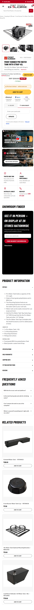

### 3.2 Config-Variant

**Purpose:** for products sold as a comparison-card choice between two configurations of the same item (example: Rhino Rack Pioneer 6 Platform, Assembled vs. Flat Pack) — each variant is its own separate product listing/URL; selecting one navigates to that sibling SKU's own page (this prototype simulates that as an in-page swap of price/gallery/video/specs/fitting-instructions purely for demo convenience, not the real production behaviour).

**Section order:** Breadcrumbs → Hero (Gallery + Decision Panel **with Variant Picker**, comparison cards for Assembled/Flat Pack, above Add to Cart) → Trust Row → Showroom Finder → *(Discontinued Alternates)* → Body Tabs → FAQ → Related Products → Sticky Mobile Bar (mobile) and Persistent Bar (desktop, thumbnail/name/price/Add to Cart, no fitment box — same reasoning as Simple's).

**Absent widgets:** Colour/Swatch Grid, Fitment Status widget, Rack Fit Guarantee, Fitted Photos Gallery, Package Contents — same "no fitment concept" gap as Simple, since this product isn't vehicle-specific.

**Desktop layout:** standard Hero split; Variant Picker sits as its own card row inside the Decision Panel, above the price/stock line. In this prototype, selecting a variant re-renders everything below it (price, gallery, specs, fitting instructions) in place, without touching the picker itself — in production, this is a navigation to that variant's own separate product page (see 4.13, Variant Picker).

**Mobile layout:** standard reflow; Variant Picker stays inside the Decision Panel's mobile position (promoted above the video row, same as the rest of the panel).

**Screenshots:**
- Desktop (1280px), whole page: 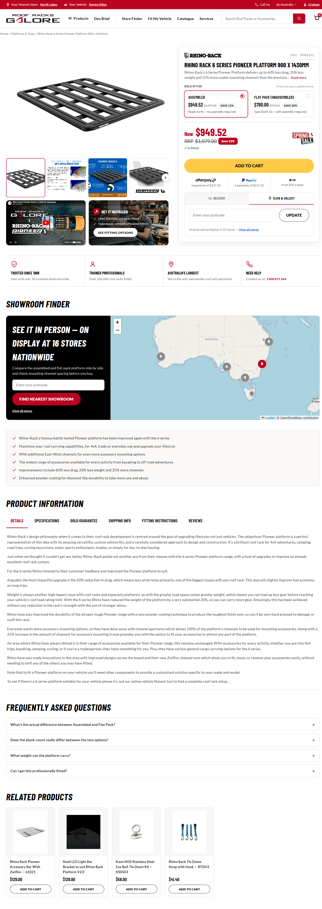
- Mobile (390px), whole page: 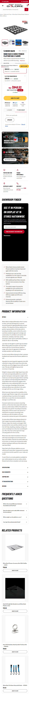

### 3.3 Sibling-Color

**Purpose:** for products sold across a colour range, each colour its own SKU (example: MAXTRAX MKII, 13 colours) — a swatch grid drives gallery/price/stock/SKU/Colour spec. Each colour is its own separate product listing/URL; selecting a swatch navigates to that colour's own page (this prototype simulates that as an in-page swap for demo convenience, not the real production behaviour).

**Section order:** Breadcrumbs → Hero (Gallery + Decision Panel **with Colour/Swatch Grid** in place of a variant picker) → Trust Row → Showroom Finder → *(Discontinued Alternates)* → Body Tabs → FAQ → Related Products → Sticky Mobile Bar (mobile) and Persistent Bar (desktop, thumbnail/name/price/Add to Cart, no fitment box).

**Absent widgets:** Variant Picker, Fitment Status widget, Rack Fit Guarantee, Fitted Photos Gallery, Package Contents.

**Desktop layout:** standard Hero split; the Swatch Grid is a grid of colour tiles (48px tap targets, clearing Google's tap-target guideline) sitting where Config-Variant's comparison cards would go.

**Mobile layout:** standard reflow; swatch tiles keep their 48px minimum tap size at every width (Google tap-target guideline).

**Screenshots:**
- Desktop (1280px), whole page: 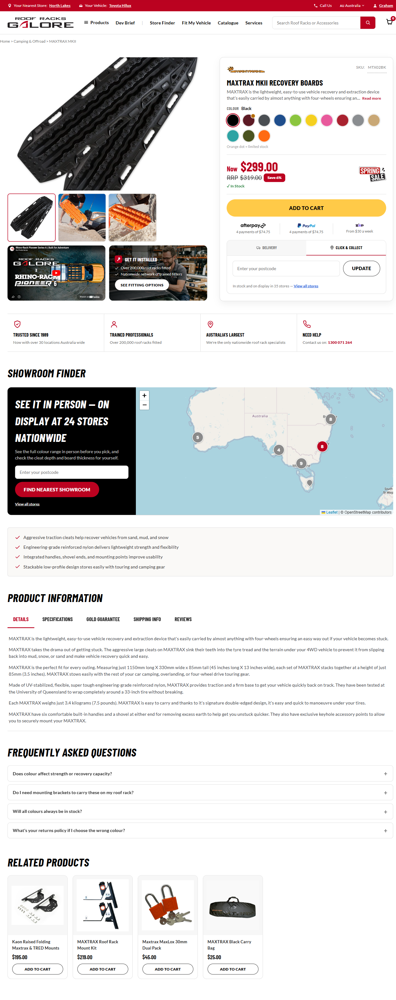
- Mobile (390px), whole page: 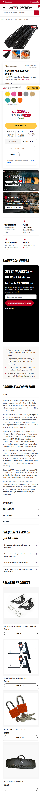

### 3.4 Vehicle-Specific

**Purpose:** the most complex template — for Vehicle Rack Sets sold against a specific vehicle fitment (example: Rhino Rack Pioneer 6 Platform Kit, Hilux N80). Carries the Fitment Status widget, the Fitted Photos Gallery, and both mobile *and* desktop condensed CTA bars.

**Section order:** Breadcrumbs → Hero (Gallery + Decision Panel **with Variant Picker, Fitment Status widget + Rack Fit Guarantee badge, Package Contents/"What's Included"**) → **Fitted Photos Gallery** (full-width, default position directly above Trust Row — can be toggled to nest inside the gallery column instead, via the Demo State Panel's placement toggle) → Trust Row → Showroom Finder → *(Discontinued Alternates)* → Body Tabs → FAQ → Related Products → Sticky Mobile Bar (mobile) **and** Persistent Bar (desktop, fades in once the Decision Panel scrolls out of view — every template has this bar, but only this one's version includes the fitment box + Rack Fit Guarantee badge, since it's the only one with fitment status worth keeping visible).

**Absent widgets:** Colour/Swatch Grid (this template uses the Variant Picker for Assembled/Flat Pack, same as Config-Variant).

**Desktop layout:** same Hero split as the rest, but the Decision Panel is the tallest of the 5 (fitment card + Rack Fit Guarantee + Package Contents + Variant Picker all stack above the price), which is exactly what makes the gallery column's `position:sticky` behaviour matter most on this template. The Persistent Bar is a condensed strip fixed to the top of the viewport, showing a product thumbnail + truncated name sharing space with a condensed fitment box (icon + short label, roughly half its full-detail width).

**Mobile layout:** standard reflow (Decision Panel promoted above the video/Fitted-Photos-nested row); the Sticky Mobile Bar's fitment box drops to icon-only (no room once sharing the row with the thumbnail/name block) — same "icon only, tooltip carries the caption" convention as the Rack Fit Guarantee badge itself.

**Screenshots:**
- Desktop (1280px), whole page: 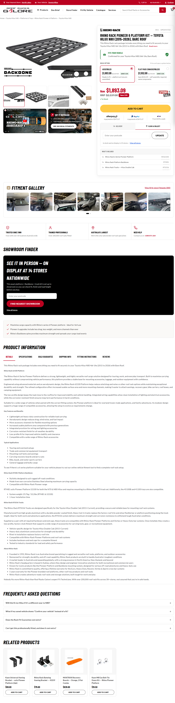
- Mobile (390px), whole page: 

### 3.5 Grouped-Bundle

**Purpose:** for a fixed bundle of several real components sold as one SKU (example: Yakima RoadShower 15L Complete Shower & Hose Bundle) — no variant/colour choice, but a Package Contents list breaking down what's actually in the box.

**Section order:** Breadcrumbs → Hero (Gallery + Decision Panel **with Package Contents/"What's Included"**, no variant or colour picker) → Trust Row → Showroom Finder → *(Discontinued Alternates)* → Body Tabs → FAQ → Related Products → Sticky Mobile Bar (mobile) and Persistent Bar (desktop, thumbnail/name/price/Add to Cart, no fitment box).

**Absent widgets:** Variant Picker, Colour/Swatch Grid, Fitment Status widget, Rack Fit Guarantee, Fitted Photos Gallery.

**Desktop layout:** standard Hero split; Package Contents renders as a list of real bundle components (each with quantity leading the row, e.g. "1x RoadShower Tank," and its own click-to-copy SKU) directly below the price/stock line.

**Mobile layout:** standard reflow described above.

**Screenshots:**
- Desktop (1280px), whole page: 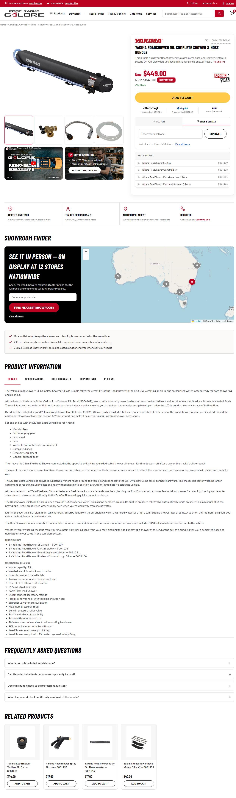
- Mobile (390px), whole page: 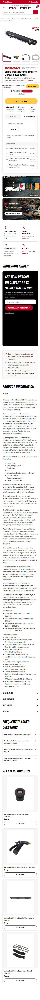

---

## 4. Component Library

Every widget named in `PAGE-GLOSSARY.md`, one entry each — Name/Location/Purpose/Typography/Region differences/real-vs-placeholder Links/States, screenshots throughout. **Ordered top-to-bottom by where each widget actually sits on the page** (reordered 2026-09-12 from build-history order, at Brenton's request), except the two bookends noted in Section 0: the Region Selector (4.1) sits first since its effects cascade into many widgets below, and the Demo State Panel (4.36) sits last since it isn't part of the real page at all. Screenshots are real captures, taken on whichever template best demonstrates the widget (usually Simple or Vehicle-Specific) — the widget itself is shared code (`shared.css`/`shared.js`), so its look is identical on every template that includes it; see Section 3 for which templates include which widget.

### 4.1 Region Selector & Multi-Region Support

> ✅ **Build status: fully built and live in the prototype.** Every row of the cascade table below, the store/contact data, and the UK payment-provider differences are confirmed built. Screenshots below are real captures (Simple template, all 3 regions), taken once all 5 templates reached hand-over-ready state.

**Name:** Region Selector

**Location:** top-right of the header's Utility Bar (the blue/red band above the main header), next to "Call Us" — a flag + country name button (e.g. "🇦🇺 Australia"), on all 5 templates.

**Purpose:** lets a reviewer preview how the page would look for RRG's other markets without needing separate page builds. Clicking a region live-swaps copy, currency, map/store data, and (for UK) the whole brand skin — no page reload. **This is a prototype-review tool that previews a future capability, not a finished customer-facing feature** — RRG doesn't currently sell in NZ/UK the way this control implies; see "Before this leaves prototype stage" below.

**States:**
- **Closed, default (AU)** — full page, red arrow shows where to click:
  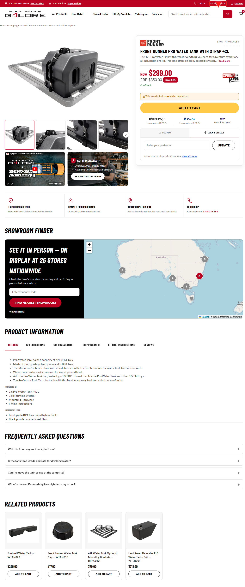
- **Open, showing all 3 options** — full page, red arrow shows the open menu:
  
- **AU selected (default on load)** — whole page:
  
- **NZ selected** — RRG branding stays, Delivery becomes the default tab, Trust Row/Showroom Finder copy and contact details change — whole page:
  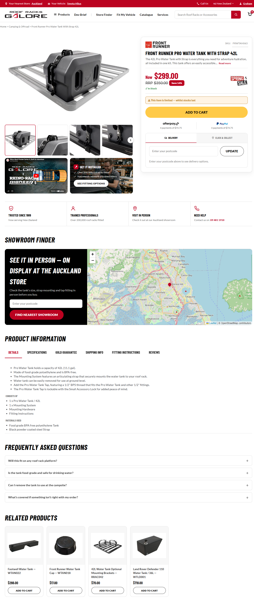
- **UK selected** — full brand skin change on top of the NZ-style cascade, plus its own payment-provider set — whole page:
  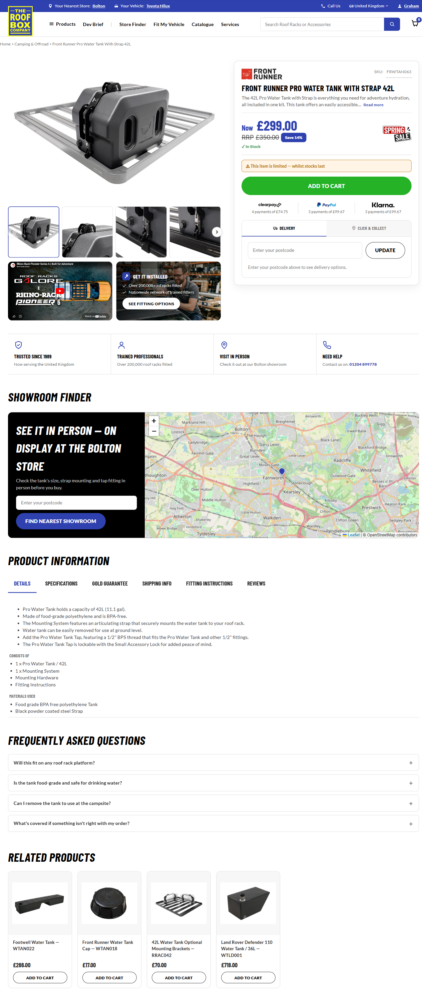

#### How the dropdown works

Same open/close interaction pattern already used elsewhere on the page for the "Products" template-switcher menu: click the button to open a menu, click outside (or pick an option) to close it. No page reload — picking a region calls one JS function, `applyRegion(region)`, which re-renders everything listed in the cascade table below.

*(Note: the dropdown's own open/close mechanics live in header markup, which is otherwise out of scope for this brief — documented here as a narrow, deliberate exception, since it's inseparable from explaining the cascade it triggers.)*

```html
<div class="region-switcher u-item">
  <button type="button" class="region-switcher-toggle" aria-haspopup="true" aria-expanded="false">
    <span class="flag-emoji" data-region-flag>🇦🇺</span> <span data-region-label>Australia</span>
    <svg viewBox="0 0 24 24" ...><path d="M6 9l6 6 6-6"/></svg>
  </button>
  <div class="region-switcher-menu">
    <span class="tsm-label">Region</span>
    <a href="#" data-region="AU" class="current"><span class="flag-emoji">🇦🇺</span> Australia</a>
    <a href="#" data-region="NZ"><span class="flag-emoji">🇳🇿</span> New Zealand</a>
    <a href="#" data-region="UK"><span class="flag-emoji">🇬🇧</span> United Kingdom</a>
  </div>
</div>
```

**Important:** the page always starts on AU, every time it loads — the selected region is **not** saved anywhere (no cookie, no localStorage, no server session). This matches every other reviewer-toggle in this prototype (the Demo State Panel). A real Magento build would decide region a different way entirely (domain/subdomain, a real customer/session setting, geo-IP) — this dropdown is a prototype-only stand-in for whatever that real mechanism ends up being, not a pattern to port as-is.

#### Per-widget region cascade

One region change touches eleven separate things on the page. Each is independent — build them as small "does this widget care about region" hooks rather than one monolithic function, same as this prototype's `applyRegion()` does internally (see below for the actual function, provided for logic reference — it depends on this prototype's own DOM/helper functions, so port the *behaviour* below, not the code verbatim). **All eleven rows are built and confirmed working.**

| # | What changes | AU (default) | NZ | UK |
|---|---|---|---|---|
| 1 | Utility bar trigger (flag + label) | 🇦🇺 Australia | 🇳🇿 New Zealand | 🇬🇧 United Kingdom |
| 2 | Delivery/Click & Collect widget — default active tab | Click & Collect | Delivery | Delivery |
| 3 | Delivery/Click & Collect widget — "View all stores" link | Shown (real 35-store AU list) | Hidden (no real store list for this region) | Hidden |
| 4 | Showroom Finder heading | Real per-product AU copy, e.g. "On Display At 26 Stores Nationwide" | "On Display At the Auckland Store" | "On Display At the **Bolton** Store" *(corrected — was "London," see Region-specific store & contact data below)* |
| 5 | Showroom Finder map | Zoomed-out clustered view of all 35 real AU stores (see 4.29, Showroom Finder interactive map) | Zoomed to one pin, Auckland (demo-precision coordinates) | Zoomed to one pin, **Bolton** *(corrected — was London, see below)* |
| 6 | Trust Row — "Trusted Since 1989" / "Australia's Largest" tiles | Real AU copy (unchanged) | "Trusted Since 1989" / "Visit In Person — Check it out at our Auckland showroom" | "Trusted Since 1989" / "Visit In Person — Check it out at our **Bolton** showroom" *(corrected — was London)* |
| 7 | Currency symbol on every price on the page | $ | $ | £ (same numeric value — **symbol swap only, no FX conversion anywhere in this prototype**) |
| 8 | Brand skin (logo, primary colour, Add to Cart colour) | RRG red/gold, RRG wordmark logo | Unchanged — NZ stays RRG-branded, no rebrand (real scraped copy already treats AU+NZ as one network under one brand) | **The Roof Box Company** navy/yellow branding, green Add to Cart — see UK Brand Skin & Currency below |
| 9 | **Trust Row phone number** ("Need Help" tile) | `1300 071 264` (unchanged) | `09 481 1910` | `01204 899778` |
| 10 | **Payment badges under Add to Cart** — see UK payment provider differences below | Afterpay + PayPal + Zip (Afterpay/PayPal "Pay in 4," Zip its own weekly copy) | Afterpay + PayPal only, "Pay in 4" (Zip dropped — not offered in NZ) | Full 3-provider swap, not a hide/show: **Clearpay** ("Pay in 4," same structure as Afterpay) + **PayPal** ("Pay in 3," not 4) + **Klarna** ("Pay in 3" over 3 months) |
| 11 | **Header utility bar "Your Nearest Store"** | North Lakes (unchanged) | Auckland | Bolton |

Row 3's Showroom Finder equivalent (its own "View all stores" link) follows the same AU-only rule — both links use the identical real 35-store slide-out, which has no NZ/UK content to show.

**UK header/CTA/price, close up** (rows 1, 2, 6 [truncated below fold], 7, 8, 9, 10, 11 together):
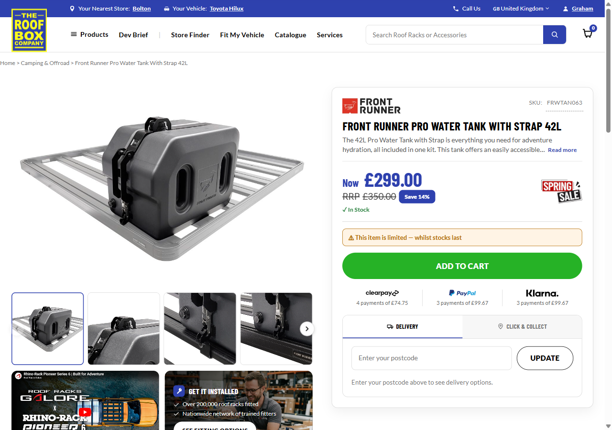

**UK Showroom Finder, close up** (rows 4–5):
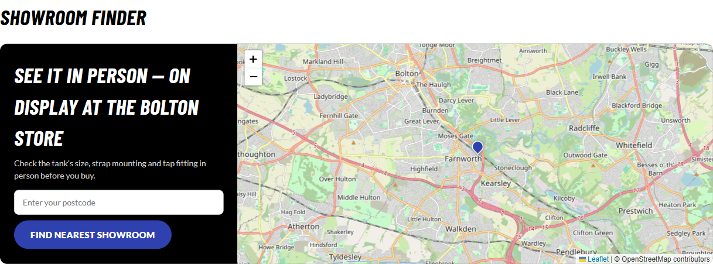

**NZ header/DC-tab, close up** (rows 1–2, 7 unchanged — still RRG branding/$; rows 9–10):
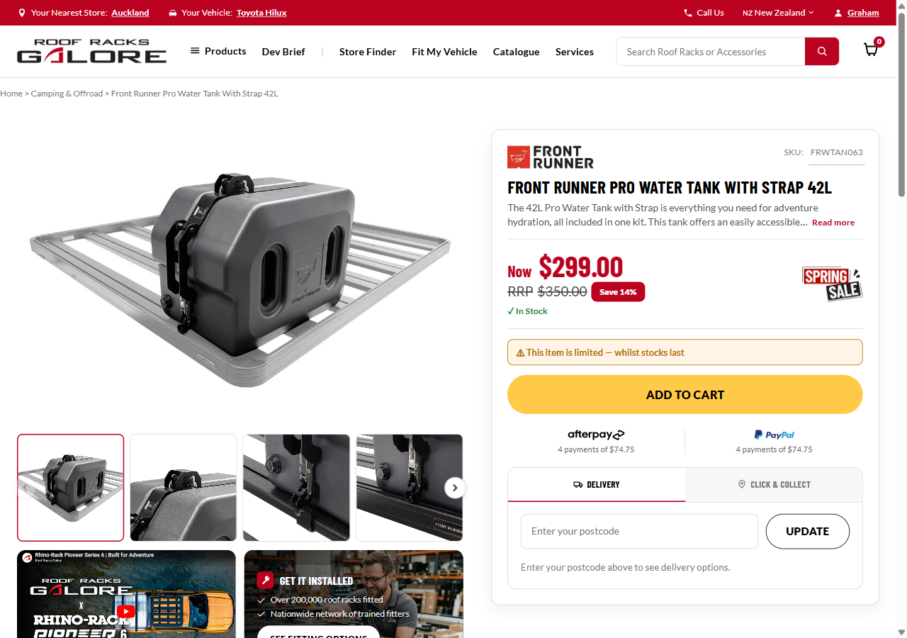

**NZ Showroom Finder, close up** (rows 4–5):
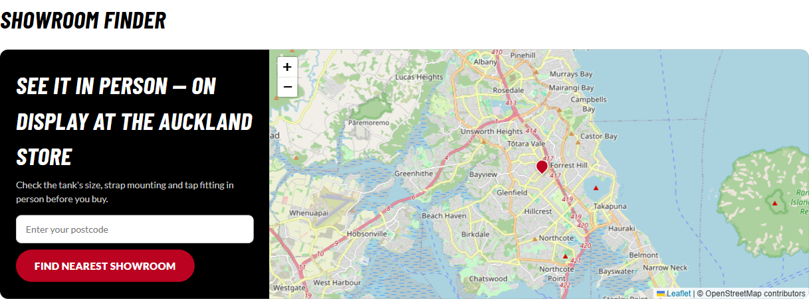

#### JavaScript — the cascade function (reference, not copy-paste)

**The data values below are the corrected, client-confirmed ones (2026-09-11) — the live prototype's `shared.js` still has the old placeholder UK values (`London`, `51.5074, -0.1278`) and no `phone`/`address` fields at all.** Treat this block as the target to build toward, not a description of what's in the repo today.

```js
const REGION_LABELS = { AU: 'Australia', NZ: 'New Zealand', UK: 'United Kingdom' };
const REGION_FLAGS = { AU: '🇦🇺', NZ: '🇳🇿', UK: '🇬🇧' };
const REGION_DEFAULT_DC_TAB = { AU: 'collect', NZ: 'delivery', UK: 'collect' };

// Corrected 2026-09-11 — real addresses/phone numbers sourced from each brand's own live
// contact page (see Region-specific store & contact data below). Coordinates are suburb/town-
// centre approximations, same demo-precision convention as the rest of this prototype's store
// data — not geocoded to the exact unit.
const REGION_SINGLE_STORES = {
  NZ: {
    name: 'Auckland',
    address: '195A Wairau Road, Wairau Valley, Auckland 0627',
    phone: '09 481 1910',
    lat: -36.7747, lng: 174.7381
  },
  UK: {
    name: 'Bolton',
    address: 'Unit B9, Edge Fold Industrial Estate, Plodder Lane, Farnworth, Bolton, BL4 0LR',
    phone: '01204 899778',
    lat: 53.5503, lng: -2.3882
  }
};

// Trust Row phone number, by region — NOT wired up yet (item 28); currently one static AU
// number (1300 071 264) regardless of selected region.
const REGION_PHONE = { AU: '1300 071 264', NZ: '09 481 1910', UK: '01204 899778' };

const REGION_TRUST_COPY = {
  AU: { founded: { h4: 'Trusted Since 1989', p: 'Now with over 30 locations Australia wide' },
        network: { h4: "Australia's Largest", p: "We're the only nationwide roof rack specialists" } },
  NZ: { founded: { h4: 'Trusted Since 1989', p: 'Now serving New Zealand' },
        network: { h4: 'Visit In Person', p: 'Check it out at our Auckland showroom' } },
  UK: { founded: { h4: 'Trusted Since 1989', p: 'Now serving the United Kingdom' },
        network: { h4: 'Visit In Person', p: 'Check it out at our Bolton showroom' } }
};

function applyRegion(region) {
  // 1. Trigger label/flag + which menu item shows as "current"
  // 2. Click the widget's own real tab button for REGION_DEFAULT_DC_TAB[region]
  //    (re-uses the existing tab-switch logic rather than duplicating it), then hide/show
  //    the "View all stores" link based on region === 'AU'
  // 3. Update the Showroom Finder <h3> — cache the real AU string the first time this runs
  //    (so switching back to AU restores the real per-product copy instead of a generic
  //    string), else show `On Display At the ${REGION_SINGLE_STORES[region].name} Store`
  // 4. Re-plot the map: AU = full 35-store clustered network; NZ/UK = a single marker at
  //    REGION_SINGLE_STORES[region], map zoomed/centred on it
  // 5. Swap Trust Row copy from REGION_TRUST_COPY[region]
  // 6. Swap the Trust Row phone number/tel: link from REGION_PHONE[region]
  // 7. Swap the header utility bar's "Your Nearest Store" text/link from
  //    REGION_SINGLE_STORES[region].name (AU keeps its own real nearest-store logic,
  //    cached from the page's own markup on first run)
  // 8. Swap the payment-badges provider set for UK (see UK payment provider differences
  //    below); NZ's Zip removal is a simple hide, UK's Clearpay/PayPal-pay-in-3/Klarna is
  //    a full re-render
  // 9. Run the currency-symbol sweep (UK Brand Skin & Currency, below)
  // 10. Run the brand-skin swap (UK Brand Skin & Currency, below)
}
```

#### UK Brand Skin & Currency

RRG trades in the UK as a real sister brand, **The Roof Box Company** (`roofbox.co.uk`) — this isn't a fictional rebrand, it's a real business the prototype is previewing. Scope was deliberately limited: **logo + core colour only** — typography (Barlow Condensed/Lato) stays the same as the rest of the prototype, this is not a full re-skin.

**Colour — CSS custom-property override (copy-paste)**

Every component already built against the shared `--rrg-red`/`--rrg-red-dark` tokens (utility bar, links, tab underline, sale badges, map pins, etc.) recolours automatically — no per-component CSS needed. Add to Cart needed its own override since it's a separate locked-in gold default, not on the red token.

```css
body.region-uk{--rrg-red:#2E41AE;--rrg-red-dark:#1F2E82;}
body.region-uk [data-cta-label].btn-primary{background:#26B226;color:#fff;}
body.region-uk [data-cta-label].btn-primary:hover{background:#1e8f1e;}
```

```js
document.body.classList.toggle('region-uk', region === 'UK');
```

Colour values were read directly off the real live `roofbox.co.uk` site: navy (`#2E41AE`) and yellow (`#FFFF19`) from their logo SVG's own fill values, green (`#26B226`) from their live "Click Here To Order" button.

**Logo**

Straight `src`/`alt` swap on every `.rrg-logo img` on the page — the same markup pattern is reused for the main header and the sticky/condensed mobile header, so one swap covers both:

```js
const RRG_LOGO = { src: '../_shared/headerlogo.png', alt: 'Roof Racks Galore' };
const UK_LOGO = { src: '../_shared/brand-roofbox-uk-logo.svg', alt: 'The Roof Box Company' };
document.querySelectorAll('.rrg-logo img').forEach(img => {
  img.src = logo.src; // logo = region === 'UK' ? UK_LOGO : RRG_LOGO
  img.alt = logo.alt;
});
```

Real logo file: `prototypes/_shared/brand-roofbox-uk-logo.svg` (downloaded from `roofbox.co.uk/images/trbc_logo.svg`).

**Why the logo needs its own CSS, not just a swapped ``:** The Roof Box Company's real logo is a tall vertical rectangle (roughly square, ~0.82:1) where RRG's is a wide horizontal wordmark (~6.2:1) — dropped in at the same size/position as RRG's logo, it would look tiny and cramped. Client direction (from a supplied reference screenshot, `UK header example.png`, project root) was for the UK logo to visually **span both header bars** — bottom flush with the base of the white Main Header, top reaching roughly halfway up through the navy Utility Bar above it — on desktop, mobile, and the sticky/scrolled header alike. This needed real CSS positioning work (the logo is pulled out of normal layout flow and absolutely positioned against fixed pixel offsets specific to this prototype's own header heights), so **don't copy the CSS verbatim** — it's in `prototypes/_shared/shared.css` around line 265–310 (search `body.region-uk .rrg-logo`) as a worked reference for the *effect* to reproduce against Magento's own header markup/heights, not a drop-in rule. Two non-obvious things worth knowing if this gets re-built from scratch:
- An absolutely-positioned-only child collapses its parent's box to zero size — anchor the parent with `align-self:flex-start` (or the grid/flex equivalent), not `center`, or the logo silently sits in the wrong place.
- If the parent's width also collapses to 0, this project's own global `img{max-width:100%}` reset will clamp the image's own explicit width down to 0 too (100% of a 0-width container) — give the parent an explicit width matching the image's, not just the image itself.

**Currency — symbol swap, no FX conversion**

```js
function regionCurrencySymbol(region) { return region === 'UK' ? '£' : '$'; }
```

Every price-rendering function in the prototype (`fmtAud()` in shared.js, plus the 3 per-template `fmtMoney()` duplicates) calls this to pick the symbol on its next render. A second pass, `applyRegionCurrency(region)`, fixes whatever's *already* sitting in the DOM at the moment of switching (static per-SKU markup, Related Products price tags, payment-badge instalment text) by walking text nodes and swapping the symbol directly:

```js
function applyRegionCurrency(region) {
  const symbol = region === 'UK' ? '£' : '$';
  const walker = document.createTreeWalker(document.body, NodeFilter.SHOW_TEXT, {
    acceptNode(node) {
      if (!/[$£]\d/.test(node.nodeValue)) return NodeFilter.FILTER_SKIP;
      return node.parentElement && node.parentElement.closest('script, style, .admin-panel')
        ? NodeFilter.FILTER_REJECT : NodeFilter.FILTER_ACCEPT;
    }
  });
  const nodes = [];
  let n;
  while ((n = walker.nextNode())) nodes.push(n);
  nodes.forEach(node => { node.nodeValue = node.nodeValue.replace(/[$£](?=\d)/g, symbol); });
}
```

**This is a symbol swap only — the numbers themselves never change.** A £299.00 UK price is the same demo figure as the $299.00 AU price, not a real currency-converted one. A real Magento build needs real UK pricing (and, if the UK ever sells in GBP for real, a real FX/pricing strategy) behind this — the symbol-swap trick is prototype-only.

#### Region-specific store & contact data

Three separate places on the page show a phone number and/or store name that change with the selected region. All three are wired into `applyRegion()` and confirmed working.

| Where | AU (real, unchanged) | NZ | UK |
|---|---|---|---|
| Trust Row "Need Help" tile phone number | `1300 071 264` | `09 481 1910` | `01204 899778` |
| Header utility bar "Your Nearest Store" | North Lakes | Auckland | Bolton |
| Showroom Finder heading + Click & Collect "on display" line (both read the same underlying store name) | Real per-product AU store count | Auckland | **Bolton** — corrected 2026-09-11, was showing a placeholder "London" |

**Real NZ contact details** (Roof Racks Galore, Auckland — sourced 2026-09-11 from [roofracksgalore.co.nz/contact-us](https://roofracksgalore.co.nz/contact-us)):
- Address: 195A Wairau Road, Wairau Valley, Auckland 0627
- Phone: `09 481 1910`

**Real UK contact details** (The Roof Box Company, Manchester North Store — sourced 2026-09-11 from [roofbox.co.uk/locations/manchester-north.php](https://www.roofbox.co.uk/locations/manchester-north.php)):
- Address: Unit B9, Edge Fold Industrial Estate, Plodder Lane, Farnworth, Bolton, BL4 0LR
- Phone: `01204 899778`
- **The store's town is Bolton, not London** — the earlier placeholder ("London") was a fabricated guess made before this research was done. The listing itself is titled "Manchester North Store," but the actual town/postcode is Bolton — use "Bolton" as the region label shown to shoppers, not "Manchester" or "Manchester North."

Both sets of coordinates in the code block above are suburb/town-centre approximations for map-pin placement — same demo-precision convention as the rest of this prototype's store data, not geocoded to the exact street address.

#### UK payment provider differences

The UK doesn't just hide/show a payment badge the way NZ does (NZ simply drops Zip, keeping Afterpay + PayPal as-is) — **the UK payment-badges row is a full 3-provider swap**, confirmed and built 2026-09-11:

| Badge slot | AU / NZ | UK |
|---|---|---|
| 1st badge | Afterpay — "4 payments of $X" | **Clearpay** — same company as Afterpay (their UK/EU brand), same "Pay in 4" structure/copy, only the logo and label change: "4 payments of £X" |
| 2nd badge | PayPal — "4 payments of $X" | PayPal (same logo, unchanged) — but the UK product is **"Pay in 3,"** not "Pay in 4": copy changes to "3 payments of £X" (divide price by 3, not 4) |
| 3rd badge | Zip — weekly copy (AU only; dropped entirely for NZ, see the cascade table above) | **Klarna** — UK's "Pay in 3," spread over 3 months. This is a **different provider** from PayPal's own Pay in 3 above; both happen to land on 3 instalments, but keep them as two separate badges with their own logo/copy, don't merge or dedupe them |

**Real logo files, staged but not yet referenced by any template:**
- `prototypes/_shared/payment-logos/clearpay.svg` — official black wordmark, downloaded 2026-09-11 from Clearpay's own retailer marketing-resources page ([clearpay.co.uk/en-GB/for-retailers/resources/marketing/logos](https://www.clearpay.co.uk/en-GB/for-retailers/resources/marketing/logos) → wordmark package, Adobe Illustrator-exported SVG)
- `prototypes/_shared/payment-logos/klarna.svg` — official black wordmark, downloaded 2026-09-11 from Wikimedia Commons ([File:Klarna Logo black.svg](https://commons.wikimedia.org/wiki/File:Klarna_Logo_black.svg)) — Klarna doesn't have a self-serve brand-asset portal as directly scrapable as Clearpay's, so Commons was used instead; same general trademark-use caveat as any brand logo
- Existing `afterpay.svg`/`paypal.svg`/`zip.svg` in the same folder are unaffected and stay as-is for AU/NZ

When this gets built, follow the existing `.payment-badge`/`.pb-logo`/`.pb-text` markup pattern already in every template (see the existing 3-badge row in any template's HTML) — swap which 3 badges render based on `region`, rather than trying to reuse one fixed set of 3 DOM slots with conditional `src` swaps, since AU/NZ and UK don't share the same instalment-count math (÷4 vs ÷3) for their shared PayPal badge.

#### Screenshot policy for this section

**The rule (0.1 rule 2) is stricter than "wait for this section to be done":** screenshots for the *entire* document are held until **all 5 templates are 100% complete and ready to hand over**, then captured in one final pass — not per section, even once a given section's own build is finished. This entry's real screenshots above were captured against that gate, on the Simple template, matching the pattern used elsewhere in this document.

#### Before this leaves prototype stage

- **NZ and UK are not real RRG store networks — this whole feature previews a hypothetical future, not a shipped capability.** RRG doesn't currently sell into NZ/UK as separate regions the way this dropdown implies (NZ is served as part of the AU network today; the UK sister brand, The Roof Box Company, trades independently and isn't integrated with RRG's systems). Confirm with the business whether/when a real region-aware storefront (real domain or session-based region detection, real UK pricing/stock, real per-region logistics) is actually wanted before treating this as a build spec rather than a design preview.
- **Trust Row NZ/UK copy is placeholder wording** ("Now serving New Zealand" etc.) — needs real client-approved copy, same caution as the rest of this project's placeholder content.
- **No real FX conversion exists anywhere** — if the UK ever needs real GBP pricing, that's a separate pricing/data feed decision, not something to build off the symbol-swap code above.
- Region selection resets on every page load by design (see "How the dropdown works" above) — don't add persistence without checking this is still wanted; it was a deliberate choice to match every other reviewer toggle in this prototype.
- The single-store coordinates for NZ/UK are town/suburb-centre approximations, not geocoded to the exact street address — same caveat as the rest of this project's store data.

---

### 4.2 Breadcrumbs

**Location:** above the Hero, the first thing on the page below the header (excluded from this brief per its own scope) — all 5 templates.

**Purpose:** quick category navigation trail, and confirms where the current product sits in the catalogue hierarchy.

**Typography:** 12px, `#767676`; links underline on hover; bumped to 13px on mobile.

**Region differences:** none — driven by the product's own category, not region.

**Links:** "Home" and each category level are real anchors, currently `href="#"` placeholders — in production these resolve to their real Magento category/home pages. The final crumb (current product name) is plain text, not a link.

**Data Source:** Magento — category structure/template-level, not a Rackit field.

**States:**
- 3 levels, Home → Category → Product (Simple, Config-Variant, Sibling-Color, Grouped-Bundle): 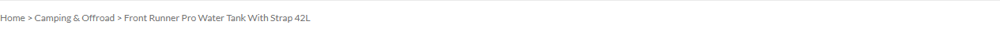
- 4 levels, Home → Vehicle → Category → Product (Vehicle-Specific only): 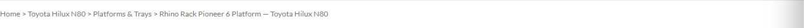

**Note:** the class is `.rrg-crumbs`, not a class containing the literal word "breadcrumb" — a past session grepped for that word, found nothing, and wrongly concluded breadcrumbs didn't exist on the page. Search for `.rrg-crumbs` instead.

---

### 4.3 Main Product Gallery

**Location:** left column of the Hero, beside the Decision Panel, on all 5 templates.

**Purpose:** the primary product photos — shoppers judge fit/finish/scale from these before reading anything else.

**Typography:** no text of its own (image component).

**Region differences:** none.

**Links:** none — thumbnails swap the main image, they don't navigate anywhere.

**States:**
- Location (full page, red arrow): 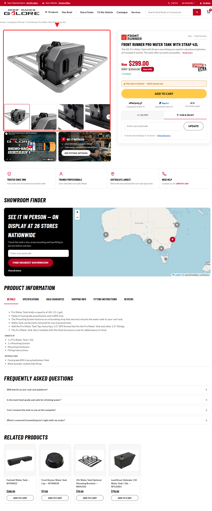
- Detail (big image + horizontal-scroll thumbnail carousel, nav arrows only appear once there are 5+ images): 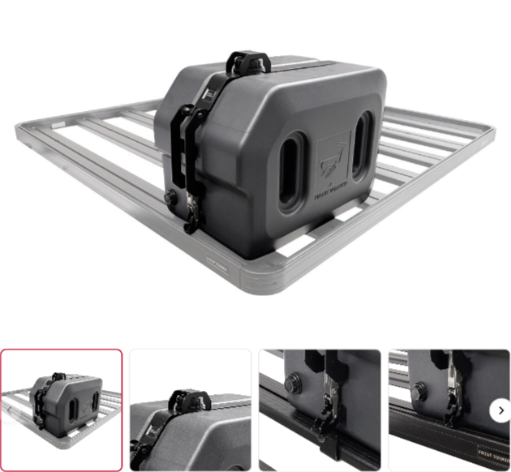

**Notes:** main image is `aspect-ratio:3/2`. Thumbnail strip is a single row (not a wrapping grid) so extra images scroll horizontally instead of pushing the row below it down — this was a deliberate 2026-09-10 fix for products with 5+ photos.

---

### 4.4 Product Video

**Location:** under the Main Product Gallery, paired with Get It Installed (4.5) — on all 5 templates. For SKUs with no real scraped video, the video slot is fully hidden (not shown as a placeholder) and Get It Installed expands to fill the full width in its place (see 4.5's `.no-video` state).

**Purpose:** embedded product video, highest-leverage visual investment per conversion research — shows the product in use, not just static photos.

**Typography:** no text of its own (video/image component).

**Region differences:** none.

**Links:** none — plays in place.

**States:** visible alongside Get It Installed's paired-state screenshot above (4.5) — no separate screenshot, since it's always shown in that same row.

---

### 4.5 Get It Installed CTA

**Location:** paired beside the Product Video (4.4) under the Main Product Gallery, on all 5 templates.

**Purpose:** drives bookings for professional fitting — a secondary conversion action, deliberately subdued so it never competes with the one primary Add to Cart CTA.

**Typography:** heading uses the shared section-heading treatment at a smaller scale for the paired (half-height) state, full shared scale for the no-video full-width state; body/bullet text similarly scales up in the no-video state since it has more room. **CTA button is `.btn-outline`** (white fill, black border/text) — never red or gold, a standing rule (Section 2) since red still pulls the eye even though it isn't the Add to Cart colour.

**Region differences:** none on the 2 trust bullets (confirmed identical across regions). The CTA link itself is a **relative path** (`/roof-rack-installation-and-fitting-costs`), so it resolves correctly per-domain once each region is a real separate Magento store view — no explicit region branching needed.

**Links:** real external link (opens in a new tab, `target="_blank" rel="noopener noreferrer"`) — except on Vehicle-Specific, where the CTA copy/link is fitment-count-aware (see `#fitGallerySection`'s data-driven copy in `PAGE-GLOSSARY.md`): 5+ fitments links in-page to the Fitted Photos Gallery (4.27), 1–4 does the same with different copy, 0 or "no gallery" falls back to the same external fitting-costs link as the other 4 templates.

**States:**
- Paired with video, Fitment Gallery on (16:9, matches the video's height exactly; CTA reads the fitment-count-aware copy, e.g. "We've fitted this 283 times — view the gallery"): 
- Paired with video, Fitment Gallery off (same size; CTA falls back to "See Fitting Options"): 
- No video, Fitment Gallery on (full-width, larger text/icons; same fitment-count-aware copy): 
- No video, Fitment Gallery off (full-width; "See Fitting Options" fallback): 

---

### 4.6 Brand Logo

**Location:** top of the Decision Panel, beside the SKU row — on all 5 templates.

**Purpose:** reinforces the manufacturer's brand at the point of purchase (Rhino Rack, Front Runner, MAXTRAX, Yakima depending on product).

**Typography:** image asset, not text — sized against a bounding box (`max-width:160px;max-height:32px`) rather than a fixed height, so brands with different source aspect ratios render at a similar visual footprint.

**Region differences:** none for RRG-branded products. The UK's own brand skin (4.1) changes the **site** logo in the header (out of scope for this brief), not this per-product manufacturer logo.

**Links:** none (not clickable).

**States:**
- Location (full page, red arrow): 
- Detail, alongside the SKU row (4.7): 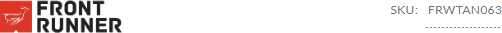

---

### 4.7 Copy-to-clipboard (SKU)

**Location:** the SKU text itself, in the Decision Panel's top row, and every Package Contents row (4.26) on Vehicle-Specific/Grouped-Bundle.

**Purpose:** lets in-store staff or the shopper copy a SKU/part number without a separate button — the text itself is the click target (no icon button, removed as a 2026-09-10 simplification).

**Typography:** standard SKU-row scale (Section 2, 14px), underlined on hover to signal it's clickable; turns green (`--rrg-fits`) with "✓ Copied" feedback on click.

**Region differences:** none.

**Links:** not a navigation link — a `navigator.clipboard.writeText()` action.

**States:**  (same shot as 4.6 — they sit in the same row)

---

### 4.8 Short description "Read more"

**Location:** Decision Panel, directly under the title — all 5 templates.

**Purpose:** the real Rackit short-description field, clamped so it never pushes the price/CTA further down the page than necessary, with a link to read the rest without losing place on the page.

**Typography:** 14px desktop / 16px mobile (Section 2 floor bump), `#555`, 2-line `-webkit-line-clamp`.

**Region differences:** none.

**Links:** "Read more"/"See less" is an animated in-place expand/collapse (`toggleShortDesc()`), not a jump to the Details tab — clicking "Read more" reveals the full text in place with a "See less" link to re-collapse it back to the 2-line clamp.

**States:**
- Collapsed (2-line clamp + "Read more"): 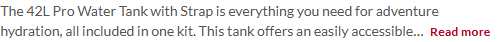
- Expanded (full text + "See less"): 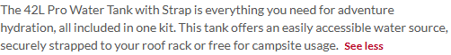

---

### 4.9 Decision Panel star-rating badge (custom-built)

**Name:** Decision Panel star-rating badge

**Location:** directly under the Short description line, above the Fitment Status widget/price — on all 5 templates.

**Purpose:** gives shoppers a quick, at-a-glance star rating right next to the price, without having to scroll down and open the Reviews tab. Reviews near the top of the page lift conversion (see `spec.md` Section 0.1.3), same reasoning as the Reviews tab (4.31).

**States:**
- **Location on the page** (red arrow shows where it sits, shown here with example review data so the badge is visible):
  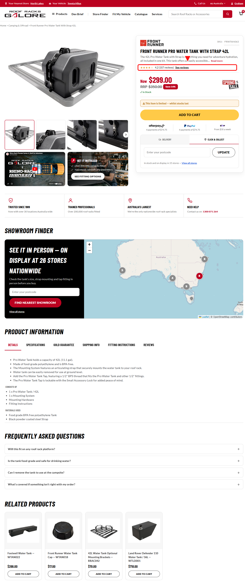
- **Current default state** — hidden, because none of this prototype's demo SKUs have real reviews yet (same underlying data gap as the Reviews tab):
  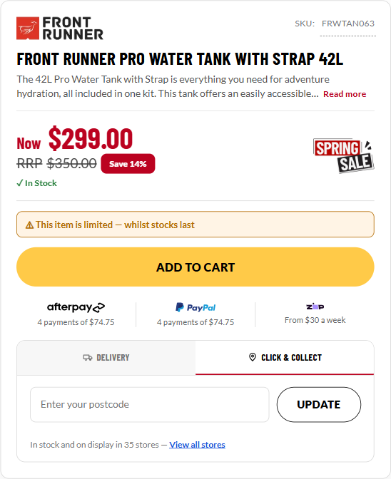
- **Once a product has real reviews** (illustrative — real markup and styling, mocked numbers to show the populated layout):
  

#### Why this is custom-built, not a REVIEWS.io widget

REVIEWS.io's product library doesn't include a small standalone "rating badge" widget for this compact above-the-fold placement — their smallest widget is still the full Polaris review-list widget used in the Reviews tab (4.31). So this badge is hand-built, but it pulls from the **same real REVIEWS.io data** the Polaris widget itself uses: the identical `api.reviews.io/timeline/data` endpoint, confirmed via network inspection to be the actual call the Polaris widget makes internally, and confirmed CORS-open (safe to call directly from any origin — it's designed to be embedded on arbitrary merchant storefronts).

#### HTML markup

Add `data-review-sku` (same semicolon-separated SKU list as the Reviews tab, 4.31) to the existing star-rating strip, and wrap the two dynamic pieces (stars, text) so the script below can target them:

```html
<div class="reviews-strip" data-review-sku="FRWTAN063">
  <span class="stars" data-stars>★★★★★</span>
  <span data-review-text>4.5+</span>
  <a href="#reviewsTab" data-jump-tab="reviewsTab">See reviews</a>
</div>
```

(`data-jump-tab` is this prototype's own mechanism for making the "See reviews" link switch to the Reviews tab and scroll to it — port the *intent*, not necessarily this exact attribute, into whatever tab-switching approach the Magento template uses.)

#### CSS

```css
.stars{color:#E8A83C;letter-spacing:1px;font-size:16px;}
.stars .stars-empty{opacity:.35;}
```

#### JavaScript

```js
// Calls the same api.reviews.io/timeline/data endpoint the REVIEWS.io Polaris widget uses
// internally (per_page=1 since only the review-count/average summary is needed, not the
// review list itself). Deliberately does NOT fall back to the store's company-wide rating
// when a product has zero reviews — on an individual product page, showing a company-wide
// figure next to one specific product would read as that product's own rating and mislead
// the customer, even though the number itself is real. No product reviews yet = hide the
// whole badge, same as a fetch failure or the account having no data at all.
function initReviewSummary(root = document) {
  root.querySelectorAll('.reviews-strip[data-review-sku]').forEach(async strip => {
    const sku = strip.dataset.reviewSku;
    const starsEl = strip.querySelector('[data-stars]');
    const textEl = strip.querySelector('[data-review-text]');
    if (!starsEl || !textEl) return;
    try {
      const url = `https://api.reviews.io/timeline/data?type=product_review&store=roof-racks-galore&per_page=1&sku=${encodeURIComponent(sku)}&lang=en`;
      const res = await fetch(url);
      const data = await res.json();
      const avg = parseFloat(data.stats?.average_rating || '0');
      const count = data.stats?.review_count || 0;
      if (!count) { strip.hidden = true; return; }
      const filled = Math.round(avg);
      starsEl.innerHTML = '★'.repeat(filled) + `<span class="stars-empty">${'★'.repeat(5 - filled)}</span>`;
      textEl.textContent = `${avg.toFixed(1)} (${count.toLocaleString()} reviews)`;
    } catch (e) {
      strip.hidden = true;
    }
  });
}

// Call once on page load, e.g.:
document.addEventListener('DOMContentLoaded', () => initReviewSummary());
```

Same SKU-list table as 4.31 (Reviews tab) applies here — use the identical `data-review-sku` value as that template's `product_review.sku`.

#### Behavior summary

| Condition | Result |
|---|---|
| SKU has ≥1 real product review | Shows real rounded star rating + `"{avg} ({count} reviews)"`, links to Reviews tab |
| SKU has 0 real product reviews | Badge is hidden entirely (no fallback to company-wide rating — see rationale above) |
| API call fails (network error, etc.) | Badge is hidden entirely |

#### Before this leaves prototype stage

- None of this prototype's demo SKUs have real REVIEWS.io reviews yet, so this shows its "no data" state on every template. This is expected and will resolve itself once real reviews exist against real SKUs — nothing to fix.
- Confirm with REVIEWS.io / Tim whether the `roof-racks-galore` store slug and API usage shown here (direct `fetch` calls to `api.reviews.io` from custom code, not just the vendor's own widget script) fall within their terms of service for this kind of lightweight custom integration — it's a public, unauthenticated, CORS-open endpoint, but it's not an officially documented/supported API surface the way the Polaris widget itself is.
- Generate the SKU list dynamically from the real product/configurable-child data in Magento rather than hardcoding it, unlike this static prototype.

---

### 4.10 Fitment Status widget

**Location:** Decision Panel, directly below the title/short description — **Vehicle-Specific only**. Also appears in condensed form in the Sticky Mobile Bar and Persistent Bar (4.34–4.35).

**Purpose:** tells the shopper immediately whether this exact product fits their saved vehicle — the single most important piece of information on a fitment-driven product page, so it sits as high as possible.

**Typography:** heading is a bold black `<strong>` within the card, not a real heading tag; body text is standard Lato body copy. Card background/accent colour comes from the state tokens in Section 2 (`--rrg-fits`/`--rrg-unknown`/`--rrg-nofit`).

**Region differences:** none — this is driven by the shopper's saved vehicle, not their region.

**Links:** none directly, but its "doesn't fit" copy names the customer's saved vehicle in full (make/model/generation, body style, roof type, year) rather than a generic message.

**Add to Cart must stay identical in every fitment state** — same "Add To Cart" text, same primary button style, always enabled/clickable — regardless of whether the fitment verdict is Fits, Doesn't Fit, or Confirm Your Vehicle. Purchase must never hard-stop or visually change based on fitment status; only the fitment card itself (and the Rack Fit Guarantee badge, 4.11) communicates the verdict. This applies to the main Decision Panel button and both condensed instances (Sticky Mobile Bar, Persistent Bar).

**States** (driven by the Demo State Panel's Session Vehicle picker — in Magento this would be the customer's real saved vehicle):
- Location (full page, red arrow): 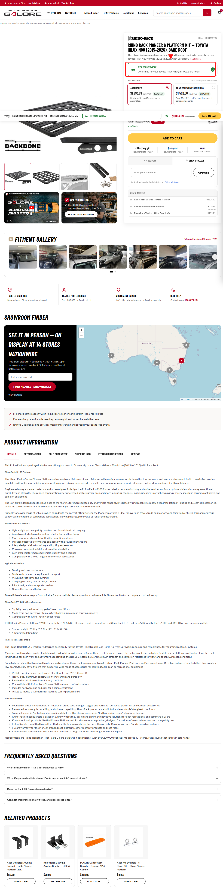
- **Fits your vehicle** (green) — confirmed match, Rack Fit Guarantee badge visible (see 4.11): 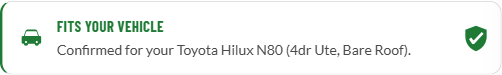
- **Doesn't fit** (red) — Rack Fit Guarantee badge auto-hidden: 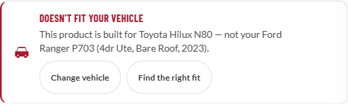
- **Confirm your vehicle** (amber) — no vehicle saved yet, shown here with the Product Notes block (4.12) also visible below it: 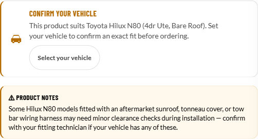

---

### 4.11 Rack Fit Guarantee badge

**Location:** right-aligned, vertically centred against the Fitment Status card (Decision Panel), plus an icon-only instance each in the Sticky Mobile Bar and Persistent Bar — **Vehicle-Specific only**.

**Purpose:** reassures the shopper their fitment purchase is backed by a real guarantee, right at the point of the fitment decision.

**Typography:** icon only, no visible text — the caption ("Peace of mind with our FREE Nationwide Rack Guarantee") lives in a `title` tooltip, not on-page text (client's explicit call — visible text read as too much). Hand-drawn placeholder vector icon (shield + checkmark), swappable for real client-approved artwork later; colour is tied to the `--rrg-fits` green token, the same token the Fitment Status card itself uses for a confirmed match.

**Region differences:** none — the badge's colour is tied to the fitment-state token (`--rrg-fits`), not the region skin, so it doesn't vary by region.

**Links:** clicking the badge (all 3 instances) jumps to and opens the Gold Guarantee tab, same tab-jump pattern as the star-rating badge (`data-jump-tab`/`initTabJumpLinks()`, see 4.30).

**States:** visible only when Fitment Status is a **confirmed match** — auto-hidden for "Confirm your vehicle," "Doesn't fit," and no-vehicle-set (see 4.10's 3 screenshots — the badge is present in `fitment-status-fits.png` and correctly absent from the other two).

---

### 4.12 Product Notes

**Location:** Decision Panel, directly below the Fitment Status widget, above the Variant Picker — **Vehicle-Specific only**. On-page name is "Product Notes"; the underlying Rackit field is named "Important Vehicle Fit Notes" (the name this block originally carried, before it was renamed on-page for clarity).

**Purpose:** surfaces vehicle-specific caveats (e.g. aftermarket parts that may need clearance checks) that don't belong in the main fitment verdict but are still worth flagging before purchase.

**Typography:** amber-accented block; all warning-box text (heading, body, icon) is **black**, not yellow/orange — a legibility fix applied to every warning box on the page (this block + the Special Order banner, 4.17).

**Region differences:** none.

**Links:** none.

**Data Source:** Rackit — field: "Important Vehicle Fit Notes."

**States:** starts hidden (no real per-vehicle content source yet — placeholder copy, flagged for real client content). Shown here toggled on: 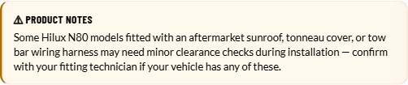

---

### 4.13 Variant Picker

**Location:** Decision Panel, above the price/stock line — **Config-Variant & Vehicle-Specific only**.

**Purpose:** lets the shopper choose between two configurations of the same product (e.g. Assembled vs. Flat Pack). Each configuration is its own separate product listing/URL; selecting a card is real navigation to that sibling SKU's own page (this prototype simulates that as an in-page swap of price/gallery/video/specs/fitting instructions for demo convenience, not the real production behaviour).

**Typography:** comparison cards use standard body/label sizing (Section 2); no bespoke type.

**Region differences:** none — currency symbol on the price inside each card follows the page-wide region currency swap (4.1, UK Brand Skin & Currency), nothing else.

**Links:** in this prototype, cards are selectable (in-page swap), not navigable. In production, each card should link to/navigate to that variant's own PDP.

**States:** 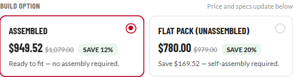

**Notes:** a "Paid Fitted Option" (4.21) can render as a third card in this same picker on Vehicle-Specific — that's a separate, demo-preview-only widget layered on top, not part of the core picker.

---

### 4.14 Colour/Swatch Grid

**Location:** Decision Panel, in the same position the Variant Picker occupies on other templates — **Sibling-Color only**.

**Purpose:** lets the shopper pick a colour, each one its own real SKU (e.g. MAXTRAX MKII's 13 colours). Each colour is its own separate product listing/URL; selecting a swatch is real navigation to that colour's own page (this prototype simulates that as an in-page swap of gallery/price/stock/SKU/Colour spec for demo convenience, not the real production behaviour).

**Typography:** no text inside the tiles themselves (colour swatches); selected-state label uses standard label sizing.

**Region differences:** none.

**Links:** in this prototype, tiles are selectable (in-page swap), not navigable. In production, each tile should link to/navigate to that colour's own PDP.

**States:** 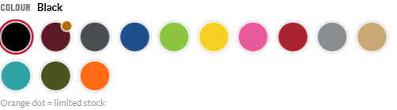

**Notes:** tiles are 48px minimum to clear Google's tap-target guideline at every width.

---

### 4.15 Price Block

**Location:** Decision Panel, directly below the title/short description — all 5 templates.

**Purpose:** the price + stock-status area (`.price-block`) — redesigned 2026-09-12 off a client-supplied Figma reference to a stacked two-line layout that reads clearly at a glance: "Now" price on top, struck-through "RRP" + a Save-percent badge below.

**Typography:** `.price-line-now` ("Now" label + `.price-now`, both red when on sale, `line-height:1`) above `.price-line-was` ("RRP" label + struck-through `.price-was` + `.badge-save`, both the label and price sharing identical dark-grey `#434343`/Lato-400 styling so the whole "RRP $X" reads as one continuous struck-through phrase — the RRP price is sized to match `.badge-save`'s own rendered height, and the two are centre-aligned). Off-sale, both labels and the whole RRP line disappear entirely, leaving a plain black price (red is reserved for the sale contrast, not every regular price).

**Region differences:** none beyond the standard currency/price-token inheritance already covered in 4.1 — the redesign is purely a layout change, region cascade untouched.

**Links:** none.

**States:**
- On-sale (desktop): 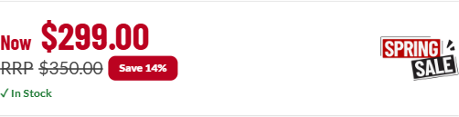
- Off-sale (desktop, plain black price, no labels): 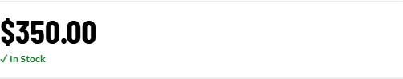
- Mobile, on-sale — price centred as a unit; the Sale Tag moves off the price block entirely onto the top-right corner of the main gallery image (a corner ribbon reads better once price content no longer runs the block's full width): 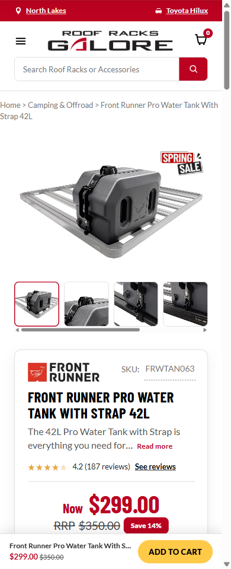
- The condensed Sticky Mobile Bar (4.34) / Persistent Bar (4.35) price is adapted, not the full stacked treatment — same red/dark-grey colour language on the existing single-line price, no labels/badge (no room).

---

### 4.16 Sale Tag

**Location:** on desktop (≥901px), an absolute-positioned corner ribbon on the Decision Panel's Price Block (4.15), vertically centred against the whole block. On mobile (≤900px), a second instance sits over the top-right corner of the Main Product Gallery's main image instead — the Price Block instance is hidden entirely on mobile, not repositioned, since a fixed corner reads better once the price content itself centres on mobile and no longer runs the block's full width. All 5 templates.

**Purpose:** flags a product currently on sale, without competing with the price for space.

**Typography:** image asset (client-supplied graphic), not text.

**Region differences:** none — tracks whatever currency/price is showing, no separate region logic.

**Links:** none.

**States:** both instances toggle together off one shared signal (`syncSaleTag()` updates every `.sale-tag` on the page at once), so Titanium Grey (sibling-color's no-discount swatch), the Demo State Panel's on/off toggle, and variant switches all stay correct for whichever instance is currently visible — see 4.15's screenshots (desktop shows the price-block instance; the mobile shot shows the gallery instance).

---

### 4.17 Special Order banner

**Location:** above Add to Cart in the Decision Panel — all 5 templates, one of 5 mutually-exclusive Stock Status states (In Stock / Low Stock / Not in Stock / Special Order / Discontinued).

**Purpose:** tells the shopper this item needs to be specially ordered in, with an honest lead-time estimate — informational, never blocks the purchase.

**Typography:** amber accent (`--rrg-unknown`); all warning-box text is black (same 2026-09-11 legibility fix as Product Notes, 4.12).

**Region differences:** none confirmed.

**Links:** none.

**States:** 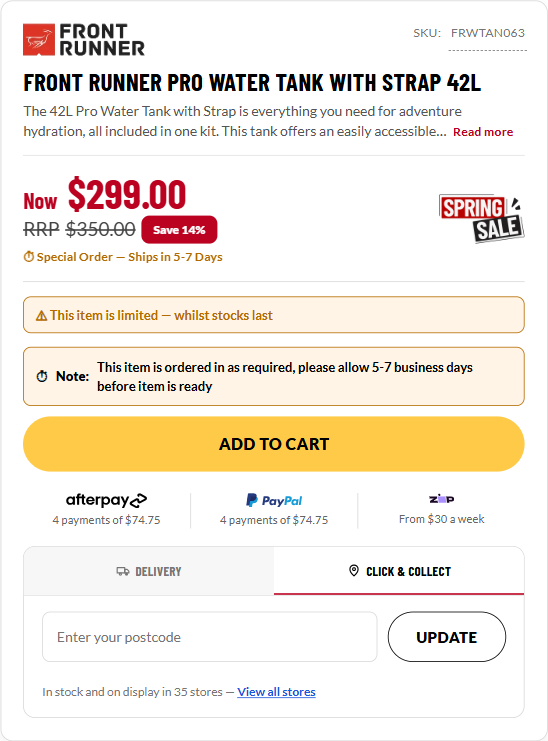 — stock-status line reads "⏱ Special Order — Ships in 5-7 Days," Add to Cart stays enabled.

---

### 4.18 Discontinued state

**Location:** Decision Panel (replaces the CTA entirely) + a new full-width section below the Hero row — all 5 templates, the 5th Stock Status state.

**Purpose:** clearly communicates a product can no longer be purchased, while still crediting its last real price and offering real, curated alternatives instead of a dead end.

**Typography:** struck-through price reuses the existing "was" price style (grey strikethrough); banner text follows the same black-on-warning-colour rule as 4.12/4.17, but uses the red/"not available" token (`--rrg-nofit`) rather than amber, since this is a harder stop than Special Order.

**Region differences:** none — the struck-through price just inherits whatever currency formatter is already active.

**Links:** none on the banner itself; the alternatives section reuses the Related Products card component (4.33) — same intended click-through behaviour applies (whole card → that product's own PDP, except Add to Cart), not yet built for the same reason (no real per-product PDP exists in this prototype yet).

**States:**
- Decision Panel — price struck through, CTA replaced by a banner, stock-status line hidden entirely (the banner already states the product is discontinued, so the line doesn't duplicate that message): 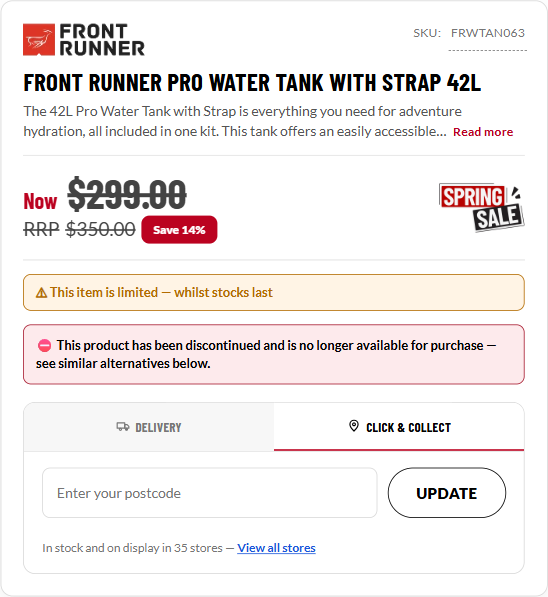
- Alternatives section — 3 real, curated, currently-live replacement products: 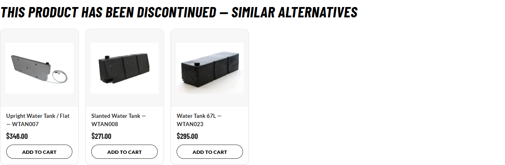

---

### 4.19 Compatibility / Cart-Conflict banner

**Location:** above Add to Cart in the Decision Panel — all 5 templates.

**Purpose:** warns the shopper if something already in their cart is incompatible with this product — specifically a **platform-vs-accessory** relationship (a roof rack platform already in the cart flagged against an accessory being viewed, or vice versa). In a real Magento build this would be driven by a genuine per-product compatibility rule the merchandising team sets; the prototype just needs to surface the message correctly.

**Typography:** amber accent, same visual tier as Special Order (4.17) — informational, never disables the CTA.

**Region differences:** none.

**Links:** none.

**States:** shown here alongside the Ex-Demo/B-Stock CTA (4.20), both stacking correctly in the same panel: 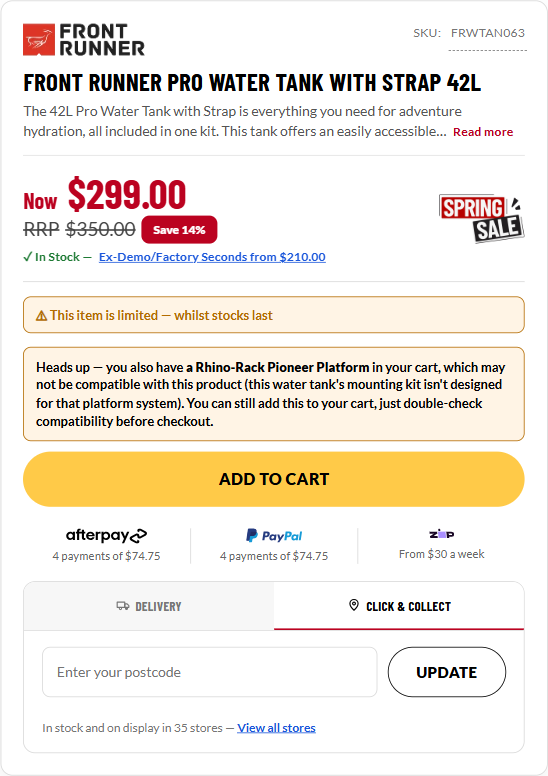

---

### 4.20 Ex-Demo / B-Stock CTA + slide-in

**Location:** inline text appended to the stock-status line itself ("In Stock — Ex-Demo/Factory Seconds from $X," the price portion a clickable link) — all 5 templates. Clicking it opens a right-edge slide-in drawer (same mechanic as the Store Slide-out, 4.24).

**Purpose:** surfaces discounted ex-demo/returned/factory-second stock as an inline upsell-down option, without a separate competing button.

**Typography:** inline link uses standard body-copy styling with a link colour, not a button.

**Region differences:** **UK calls this "Graded"** instead of "Ex-Demo/Factory Seconds" (drawer heading + inline stock-line text only — the 3 individual option tags are unchanged in every region). Option-card store names are real, region-aware (AU cycles real store names, NZ/UK show their single region store).

**Links:** not a navigation link — opens the slide-in drawer in place.

**States:** 3 discount options (Ex-Demo/Sellable Return/Factory Second), computed live off whatever price is currently showing — the 3 tags are identical in every region, only the drawer heading and inline stock-line text change:
- AU/NZ wording ("Ex-Demo & Factory Seconds"): 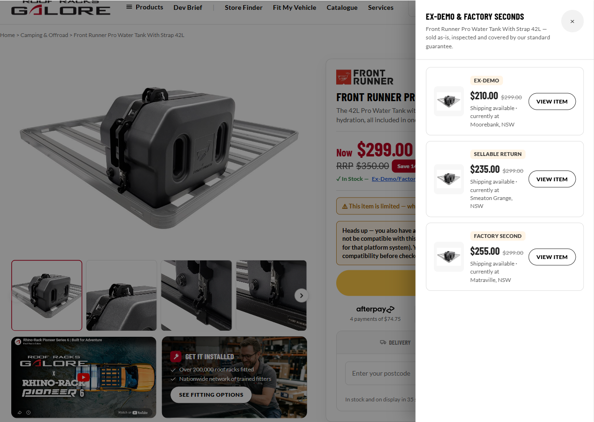
- UK wording ("Graded Stock"): 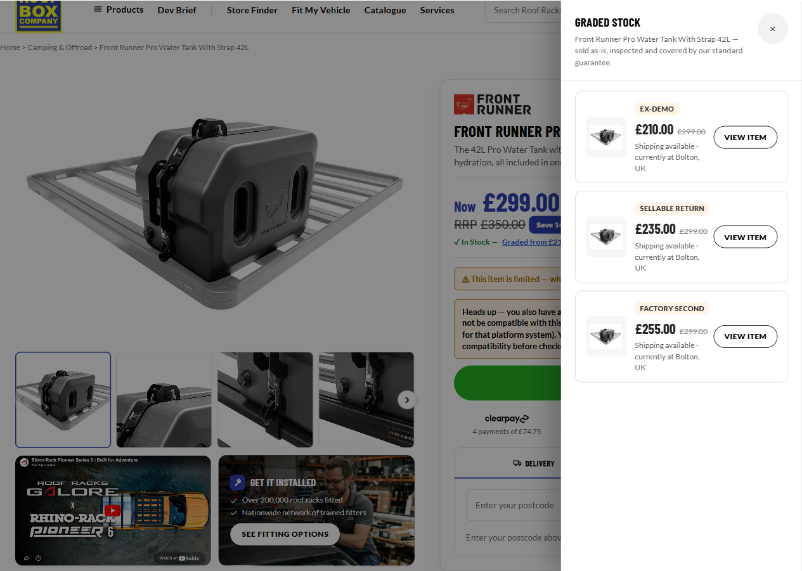

---

### 4.21 Paid "Fitted" Option

**Demo-preview-only — not a real, decided feature.** Either a third Variant Picker card or a checkbox above Add to Cart, offering paid professional fitting as an add-on — **Config-Variant & Vehicle-Specific only**. No production data or pricing model backs this yet; it exists purely so stakeholders can preview both interaction patterns (Mode 1: third card: Mode 2: upsell checkbox) before a real decision is made. Not screenshotted here — confirm which interaction pattern (if either) is wanted before treating this as a build spec.

---

### 4.22 Payment-Plan Badges

**Location:** Decision Panel, directly under Add to Cart, on all 5 templates.

**Purpose:** surfaces buy-now-pay-later options at the point of purchase decision — real logos, real live-computed instalment amounts (not static text).

**Typography:** provider logos are image assets (real SVGs); instalment text is small label-scale copy, no bespoke sizing.

**Region differences (4.1, UK payment provider differences):** AU shows Afterpay + PayPal + Zip (all "Pay in 4" except Zip's own weekly copy). NZ drops Zip (2 badges, still centred with no gap). **UK is a full 3-provider swap, not a hide/show:** Clearpay (Afterpay's UK brand, "Pay in 4") + PayPal ("Pay in 3," not 4 — different math from AU/NZ) + Klarna ("Pay in 3" over 3 months, a distinct provider from PayPal's own Pay-in-3, kept as its own badge).

**Links:** none — informational only, no provider deep-links.

**States:**
- Location (full page, red arrow): 
- AU default (Afterpay/PayPal/Zip): 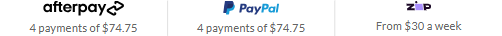
- UK's 3-provider swap: see 4.1's UK close-up (`region-uk-header-closeup.png`), which shows this widget in its UK state.

---

### 4.23 Delivery / Click & Collect widget

**Location:** Decision Panel, directly under Add to Cart / payment badges, on all 5 templates. A **second, identical copy** also sits at the top of the Shipping Info tab (4.30, Tabs widget) — both share one live postcode field (typing in either updates both).

**Purpose:** lets the shopper check delivery cost or store pickup availability without leaving the page.

**Typography:** tab labels use button-style uppercase text; body copy is standard.

**Region differences (4.1 cascade):** default active tab is **Click & Collect** for AU, **Delivery** for NZ/UK (both single-store regions); the "View all stores" link and postcode-driven results are **AU-only** (hidden for NZ/UK, since the real 35-store list has no NZ/UK data). NZ/UK's summary line reads "On display at the ___ Store" only when that single store's own on-display flag is set, otherwise "In stock at the ___ Store" — it's a real per-store check, not an unconditional claim (see 4.25, On Display pill).

**Links:** "View all stores" opens the Store Slide-out (4.24) — real interaction, not a placeholder.

**States:**
- Location (full page, red arrow): 
- Default, no postcode entered yet: 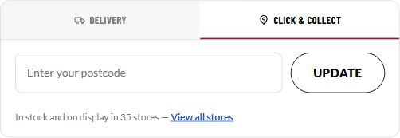
- Postcode entered (AU), Delivery tab — Standard/Express Freight rates shown: 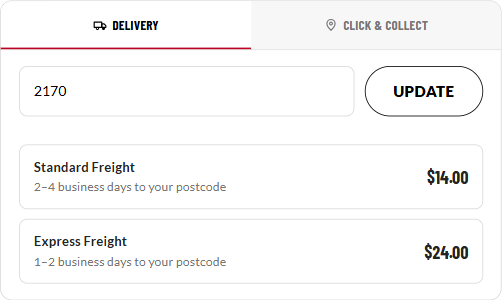
- Postcode entered (AU), Click & Collect tab — store results + "View all stores": 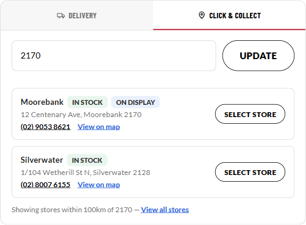
- NZ/UK (single-store region) — fixed store line, no postcode search UI: 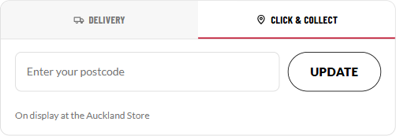

---

### 4.24 Store Slide-out

**Location:** right-edge drawer, opened by "View all stores" from either the Delivery/Click & Collect widget (all 5 templates) or the Showroom Finder widget.

**Purpose:** shows the shopper the full real store network so they can find one near them, grouped so the closest stores are easy to find without scrolling the whole list.

**Typography:** standard body/label scale; store names use a slightly heavier weight than the address/phone lines beneath them.

**Region differences:** AU-only — the trigger itself is hidden for NZ/UK (4.1 cascade), since the real 35-store data has no NZ/UK equivalent.

**Links:** each store row has a real "View on map" link (Google Maps) and a real `tel:` phone link.

**States:**
- Postcode entered (NSW, 2170) — NSW promoted to a "Within 100km" group at the top, open by default, On Display pill visible on Moorebank: 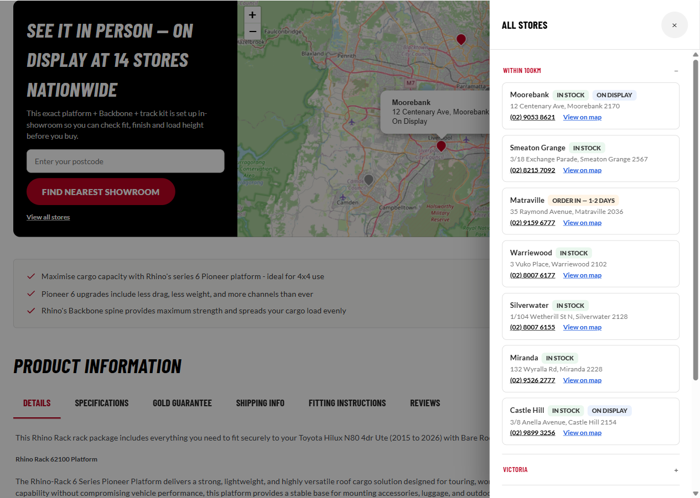
- No postcode — every state renders as its own open `<details>` group (native accordion, no JS), same visual pattern as the FAQ accordion (4.32): 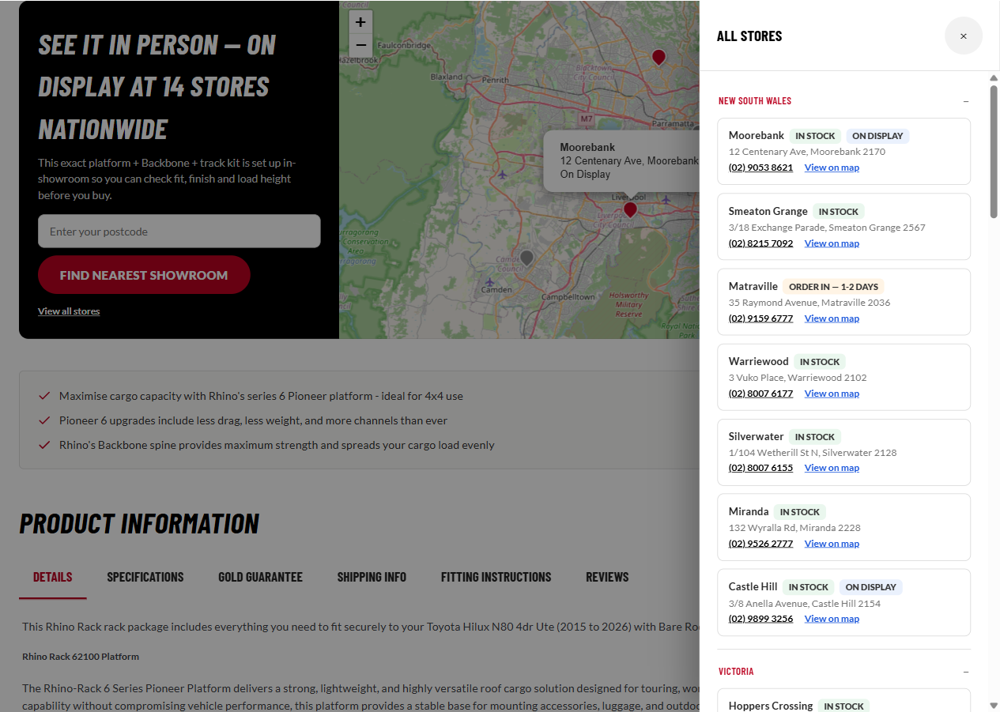

---

### 4.25 On Display pill

**Location:** on individual store rows, in both the Store Slide-out (4.24) and the Delivery/Click & Collect widget's inline rows — wherever that specific store is flagged as having this product on display.

**Purpose:** a per-store fact ("this exact item is set up on display at this store"), distinct from the store's own In Stock/Order In status.

**Typography:** small pill/badge text, same size as the adjacent In Stock pill.

**Region differences:** the on-display concept itself isn't AU-only — it's the components it currently lives in (4.23's store rows, 4.24) that are AU-only. NZ/UK's single-store Click & Collect line reads "On display at the ___ Store" (or "In stock at the ___ Store" when not flagged on-display) using the same underlying flag, just without a per-store pill UI.

**Links:** none (not clickable).

**States:** visible on Moorebank in the Store Slide-out screenshot above (4.24) — blue/gold colour token (`--rrg-display`), distinct from the green "In Stock" pill next to it.

---

### 4.26 Package Contents / "What's Included"

**Location:** Decision Panel, the last item in the panel — below the Delivery/Click & Collect widget (4.23) — **Vehicle-Specific & Grouped-Bundle only**.

**Purpose:** breaks down exactly what physical components ship in the box for a multi-part kit or bundle.

**Typography:** standard body/label scale; quantity leads each row (e.g. "1x Rhino-Rack 6 Series Pioneer Platform"), not trailing.

**Region differences:** none.

**Links:** each component name (`.pi-name`) is currently an `href="#"` **placeholder link** — doesn't resolve to a real product page yet. **Intended production behaviour:** each component name should link to that component's own PDP, same as any other real Magento product reference on this page. SKU text is a real click-to-copy target (4.7), not a link.

**States:**
- Vehicle-Specific (placeholder ×1 quantities — no real per-component quantity data exists yet): 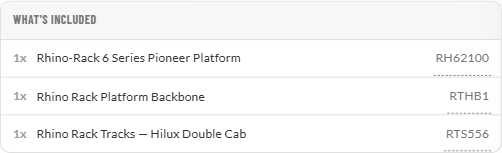
- Grouped-Bundle (**real quantities**, taken verbatim from the live site's own "Bundle Includes" list): 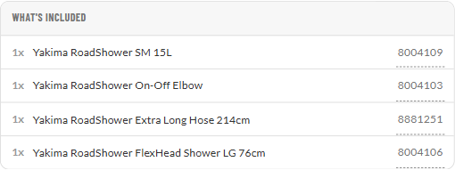

---

### 4.27 Fitted Photos Gallery

**Location:** full-width section directly above the Trust Row by default (or nested under the Main Product Gallery in the left column, via a Demo State Panel placement toggle) — **Vehicle-Specific only**. See `PAGE-GLOSSARY.md`'s naming-clash note — this is *not* the Main Product Gallery.

**Purpose:** real customer installation photos ("Fitment Gallery" panel) — builds confidence by showing the product actually fitted to the shopper's vehicle model, not just studio photos.

**Typography:** heading uses the shared section-heading style (Section 2) sized to match the icon badge's cap-height; badge is a 26px icon.

**Region differences:** none — not part of the Region Selector cascade.

**Links:** "View All In-store Fitments (N)" opens a real two-view slide-out drawer (not an in-page expand) — a photo grid, then a per-fitment detail view when a photo is clicked. The CTA copy itself is fitment-count-aware, driven by Get It Installed (4.5).

**States:**
- Location (full page, red arrow): 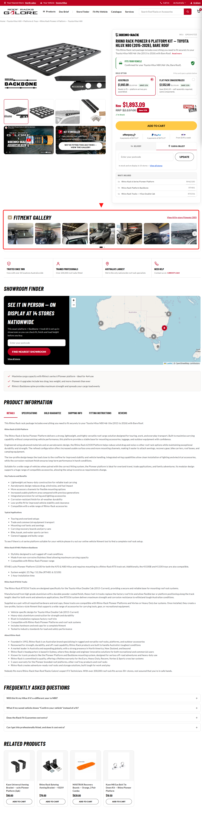
- Detail, full-width/non-red default (7 photos visible; nested placement shows 4): 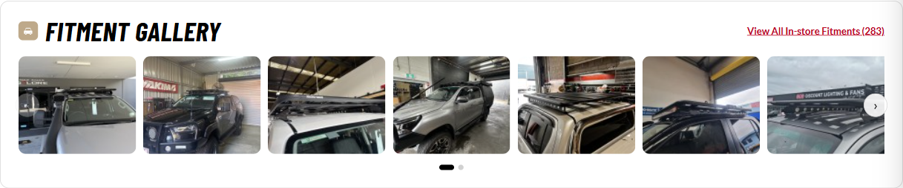
- Slide-out drawer, grid view (all 283 photos, opened via "View All In-store Fitments"): 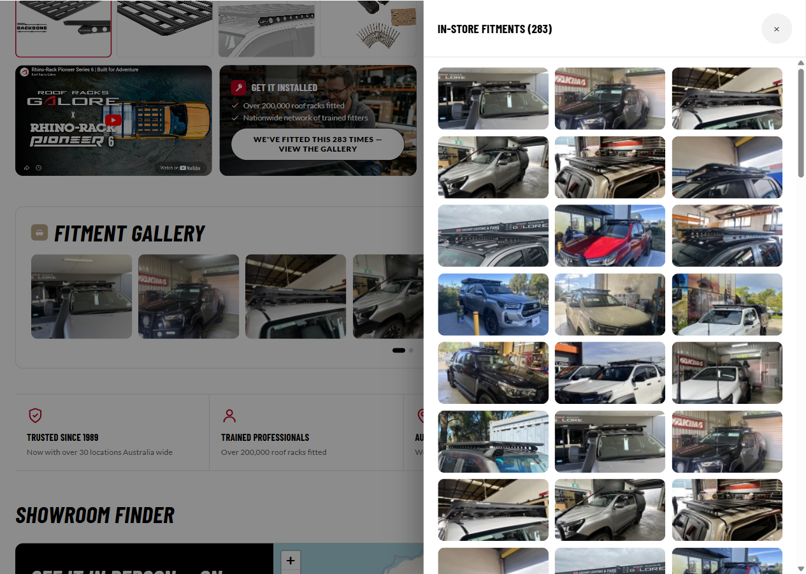
- Slide-out drawer, detail view (clicking any grid photo opens this: "Browse Fitment N of 283 / Fit #" bar, Prev/Next, main photo + 4 thumbnails, the page's own real product title + vehicle line, and a live Rack Components list read from the page's own Package Contents rows): 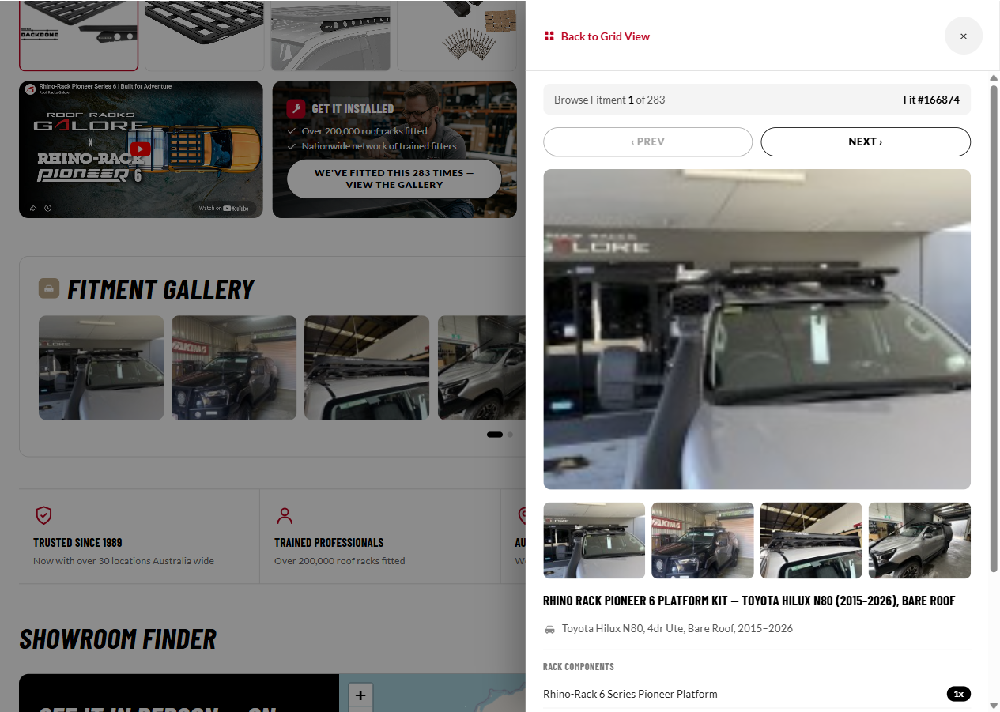

**Notes:** a "Red background (live-site style)" toggle exists for stakeholder conversations expecting the old red-background treatment — default is non-red, per client direction. Every fitment in the detail view shows the *same* real vehicle/components (no fabricated variety across vehicles) — the components list is read live from the page's own What's Included rows so the two can't drift apart; the detail view's "other angle" thumbnails reuse other real photos from the same 16-photo set rather than inventing new ones.

---

### 4.28 Trust Row

**Location:** full-width 4-column strip directly below the Hero, above the Showroom Finder section — all 5 templates. 2-column grid on mobile (≤900px).

**Purpose:** quick-scan trust signals (tenure, expertise, network size, contact) right below the fold, reinforcing credibility before the shopper scrolls further.

**Typography:** 26px icon (`--rrg-red`); label is `h4`, 16px bold; body copy 14px, `#666` (desktop and mobile — no separate floor bump needed since the 2026-09-16 sitewide pass). The "Need Help" tile's phone number is bold red, not the default grey.

**Region differences:** 2 of the 4 tiles are region-aware, swapped by `applyRegion()` via `REGION_TRUST_COPY`: "Trusted Since 1989" (`[data-trust="founded"]`) and "Australia's Largest" (`[data-trust="network"]`) — NZ/UK show placeholder region-appropriate wording (e.g. NZ: "Visit In Person" / "Check it out at our Auckland showroom"), flagged as needing real client-approved copy before production. The "Need Help" tile's phone number + `tel:` link is separately region-aware via `REGION_PHONE` (AU `1300 071 264` / NZ `09 481 1910` / UK `01204 899778`) — handled as its own pass since it nests a link inside the `<p>`, unlike the other two tiles' plain-text swap. "Trained Professionals" is not region-aware — identical copy everywhere.

**Links:** only the "Need Help" tile's phone number is a real link (`tel:`); the other 3 tiles are plain text, no links.

**States:** single static layout, content varies by region only (see 4.1 for the full AU/NZ/UK region screenshots): 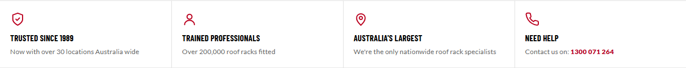

---

### 4.29 Showroom Finder interactive map

> 📷 Screenshots below are real captures, taken in the final screenshot pass, same as the rest of this document.

**Name:** Showroom Finder map (`#showroomMap`)

**Location:** inside the black "Showroom Finder" block, below the hero and Trust Row, on all 5 templates. The block splits into two columns on desktop (postcode search on the left, map on the right, roughly a third/two-thirds split) and stacks on mobile.

**Purpose:** shows shoppers the real size of RRG's store network at a glance and, more importantly, which of those stores currently have this exact product set up on display so they can check fit/finish in person before buying. A map with all 35 real stores (not just the 2 nearest) is deliberate — it communicates "we're a large nationwide network," not a small chain, even for stores that don't have this specific item on display.

**States:**
- **Location on the page, default zoomed-out view** (red arrow shows where it sits):
  
- **Zoomed in — pins split apart, popup open on a red (on-display) pin**:
  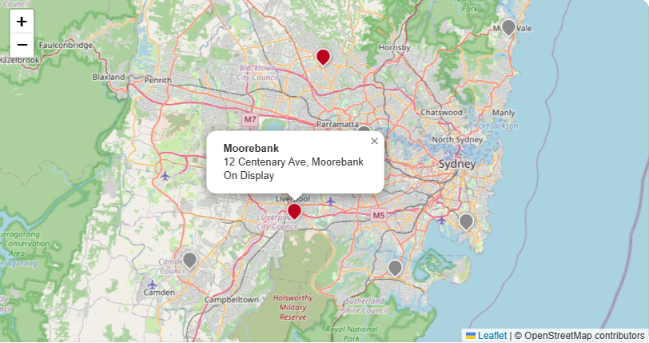

Built with Leaflet + OpenStreetMap, rolled out to all 5 templates, with clustering, colour-coded pins, and a zoomed-out default view.

#### Why this is custom-built, not a vendor widget

There's no off-the-shelf "store locator" SaaS widget in use here — this is plain Leaflet (a free, open-source mapping library, no API key) plus OpenStreetMap tiles (free) plus one plugin, Leaflet.markercluster, for the pin-grouping behaviour. All three are loaded via CDN `<script>`/`<link>` tags; the logic that plots pins, colours them, and sets the default view is hand-written in `shared.js` and needs to be ported into the Magento template's own JS, not copy-pasted verbatim (it depends on this prototype's shared store-data array).

#### CDN tags (copy-paste, goes in `<head>`)

```html
<link rel="stylesheet" href="https://unpkg.com/leaflet@1.9.4/dist/leaflet.css">
<script src="https://unpkg.com/leaflet@1.9.4/dist/leaflet.js" defer></script>
<link rel="stylesheet" href="https://unpkg.com/leaflet.markercluster@1.5.3/dist/MarkerCluster.css">
<link rel="stylesheet" href="https://unpkg.com/leaflet.markercluster@1.5.3/dist/MarkerCluster.Default.css">
<script src="https://unpkg.com/leaflet.markercluster@1.5.3/dist/leaflet.markercluster.js" defer></script>
```

#### Store data needed

Every store needs a `lat`/`lng` in addition to the name/address/phone already used elsewhere on the page (Click & Collect widget, store slide-out). In this prototype that's `RRG_STORE_NETWORK` in `shared.js` — in Magento, whatever the real store/location data source is (a CMS store-locator table, a custom attribute set, etc.) needs to carry real geocoded coordinates for this to work. **This prototype's coordinates are demo-precision only** — approximate suburb-centre points, not geocoded from the real street addresses — so don't carry them over as-is; geocode the real addresses when this is built for real.

Separately, whatever marks a store as having this specific product **on display** (a boolean per store, per product — in this prototype, `ON_DISPLAY_STORES`, a flat placeholder list, not per-product) needs a real data source before this leaves prototype stage. See `spec.md` Section 10's scope note: the actual backend trigger for a genuine on-display flag is being handled separately (Rackety bin-location work), out of this project's scope — this page only needs to *read* that flag once it exists.

#### JavaScript — plotting the pins

```js
function rrgPinIcon(onDisplay) {
  return L.divIcon({
    className: `rrg-map-pin${onDisplay ? ' on-display' : ''}`,
    html: '<span></span>',
    iconSize: [22, 22],
    iconAnchor: [11, 22],
    popupAnchor: [0, -20]
  });
}

function rrgClusterIcon(cluster) {
  const markers = cluster.getAllChildMarkers();
  const hasDisplay = markers.some(m => m.options.rrgOnDisplay);
  return L.divIcon({
    className: `rrg-map-cluster${hasDisplay ? ' on-display' : ''}`,
    html: `<span>${cluster.getChildCount()}</span>`,
    iconSize: [36, 36]
  });
}

const map = L.map(mapEl);
L.tileLayer('https://{s}.tile.openstreetmap.org/{z}/{x}/{y}.png', {
  attribution: '&copy; OpenStreetMap contributors',
  maxZoom: 18
}).addTo(map);

const clusterGroup = L.markerClusterGroup({ iconCreateFunction: rrgClusterIcon, maxClusterRadius: 60 });
const latLngs = [];
allStores.forEach(s => {
  const onDisplay = storeIsOnDisplay(s); // real per-store/per-product check goes here
  L.marker([s.lat, s.lng], { icon: rrgPinIcon(onDisplay), rrgOnDisplay: onDisplay })
    .bindPopup(`<strong>${s.name}</strong><br>${s.street}, ${s.city}<br>${onDisplay ? 'On Display' : 'In-store stock varies'}`)
    .addTo(clusterGroup);
  latLngs.push([s.lat, s.lng]);
});
clusterGroup.addTo(map);
map.fitBounds(L.latLngBounds(latLngs), { padding: [24, 24] });
```

`fitBounds()` is what gives the zoomed-out, whole-country default view — it calculates the right zoom level and centre point to fit every pin on screen, rather than a hardcoded zoom/centre.

#### CSS — pin and cluster colours

```css
.rrg-map-pin span{display:block;width:20px;height:20px;border-radius:50% 50% 50% 0;transform:rotate(-45deg);background:#8a8a8a;border:2px solid #fff;box-shadow:0 1px 4px rgba(0,0,0,.4);}
.rrg-map-pin.on-display span{background:#BB0220;}
.rrg-map-cluster{display:flex;align-items:center;justify-content:center;}
.rrg-map-cluster span{display:flex;align-items:center;justify-content:center;width:36px;height:36px;border-radius:50%;background:#8a8a8a;color:#fff;font-weight:800;font-size:13px;border:2px solid #fff;box-shadow:0 1px 4px rgba(0,0,0,.4);}
.rrg-map-cluster.on-display span{background:#BB0220;}
```

Pins and cluster bubbles use hand-drawn CSS shapes (`L.divIcon`), not image files — no marker-icon assets to manage. Grey (`#8a8a8a`) is the default for a store without this product on display; `#BB0220` (brand red) marks a store that has it, for both individual pins and clusters. A cluster renders red the moment **any** store inside it is on display, so that signal is visible before a viewer zooms in — confirmed as the preferred approach over a single flat cluster colour or Leaflet.markercluster's default green/yellow/orange scheme.

#### Behavior summary

| Situation | Behaviour |
|---|---|
| Page loads, widget scrolls near viewport | Map initializes lazily (not on page load) for mobile data/performance reasons — see `spec.md` Section 10's mobile-audit note |
| Default view | Zoomed out to fit all stores in view (`fitBounds`), not centred on any one region |
| Many stores close together at low zoom | Grouped into one numbered cluster bubble; red if any store inside has the product on display, grey otherwise |
| User zooms in | Clusters split apart automatically (click a cluster to zoom into it directly) until individual pins show |
| Clicking a pin | Opens a popup with the store's real name, street address, and On Display / not status |

#### Region-specific heading copy

The black block's own heading (`<h3>` above the map, e.g. "See It In Person — On Display At 26 Stores Nationwide") is per-template static markup for AU, and swaps automatically for NZ/UK once the Region Selector is used — **built, see 4.1**.

#### Before this leaves prototype stage

- Pin coordinates are demo-precision (approximate suburb centres) — geocode the real store addresses for production.
- The on-display flag per store is still a flat placeholder list, not driven by real per-product/per-store data — the real bin-location data source is a separate backend project, out of scope here; this widget just needs to read whatever boolean that work produces.
- Real postcode-driven search (typing a postcode and having the map re-centre/filter to nearby stores) isn't implemented — the postcode field in the black block still just informs the "View all stores" copy, not the map itself.
- Heading copy now has real NZ/UK variants via the Region Selector (see "Region-specific heading copy" above and 4.1) — the AU copy shown by default is still real per-product data, NZ/UK are the region-preview variants.

---

### 4.30 Tabs widget

**Location:** full-width section below the Trust Row/Showroom Finder, above FAQ — on all 5 templates. Tabs: Details, Specifications, Gold Guarantee, Shipping Info, Fitting Instructions, Reviews (4.31 — see there for the Reviews tab specifically).

**Purpose:** houses the product's full detailed copy without competing with the above-the-fold purchase decision — pure CSS accordion (radio + label + sibling `.content`, no JS), so it degrades gracefully.

**Typography:** heading uses the shared section-heading style (Section 2); tab labels are button-style uppercase; body copy inside each panel is standard Lato body copy, real scraped/verbatim product content (not paraphrased).

**Region differences:** none — tab content isn't part of the Region Selector cascade.

**Links:** Fitting Instructions' download link is real (`cdn.rackit.app`, PDF icon rendered beside any link in this tab). Gold Guarantee currently has **no links** — nothing in the current content links out.

**Data Source:** Gold Guarantee tab content is Magento CMS content, not Rackit — same as the current live site.

**States:**
- Location (full page, red arrow): 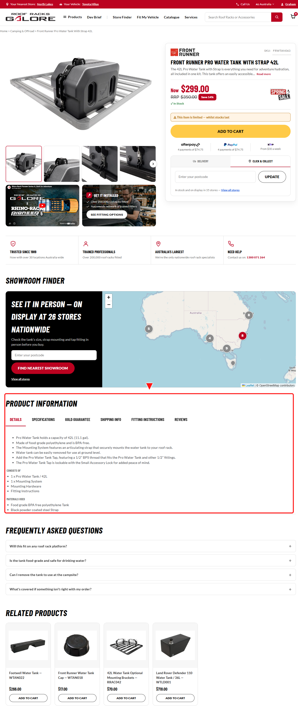
- Details (real verbatim product copy): 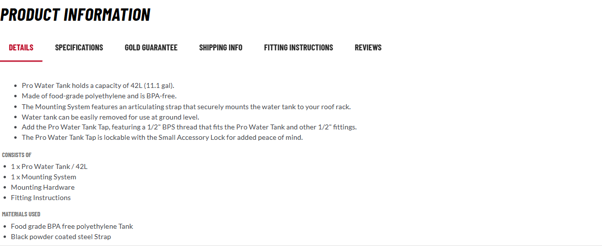
- Specifications (real 2-column table, not dot points): 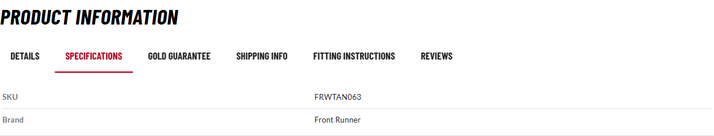
- Gold Guarantee (full real guarantee copy): 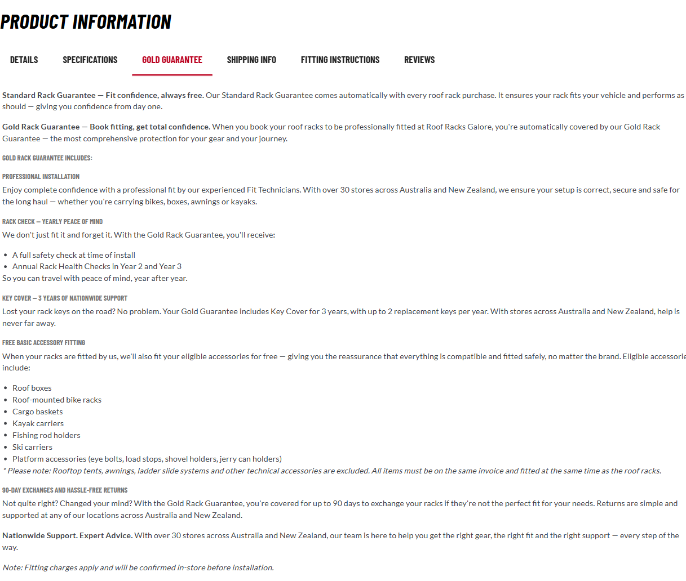
- Shipping Info (a full second Delivery/Click & Collect widget, 4.23, at the top of the panel): 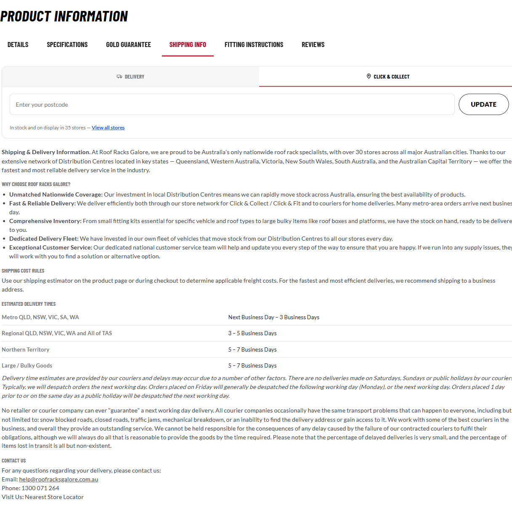
- Fitting Instructions (PDF-icon download link): 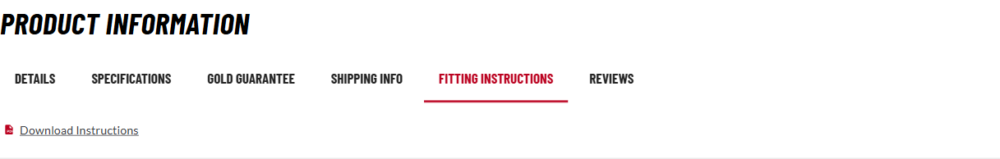
- Reviews — see 4.31 (Reviews tab) for this tab's full writeup, screenshots, and embed config.

---

### 4.31 Reviews tab (REVIEWS.io Polaris widget)

> 📷 Screenshots below are real captures, taken in the final screenshot pass, same as the rest of this document.

**Name:** Reviews tab (REVIEWS.io Polaris widget)

**Location:** the last tab in the row of tabs near the bottom of the page (Details / Specifications / Gold Guarantee / Shipping Info / Fitting Instructions / **Reviews**), on all 5 templates. Click it to open the panel shown below.

**Purpose:** shows this product's customer reviews (star rating, written reviews, photos) so shoppers can see what other buyers thought before purchasing. Reviews with 5+ ratings are shown to lift conversion significantly on higher-priced items (see `spec.md` Section 0.1.3), so this needs to stay easy to find, not buried. Driven by RRG's real REVIEWS.io account (`store: 'roof-racks-galore'`) — no mock/fake review data. Pulls from the **same underlying data** as the Decision Panel star-rating badge (4.9) but is visually and technically independent — this widget does not embed or depend on that badge.

**States:**
- **Location on the page, tab opened** (red arrow shows where to click):
  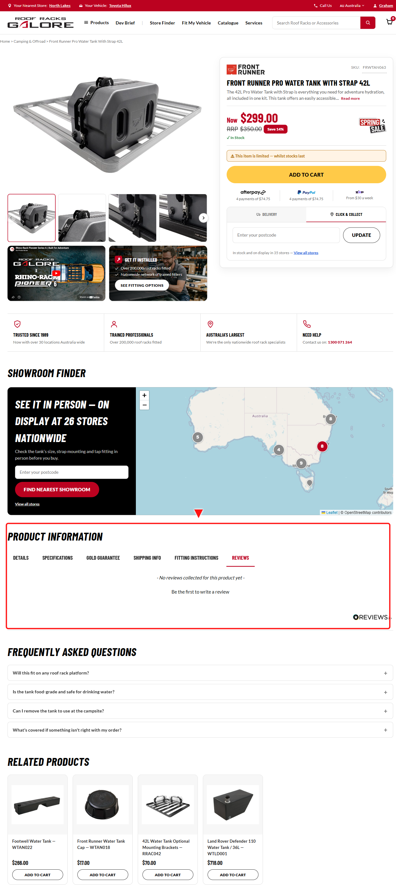
- **Current real state** — Front Runner Water Tank, `FRWTAN063`, no reviews against this SKU yet on the live account:
  
- **Once a product has real reviews** (genuine screenshot of the same widget pulling RRG's actual company reviews, shown to illustrate the populated layout — not this SKU's real content):
  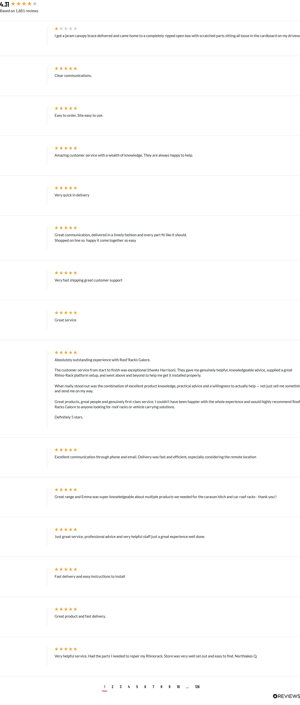

#### Code snippet (copy-paste)

This is the exact, current, working block from `prototypes/simple/index.html`. Drop the `<script src>` tag, the `<div id="ReviewsWidget">`, and the config `<script>` into the Reviews tab panel's markup. **Only `product_review.sku` and `questions.grouping` need to change per product** — everything else is shared config and brand styling, identical across all 5 templates.

```html
<script src="https://widget.reviews.io/polaris/build.js"></script>
<div id="ReviewsWidget"></div>
<script>
new ReviewsWidget('#ReviewsWidget', {
  store: 'roof-racks-galore',
  widget: 'polaris',
  options: {
    types: 'product_review,store_review',
    enable_sentiment_analysis: true,
    lang: 'en',
    layout: '',
    per_page: 15,
    store_review: { hide_if_no_results: false },
    third_party_review: { hide_if_no_results: false },
    product_review: { sku: 'FRWTAN063', hide_if_no_results: false },
    questions: {
      hide_if_no_results: true,
      enable_ask_question: true,
      enable_ask_question_button_style: false,
      show_dates: true,
      include_qna_structured_data: true,
      grouping: 'FRWTAN063'
    },
    header: {
      enable_summary: true,
      enable_ratings: true,
      enable_attributes: true,
      enable_image_gallery: true,
      enable_percent_recommended: false,
      enable_write_review: true,
      enable_ask_question: true,
      enable_sub_header: true,
      rating_decimal_places: 2,
      use_write_review_button: false,
      enable_if_no_results: false,
      show_review_title_field: false
    },
    sentiment: { badge_text: 'Our Customers Say', enable_rating_breakdown: false },
    filtering: {
      enable: true,
      enable_text_search: true,
      enable_sorting: true,
      enable_product_filter: false,
      enable_media_filter: true,
      enable_overall_rating_filter: true,
      enable_language_filter: false,
      enable_language_filter_language_change: false,
      enable_ratings_filters: true,
      enable_attributes_filters: true,
      enable_expanded_filters: false
    },
    reviews: {
      enable_avatar: true,
      enable_reviewer_name: true,
      enable_reviewer_address: true,
      reviewer_address_format: 'city, country',
      enable_verified_badge: true,
      verified_badge_position: '',
      enable_subscriber_badge: true,
      review_content_filter: 'all',
      enable_reviewer_recommends: true,
      enable_attributes: true,
      enable_product_name: true,
      enable_link_product: true,
      enable_review_title: true,
      enable_replies: true,
      enable_images: true,
      enable_ratings: true,
      enable_share: true,
      enable_helpful_vote: true,
      enable_helpful_display: true,
      enable_report: true,
      enable_date: true,
      date_format: undefined,
      date_location: undefined,
      enable_third_party_source: true,
      enable_duplicate_reviews: undefined,
      combine_title_stars: true,
      show_untranslated: false
    }
  },
  translations: { 'Verified Customer': 'Verified Customer' },
  styles: {
    '--base-font-size': '16px',
    '--common-button-font-family': 'inherit',
    '--common-button-font-size': '16px',
    '--common-button-font-weight': '700',
    '--common-button-letter-spacing': '0',
    '--common-button-text-transform': 'none',
    '--common-button-vertical-padding': '10px',
    '--common-button-horizontal-padding': '20px',
    '--common-button-border-width': '2px',
    '--common-button-border-radius': '4px',
    '--primary-button-bg-color': '#BB0220',
    '--primary-button-border-color': '#BB0220',
    '--primary-button-text-color': '#ffffff',
    '--secondary-button-bg-color': 'transparent',
    '--secondary-button-border-color': '#0E1311',
    '--secondary-button-text-color': '#0E1311',
    '--common-star-color': '#E8A83C',
    '--common-star-disabled-color': 'rgba(0,0,0,0.2)',
    '--medium-star-size': '22px',
    '--small-star-size': '19px',
    '--heading-text-color': '#0E1311',
    '--heading-text-font-weight': '700',
    '--heading-text-font-family': "'Barlow Condensed', sans-serif",
    '--heading-text-line-height': '1.3',
    '--heading-text-letter-spacing': '0',
    '--heading-text-transform': 'none',
    '--body-text-color': '#0E1311',
    '--body-text-font-weight': '400',
    '--body-text-font-family': 'inherit',
    '--body-text-line-height': '1.4',
    '--body-text-letter-spacing': '0',
    '--body-text-transform': 'none',
    '--pagination-tab-active-border-color': '#BB0220',
    '--pagination-tab-active-text-color': '#BB0220',
    '--sentiment-pagination-tab-active-border-color': '#BB0220',
    '--sentiment-pagination-tab-active-text-color': '#BB0220',
    '--sentiment-common-star-color': '#E8A83C'
  }
});
</script>
```

#### Per-template SKU values

The `sku` field takes a semicolon-separated list. Where a product has variants/colours that are each their own SKU on the live site, **all of them are listed together** so the widget shows reviews regardless of which variant a shopper has selected — the widget is not re-initialized when a variant/colour selector changes, it's set once on page load with the full family.

| Template | `product_review.sku` value |
|---|---|
| Simple (Water Tank) | `FRWTAN063` |
| Config-Variant (Pioneer 6 Platform) | `RH62112;RH62112F` |
| Sibling-Color (MaxTrax MKII, 13 colours) | `MTX02BK;MTX02MA;MTX02GG;MTX02FJB;MTX02LG;MTX02BY;MTX02PK;MTX02FJR;MTX02TG;MTX02DT;MTX02TQ;MTX02OD;MTX02SO` |
| Vehicle-Specific (Hilux N80 kit) | `GP01M1TZZ;GP01M1TZZF` |
| Grouped-Bundle (Yakima RoadShower) | `8004109PROMO` |

For a real Magento product page, generate this list dynamically from the product's configurable/sibling SKUs rather than hardcoding it — the semicolon-joined string is all the widget needs.

#### Config decisions worth knowing

- **`types: 'product_review,store_review'`** — this single line is what makes the widget render its own native Product/Company reviews tabs internally. An earlier prototype build hand-rolled a custom pill toggle for this before this real widget config was supplied; that custom code no longer exists, don't recreate it.
- **`hide_if_no_results: false`** on `product_review` and `store_review` — deliberately **not** the REVIEWS.io default (which is `true`). With `true`, a SKU with zero reviews renders nothing at all, which looks like the integration is broken. With `false`, the widget shows its real "No reviews collected for this product yet — Be the first to write a review" state instead — honest, correctly branded, and exactly what's in the first screenshot above. Keep this `false` in production too, for the same reason.
- **`styles` colour variables** were retinted from REVIEWS.io's neutral black/grey defaults to RRG's actual brand colours: `#BB0220` (brand red) for primary buttons and active pagination state, `#E8A83C` (amber/gold) for stars, `'Barlow Condensed'` for headings, matching the rest of the page.
- No API key is required — this widget is a public client-side embed tied to the `store` slug only.

#### Before this leaves prototype stage

- None of this prototype's demo SKUs have real REVIEWS.io reviews yet, so this shows its "no data" state on every template. This is expected and will resolve itself once real reviews exist against real SKUs — nothing to fix.
- Confirm with REVIEWS.io / Tim whether the `roof-racks-galore` store slug and API usage shown here fall within their terms of service for this kind of lightweight custom integration.
- Generate the SKU list dynamically from the real product/configurable-child data in Magento rather than hardcoding it, unlike this static prototype.

---

### 4.32 FAQ section

**Location:** below the Tabs widget, above Related Products — on all 5 templates. Not a tab (deliberate — FAQ items should each open independently, not exclusively like the Tabs above).

**Purpose:** answers common pre-purchase questions inline, reducing the need to contact support.

**Typography:** heading uses the shared section-heading style (Section 2); question/answer text is standard body copy. Pure native `<details>`/`<summary>`, no JS.

**Region differences:** none.

**Links:** none.

**Data Source:** Rackit — per-product FAQ content (currently placeholder copy in this prototype, tailored per template rather than generic filler, pending real client content).

Each template also carries a `FAQPage` JSON-LD structured-data block (in `<head>` alongside the Product/Offer schema where present) built from this same on-page Q&A content, for AEO/search-result rich-answer eligibility.

**States:**
- Location (full page, red arrow): 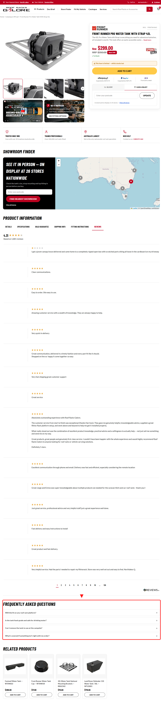
- Detail, one item expanded: 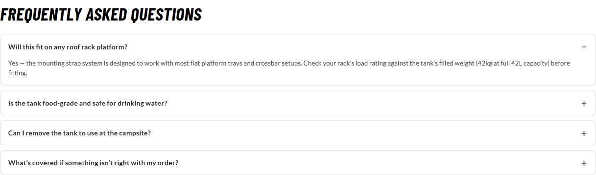

**Notes:** 4 Q&As per product, tailored per template — currently placeholder copy pending real client-supplied FAQ content (flagged in `spec.md` Section 7).

---

### 4.33 Related Products carousel

**Location:** bottom of the page, below FAQ — on all 5 templates.

**Purpose:** cross-sell to keep the shopper browsing if this specific product isn't quite right.

**Typography:** heading uses the shared section-heading style (Section 2); card title/price use standard label/price scale.

**Region differences:** price currency follows the page-wide region symbol swap (4.1); nothing else.

**Links:** **cards do not link to a product page in this prototype** — they're informational only, each with a decorative `.btn-outline` "Add to Cart" button that isn't wired to a real cart (this prototype has no cart, and no real per-product PDP exists to link to). **Intended production behaviour:** clicking anywhere on a card except the Add to Cart button should navigate to that product's own PDP; Add to Cart stays a real add-to-cart action and must not also trigger navigation. This same rule applies to 4.18 Discontinued's "alternatives" section, which reuses this exact card component.

**States:**
- Location (full page, red arrow): 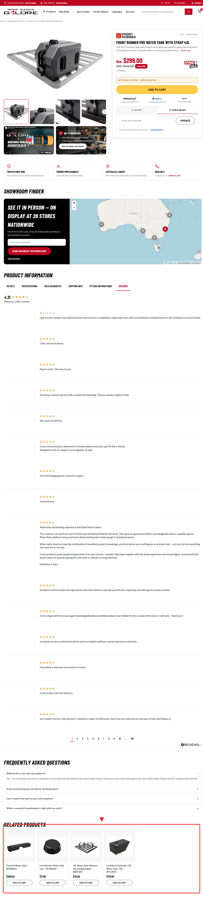
- Detail: 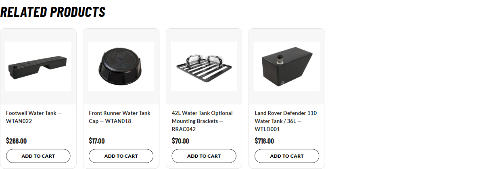

---

### 4.34 Sticky Mobile Bar

**Location:** fixed to the bottom of the screen, mobile only, all 5 templates.

**Purpose:** keeps price + Add to Cart reachable once the real Add to Cart button scrolls out of view — genuinely scroll-aware (an `IntersectionObserver` on the real button, not a width-only always-visible rule).

**Typography:** condensed price/button scale, same button styling as the main Add to Cart.

**Region differences:** follows whatever region state is active (price currency, Add to Cart colour for UK) — no separate logic of its own.

**Links:** none beyond the Add to Cart action itself.

**States:**
- Vehicle-Specific (thumbnail + name sharing space with a condensed, icon-only fitment box — no room for the full fitment label once both are present): 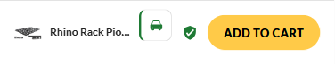
- Other 4 templates (truncated name + price + Add to Cart, no fitment box): 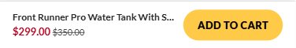

---

### 4.35 Persistent Bar

**Location:** fixed to the top of the screen, desktop only — **all 5 templates**. Only the fitment-status portion is conditional (present on Vehicle-Specific, omitted on the other 4), same "present where the concept applies, absent where it doesn't" pattern the Sticky Mobile Bar (4.34) already uses on mobile.

**Purpose:** same reasoning as the Sticky Mobile Bar (4.34) but for desktop — keeps a condensed product thumbnail + name + price + Add to Cart visible once the full Decision Panel scrolls out of view; on Vehicle-Specific, also keeps the fitment status + Rack Fit Guarantee badge visible.

**Typography:** condensed scale; product name is truncated to fit alongside the thumbnail (and, on Vehicle-Specific, the condensed fitment box).

**Region differences:** none beyond the standard price/currency inheritance.

**Links:** Add to Cart action on every template; Vehicle-Specific's instance also carries the Rack Fit Guarantee badge's click-to-jump-to-Gold-Guarantee-tab action (see 4.11).

**States:**
- Vehicle-Specific: product thumbnail + truncated name sharing space with a condensed fitment box (icon + short label, roughly half its full-detail width) + Rack Fit Guarantee badge: 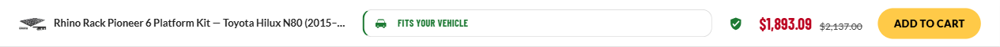
- Other 4 templates: thumbnail + truncated name + price + Add to Cart only, no fitment box or badge: 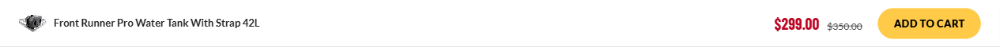

---

### 4.36 Demo State Panel

**Not part of the actual design — used to demo different states across the page only, do not build this in Magento.** A floating "Demo State" button (bottom-right, hidden on mobile) expanding into a panel that lets a reviewer preview every simulated product state (video/sale/stock/shipping/collect/special order/ex-demo/showroom/fitted-option/gallery-placement/session-vehicle/cart-contents) without needing real data for each. Every screenshot in this document was captured with this panel closed — see Section "Screenshot capture process" convention. Mentioned here only so a developer who notices it in the prototype's source knows to leave it out of the production build.

---

## 5. SEO & Structured Data

**Location:** the page `<head>` and inline `<script type="application/ld+json">` blocks — not a visible widget, so it doesn't follow the Name/Location/Purpose/screenshot template used elsewhere in this document. Applies to all 5 templates.

**Purpose:** technical elements that search engines and AI shopping agents (AEO — "answer engine optimization") read directly from the page, separate from anything a shopper sees. Logged via a scoping pass on 2026-09-12 (`spec.md` Section 12 item 31), after heading-hierarchy semantics and baseline `Product`/`Offer`/`FAQPage` schema were already built (see Section 4's audit and the JSON-LD blocks already in every template). **Nothing below is built in the prototype** — this section is scope notes for the real Magento build, written up directly rather than prototyped first, per Brenton's call on this item.

1. **Meta description.** None of the 5 prototype templates carry a `<meta name="description">` tag. Needs real, keyword-targeted copy per product in the Magento build — this is on-page-copy/SEO-strategy work, not something to template-generate generically from other fields.
2. **Canonical URL.** None of the 5 prototype templates carry a `<link rel="canonical">` tag. Add one per product page pointing at that product's real, single canonical URL.
3. **`BreadcrumbList` structured data.** The visual breadcrumb trail (`.rrg-crumbs`, 4.2) already exists and is correct on all 5 templates (fixed in `spec.md` Section 10 item 1), but nothing mirrors it as JSON-LD. Add a `BreadcrumbList` block matching whatever trail renders for that page.
4. **`<title>` tag.** The prototype's `<title>` tags are dev-facing labels for this project (e.g. `"Simple Product PDP — Front Runner Pro Water Tank 42L"`), not real production titles. Build to whatever title format the wider Magento site already uses for product pages.
5. **Alt text.** A handful of images ship with empty `alt=""` in the prototype — the payment-plan badge logos (`.pb-logo`) and the Persistent Bar thumbnail (`.persistent-thumb`). Give these real, descriptive alt text in the Magento build.
6. **`Product` schema's `priceCurrency` — region-specific, flag to whoever builds the Region Selector (4.1).** Every prototype template hardcodes `"priceCurrency": "AUD"` inline in its own `Product`/`Offer` JSON-LD block. The Region Selector's `applyRegionCurrency()` function (`shared.js`) only swaps the visible `$`/`£` symbol in on-page text — it doesn't touch these `<script>` blocks, so a UK/NZ page would still assert AUD pricing to search engines and AI shopping agents. In the real build, `priceCurrency` needs to follow the actual region/currency the page is served in.
7. **`AggregateRating`/`Review` schema — not blocked on missing data.** No `aggregateRating` or `Review` schema exists yet in the `Product` block on any template, but the real data to populate it already exists: the Decision Panel star-rating badge (4.9) already calls `api.reviews.io/timeline/data` live per SKU and gets back `average_rating`/`review_count`. Once a SKU has real reviews, that same response can drive `aggregateRating` — this is a straightforward addition once building in Magento, not something waiting on new data the way the FAQ content behind the `FAQPage` schema is (4.32).

