# PLP / VPLP — Developer Brief

## 1. Project context

**Audience:** for Marc, same as `DEVELOPER-BRIEF.md`, `HEADER-DEVELOPER-BRIEF.md`, `FOOTER-DEVELOPER-BRIEF.md`, the Vehicle Category Landing Page brief, and `SEARCH-RESULTS-DEVELOPER-BRIEF.md` — detailed information on this page family's build so implementation decisions in Magento stay consistent with the intent, even where the exact prototype code can't be lifted verbatim.

**What this covers:** category (listing) pages — the pages that sit between the header's product taxonomy and an individual PDP. Two related but distinct page types, built from one shared engine (`prototypes/_shared/plp.css`/`plp.js`), not two separate codebases:

- **PLP** — a standard category listing (e.g. Bike Racks). Works exactly like a normal ecommerce category page.
- **VPLP** — the same engine's variant for **VRS** (Vehicle Rack Set) categories: Roof Racks and backbones/spines specifically, the *only* categories RRG tracks real per-vehicle fitment data for. Not a separate template from a build standpoint — it's the "exact-fitment-locked category" branch of the same engine, with a handful of extra per-row/page elements (Fitment Gallery, a different breadcrumb pattern) layered on top.

A third template, **`prototypes/plp-camping/`**, exists alongside these two — same standard-PLP engine, different demo dataset (real scraped Camping & Offroad products), built specifically to demonstrate the nav-depth Level 3 icon-card pattern (Section 4.4) with real subcategory data. It isn't a third page type.

**Both states, both category types:** every category (VRS or standard) has two states — **Simple** (no vehicle in session) and **Vehicle-Set** (a vehicle exists in session, however it got there) — this is a binary state, not a third template. A vehicle-set *standard* category (Bike Racks, Camping) still gets full vehicle-specific hero framing ("Bike Racks for your Toyota Hilux") but no fitment badges and no Fitment Gallery — those are VRS-only. **RRG has no real fitment data for anything except Roof Racks/backbones/spines** — don't add a fitment badge to a non-VRS product card in the real build, no matter how tempting it looks structurally similar.

**Companion documents:** `docs/plp/plp-spec.md` is the full engineering spec (written 2026-09-17, before build, then updated 2026-09-18 with a design-review backlog) — read it for the *why* behind each decision and the full list of open items (Section 14) and deferred/blocked items (Section 15.C) this brief doesn't repeat. This brief is the handover summary of what was actually built. `docs/PAGE-GLOSSARY.md` is the source of truth for this page family's component names.

**Why this brief didn't exist until now:** `search-results-spec.md`/`SEARCH-RESULTS-DEVELOPER-BRIEF.md` both flagged that the search-results page reuses this same engine wholesale but had nothing beyond the spec to point to. This brief fills that gap — written 2026-09-22, well after the PLP/VPLP/Camping prototypes themselves were built and design-reviewed (2026-09-17 through 2026-09-18).

**Build status:** built as `prototypes/plp/index.html` (Bike Racks, standard), `prototypes/vplp/index.html` (Roof Racks, VRS), `prototypes/plp-camping/index.html` (Camping & Offroad, standard, Level 3 nav-depth demo). All three Playwright-verified repeatedly across the 2026-09-17/18 build and design-review rounds: desktop (1440px) and mobile (390px, zero horizontal overflow), Simple/Vehicle-Set toggle, Grid/List toggle, filter counts (including live narrowing against the query-independent product pool), mobile filter drawer + priority chips, Compare Products (2-product side-by-side drawer), Fitment Gallery inline widget + per-row slide-out (VPLP only), category videos, FAQ, sidebar merchandising carousel. Zero console errors throughout (aside from the usual harmless favicon 404). Pushed to `main` across the 2026-09-17/18 commits (see `plp-spec.md`'s own log for the exact history).

---

## 2. Typography & colour reference

Same type scale and colour tokens as `DEVELOPER-BRIEF.md` Section 2 — not repeated here. No page-family-specific typography deviations; every heading/label on plp/vplp/plp-camping uses the shared scale as-is, including the shared 40px italic section-heading style (Category Videos, FAQ) and the shared button/price scales.

Region/currency behaviour (AU/UK/NZ price symbol swap, UK Add to Cart colour override) is inherited from the same global `applyRegionCurrency()`/region-skin mechanism documented in `DEVELOPER-BRIEF.md` 4.1 — no PLP-specific logic on top of it.

---

## 3. Page Layout — PLP / VPLP / Camping

One shared section order, top to bottom, across all three templates (VRS-only rows marked):

1. Global Header + vehicle strip, Global Footer — untouched, shared.
2. Breadcrumb — category-path pattern (standard) or vehicle-path pattern (VRS only) — Section 4.2.
3. Hero — Vehicle-Set or Simple state, with a "Change Vehicle"/"Set Your Vehicle" CTA — Section 4.1.
4. SHOP BY row (Level 2 subcategory tabs, real fixed URLs) — Section 4.3.
5. Toolbar — Refine Results button (mobile) / inline filters (desktop), Grid/List toggle, Sort dropdown.
6. Priority-filter quick-access chips (mobile only, directly above the grid) — Section 4.5.
7. Level 3 icon-card row (only when the active Level 2 tab has configured children, e.g. Camping's subcategories) — Section 4.4.
8. Two-column layout: **Sidebar** (Filters, Section 4.5 + Merchandising, Section 4.9 + Category Videos-sidebar-slot's replacement, see 4.9's note) / **Main** (product grid or list, Section 4.6 + Fitment Gallery inline widget at position 2, VRS only, Section 4.7 + pagination, Section 4.8).
9. Category Videos bottom carousel — Section 4.10.
10. FAQ accordion — Section 4.11.

**Screenshots:**
- PLP (Bike Racks), desktop (1440px), full page, Vehicle-Set state: 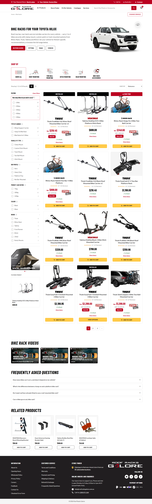
- PLP, mobile (390px), full page: 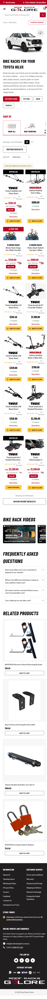
- VPLP (Roof Racks) breadcrumb + hero, showing the vehicle-path breadcrumb and full fitment-spec H1 (contrast with the PLP screenshot above): 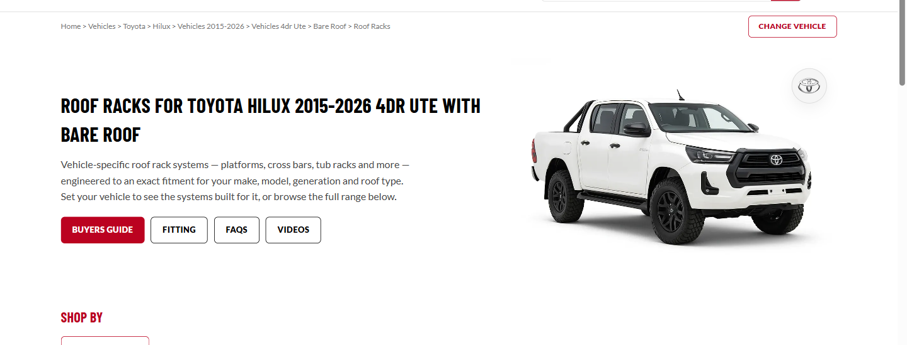

---

## 4. Component Library

### 4.1 Hero (Simple / Vehicle-Set states)

**Name:** PLP Hero

**Location:** top of page, below the breadcrumb.

**Purpose:** communicates "you're shopping for your [vehicle]" once one is set in session, regardless of whether the category is fitment-locked — while still working as a normal, generic category page when no vehicle is set.

**Contents:**
- **Vehicle-Set:** vehicle photo + make badge, "Change Vehicle" gold CTA (right-aligned near the breadcrumb, 2026-09-18 design review), H1 copy that differs by category type — VRS gets the full fitment spec ("Roof Racks for Toyota Hilux 2015-2026 4dr Ute with Bare Roof"), standard gets short framing ("Bike Racks for your Toyota Hilux") — plus the secondary CTA row (Buyers Guide / Fitting / FAQs / Videos), category-general, unchanged between states.
- **Simple:** no vehicle photo — a 3-state image fallback applies instead (vehicle photo → category image, if one's configured → no image at all, collapsing to full width rather than leaving an empty column, 2026-09-18 resolution). H1 reverts to generic category copy. "Change Vehicle" is replaced by a "Set Your Vehicle" CTA opening the same header vehicle drawer (not a new component).
- **VRS with no vehicle set, specifically:** never gated or empty — shows the real, unfiltered catalogue across every vehicle plus a CTA banner to open the vehicle drawer (matches a live-site reality check done 2026-09-17, replacing the live site's inline 5-field widget with the existing drawer).

**Toggle (dev/demo only):** the Vehicle-Set/Simple state itself isn't a PLP-specific control — it reuses the Site Admin Panel's existing "Vehicle Set" session toggle (bottom-left FAB), the same one the header/PDP/VCLP all read. The 3-state hero image fallback (vehicle/category/none) has its own preview control in the Demo State Panel (bottom-right FAB), independent of the vehicle toggle, so a reviewer can see all 3 image states without also flipping session vehicle state.

**Screenshots:**
- Vehicle-Set: 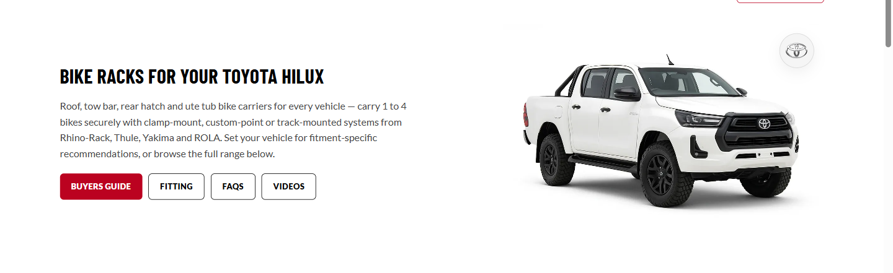
- Simple (category-image fallback): 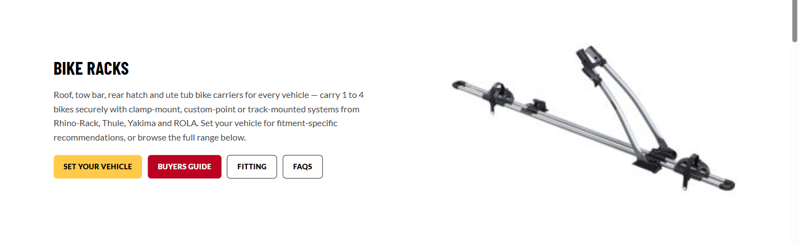

---

### 4.2 Breadcrumbs

**Name:** PLP Breadcrumb

**Location:** top of page, above the hero.

**Purpose:** driven by the page type's own taxonomy, **not** by session vehicle state — a standard category never shows the vehicle in its breadcrumb, even with one set.

**Contents:**
- **Standard PLP:** always the category path — `Home → Bike Racks → Attachment Style → Roof Mounting` — regardless of vehicle state.
- **VPLP (VRS):** always the vehicle path, since the page is inherently scoped to an exact vehicle spec — `Home → Vehicles → Toyota → Hilux → Vehicles 2015-2026 → Vehicles 4dr Ute → Bare Roof`.

Rebuilt fully on every Level 2/3 tab change (`plpRenderBreadcrumb()`) — in the real build, each subcategory tile is its own real URL, so its breadcrumb would be server-rendered per-page rather than rebuilt client-side the way this demo does it.

**Screenshot:** see the VPLP breadcrumb in the Section 3 screenshot above (its vehicle-path pattern is the notable contrast with a standard PLP's category-path breadcrumb, which isn't separately screenshotted since it's a plain, unremarkable crumb trail).

---

### 4.3 SHOP BY row (Level 2 subcategory tabs)

**Name:** SHOP BY row

**Location:** directly below the hero, on every category, both states.

**Purpose:** real subcategory navigation — confirmed as **real, fixed, distinct URLs** per tile (not an in-place AJAX filter), deliberately for SEO so each subcategory can be indexed on its own. This is the one place this engine's demo behaviour (client-side tab switching against one shared dataset) is a **known, deliberate stand-in** for what production actually needs to be (Section 6).

**Contents:** icon + label per tile, "Show All" always first (navigates to the parent category view). The full sibling list stays visible regardless of which tile is active — selecting one never collapses the row into a further drill-down. Mobile: horizontal-scroll carousel when the row overflows one line.

**Screenshot:** see Section 4.4's screenshot, which shows this row together with the Level 3 cards it can reveal.

---

### 4.4 Level 3 Icon-Cards (nav-depth)

**Name:** Level 3 icon-cards

**Location:** between the toolbar and the product grid — only present when the active Level 2 tab has `children` configured (not every subcategory has them).

**Purpose:** added 2026-09-18 specifically to demonstrate a real "Camping & Off-Road" style nav-depth pattern (Level 1 Show All → Level 2 persistent subcategory tabs → Level 3+ icon cards inside the results area) — built and demoed on `prototypes/plp-camping/`, which has real scraped Camping subcategory data for it (Tents, Swags, Gazebo, Camp Site → Camp Bags & Storage/Camp Cooking & Kitchen/Camp Lighting & Fans/Camp Accessories, etc.).

**Contents:** a dedicated row of icon-card tiles, fixed at 5 columns on desktop regardless of how many children a tab has, sitting above the results grid rather than merged into it as leading grid cells (an earlier pass tried merging them into the grid; that stretched the icon cards to match a full product card's height, so they got their own row instead). Reuses the exact same `.plp-shopby-icon`/`.plp-shopby-label` styling as the Level 2 tabs, at the same size — deliberately "not shrunk."

**Note — no result count on plain PLP/Camping.** This component is shared with the search-results page (`SEARCH-RESULTS-DEVELOPER-BRIEF.md` 4.2), which *does* show a live count on each card (e.g. "Thru Bars (5)") since it's genuinely filtering a query-matched pool there. On plain PLP/Camping, this is pure catalogue navigation against a fixed dataset, so no count is shown — don't expect the two usages to look identical if you're cross-referencing.

**Screenshot (Level 2 tabs + Level 3 icon-cards, Camping "Camp Site" tab active):** 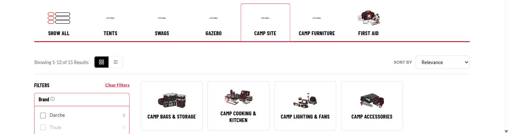

---

### 4.5 Filters (priority + standard, per-category configurable)

**Name:** Filters sidebar

**Location:** left column, alongside the product grid (desktop); a right-edge slide-out drawer behind a "Refine Results" button (mobile).

**Purpose:** **per-category/subcategory configurable facet set** — different categories show entirely different filter attributes (Bike Racks' "How many bikes"/"Type of Carrier" vs. Roof Racks' "Cross Bar Qty"/"Platform Style"). Built as a real configurable structure (an array of facet definitions in `PLP_CONFIG`), not a hardcoded one-off list.

**Contents:**
- **Priority filters** — a per-subcategory subset (soft guideline: ~4 max) promoted to a visually distinct gold-bordered treatment (originally solid yellow fill, changed to a red outline in the 2026-09-18 review to match the live site more closely), always above the standard list, worded as buyer-journey questions ("How many bikes do you need to carry?") rather than plain technical labels. Which filters are priority varies per subcategory, not just per top-level category.
- **Standard filters** — plain collapsible `
` groups, same live-updating option counts.
- **Tooltip icon** on every filter group (hover/focus) — **placeholder copy only**, real per-attribute wording is blocked on a client-side attribute glossary that doesn't exist yet (Section 6).
- **Clear Filters** button (top of sidebar) and **Clear All** (top of the mobile drawer) — added 2026-09-18, there was no way to reset a filter selection before that.
- **Mobile priority chips** — a row of quick-access chips above the grid (not merged with the "Refine Results" button itself, see the screenshot), one per priority filter; tapping one opens the full drawer scrolled to that filter's group, with priority filters still pinned at the top of the drawer.

**Engine note:** every option's count is computed live against the current query/tab/other-active-filters via one shared function (`plpMatchesFiltersExcept()`), the same choke point the search-results page's universal facets and `'range'` price mode extend (`SEARCH-RESULTS-DEVELOPER-BRIEF.md` 4.3) — this page family's facets use `'eq'`/`'atleast'` modes only, no range mode of its own.

**Screenshots:**
- Desktop sidebar (priority gold-outline group with tooltip open, standard groups below): 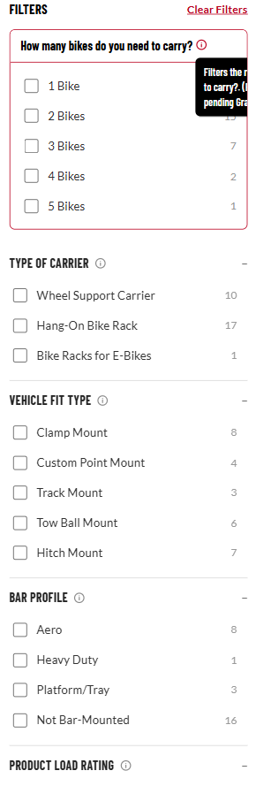
- Mobile toolbar sequence (Refine Results → Sort → priority chip): 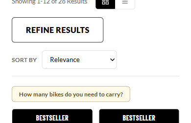
- Mobile filter drawer (priority group pinned at top): 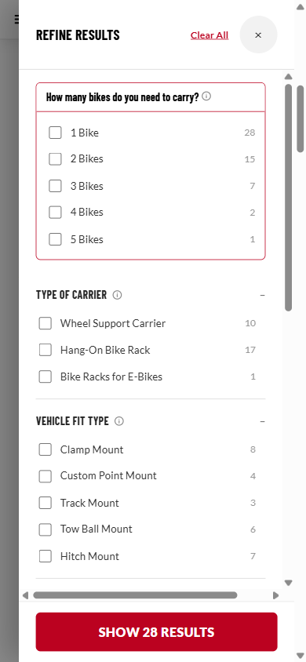

---

### 4.6 Product Grid / List / Cards

**Name:** PLP Product Card

**Location:** main content column, below the toolbar/Level 3 row.

**Purpose:** the actual product listing — same underlying card data drives both a compact Grid view and a more detailed List view via one toggle (not tied to VRS vs. standard; every category gets both).

**Contents:**
- **Ribbons** — Bestseller or Staff Pick, mutually exclusive (Staff Pick wins if a product somehow carries both — an explicitly flagged assumption, not confirmed). Any other truthy string on a product's `ribbon` field renders verbatim as a third, arbitrary ribbon style (e.g. "Limited Stock Left") — the real backend flagging mechanism behind this doesn't exist yet (Section 6).
- **Pricing** — current price, and if on sale: RRP (strikethrough) + a "Save X%" badge + the same seasonal sale-tag graphic as the PDP price block, in a two-column layout (price/RRP/Save badge left, sale tag right — moved off the product photo itself in the 2026-09-18 review, since overlaying it there was hard to control and landed wrong too often). Sibling/variant products (`hasOptions`) get a "From $X" prefix instead of a bare price.
- **Two real data gaps found during the Camping re-scrape, both handled explicitly rather than papered over:** (1) **Price on Application** — some real scraped SKUs have no listed price at all (not out of stock, just no price shown) — shows "Price on Application" and swaps the primary action to a plain "View Details" link, since quick-add needs a real price to add. (2) **Out of Stock** — some real SKUs are genuinely out of stock per the live site's own schema — primary action becomes a disabled "Out of Stock" button.
- **Show Specs** — expandable row (`
`), present on every card in both Grid and List view, defaulting collapsed in both — flagged as an assumption to revisit, Brenton was lukewarm rather than certain on this default.
- **Primary action split** — simple/single-SKU products get a quick "Add to Cart" button (bumps the real header cart badge, no real cart exists behind it); sibling/variant products get "View Options" through to the PDP instead (no quick add, since an option must be picked first) and link to the cheapest sibling.
- **Compare Products checkbox** — only rendered when Compare is enabled (Section 4.12's Demo State Panel gate).
- **List view only:** brand logo overlaid on the photo (top-left chip) instead of sitting in the info column; 2-3 USP bullet points instead of a rating row.
- **VRS/VPLP list rows additionally carry** a per-SKU "Fitment Gallery (N)" button under the thumbnail (Section 4.7) and always a single "View Options" CTA, never PLP's Add to Cart vs. View Options split — **open dispute, not yet resolved:** the client's dev team wants two separate buttons (Flat-pack vs. Assembled are distinct Magento URLs/products); Brenton wants one button landing on the default variant and built this version first, taking it to the team for feedback before any dual-button version gets built.

**Screenshots:**
- Grid view (ribbons, sale pricing, Show Specs expanded, quick Add to Cart): 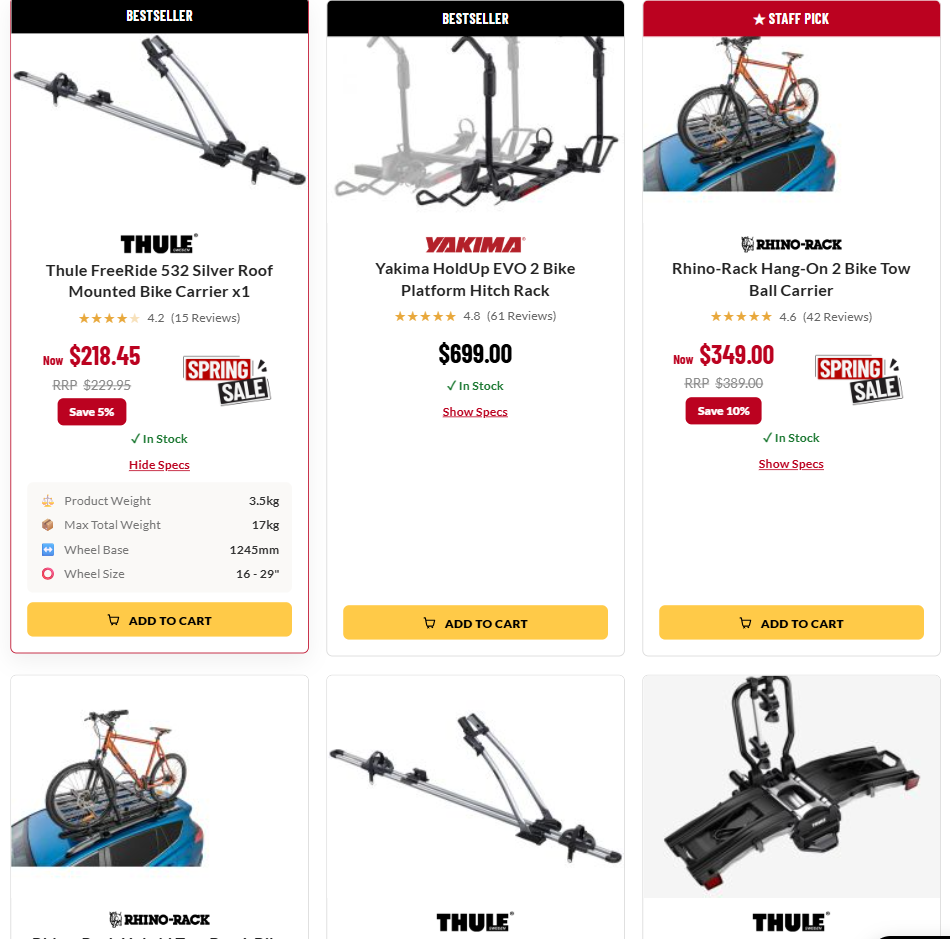
- List view, standard category (USP bullets, no Fitment Gallery button): 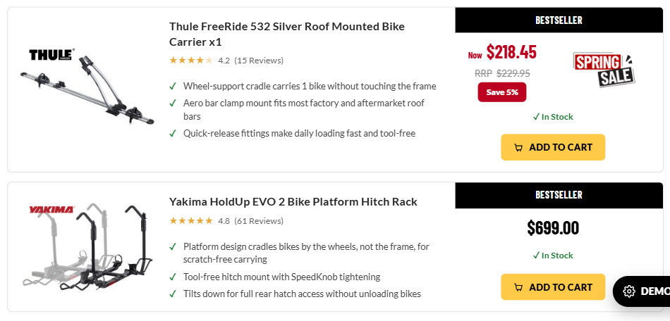
- List view, VRS/VPLP row (Fitment Gallery button + single View Options + "From" price): 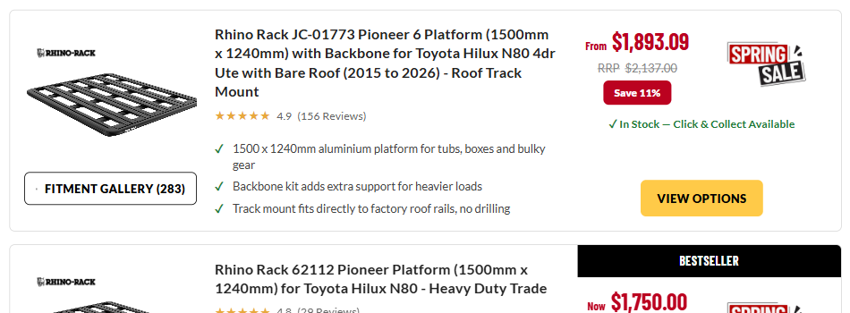

---

### 4.7 Fitment Gallery (VRS/VPLP only)

**Name:** Fitment Gallery — page-level inline widget + per-row slide-out

**Location:** page-level instance sits at position 2 in the results (the 2nd row in list view, or directly after the first full row in grid view); per-row instance is the "Fitment Gallery (N)" button under each VRS product's thumbnail (4.6).

**Purpose:** exact same widget/visual style as the PDP/VCLP version (icon-badge panel, heading, "View All In-store Fitments" link, photo carousel, slide-out with per-fitment detail view) — reused, not rebuilt. Only appears on VRS/fitment-relevant categories with a vehicle set; never on standard PLPs, never in the Simple state.

**Click action:** the per-row button opens the exact same drawer/component as the PDP's Fitment Gallery, launched inline from the PLP without navigating away.

**Known open item:** Brenton flagged this widget as "unfinished/not happy with it" during the 2026-09-18 review without specifying what's wrong — needs his direction on the actual target before further work (Section 6).

**Screenshot:** 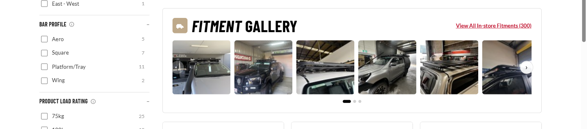

---

### 4.8 Sort & Pagination

**Name:** Sort dropdown / Pagination

**Location:** toolbar row (Sort, next to the Grid/List toggle); bottom of the results (Pagination).

**Purpose/contents:** standard sort set — Relevance (default), Newest, Best Selling, Highest Rated, then Price Low→High, Price High→Low (this exact order/labelling, incl. "Relevance" not "Default," was a 2026-09-18 fix). Desktop: numbered pagination (not infinite scroll). Mobile: manual "Show More Results" button, not auto-triggered on scroll.

**Open item:** Highest Rated's real feasibility depends on Mark confirming reviews.io data is queryable at the catalogue level — drop the option if it isn't (Section 6).

**Screenshot:** 

---

### 4.9 Merchandising Sidebar

**Name:** Merchandising Sidebar (promo carousel + Featured Product)

**Location:** directly below the Filters panel, same column.

**Purpose:** replaces an originally-planned "sidebar video module, capped at 2 videos" (`plp-spec.md` Section 10.1) — the 2026-09-18 design review resolved that slot to a promo carousel/Featured-Product block instead (swipeable between multiple active promos, most-specific-wins inheritance intended for the real Magento build). **Only one video surface actually exists in this build** — the bottom-of-page carousel (Section 4.10) — the sidebar video slot was replaced entirely, not kept alongside this.

**Contents:** image carousel (dots if more than one promo) + a "Featured Product" card below it. This same component, unchanged, is what `search-results` reuses for its own sidebar (`SEARCH-RESULTS-DEVELOPER-BRIEF.md` 4.4) — this page family is the original/source of it.

**Screenshot:** 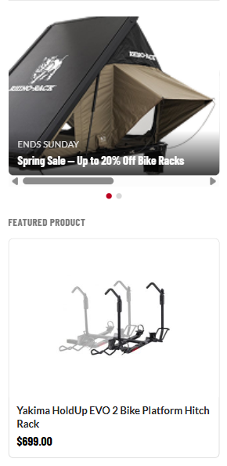

---

### 4.10 Category Videos

**Name:** Category Videos carousel

**Location:** bottom of page, above the FAQ.

**Purpose:** cross-sell/education via video, sourced from a Magento video field set on the category (or, in the real build, aggregating its subcategories too — see Section 6, this aggregation isn't actually built in the prototype).

**Contents:** horizontal carousel of video tiles (thumbnail + play icon + title), reusing the same section-heading style as Related Products/FAQ.

**Screenshot:** 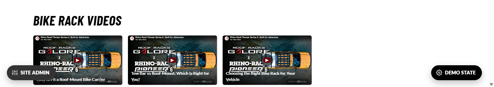

---

### 4.11 FAQ

**Name:** Category FAQ accordion

**Location:** bottom of page, below Category Videos.

**Purpose:** VRS/VPLP categories get real, vehicle-specific FAQ content (same idea as the VCLP's per-make/model FAQ); standard PLPs get generic category-based FAQ content that never references the vehicle (confirmed this doesn't scale to author per-vehicle content for every generic category).

**Contents:** reused `.faq-section`/`.faq-item` accordion component (same as the PDP's). Dynamic per Level 2/3 tab on pages that opt in via `cfg.faqByCategory` (e.g. plp-camping) — re-renders on every tab change so the section genuinely demonstrates swapping content in/out, not just an empty/non-empty toggle. Pages without that config (plain plp/vplp) show static content instead.

**Screenshot:** 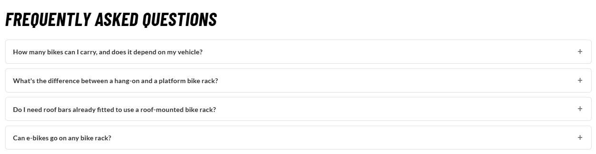

---

### 4.12 Compare Products

**Name:** Compare Products

**Location:** a checkbox on every product card (when enabled) + a sticky "N of 2 products selected / Compare" bar + a right-edge slide-out drawer.

**Purpose:** originally deferred as future-only, then brought back into scope mid-planning-session. **Gated entirely behind a Demo State Panel toggle, off by default** — same convention as every other reviewer-only preview toggle in this prototype set, not part of the shipped default state until the client explicitly confirms it should be.

**Contents:** checkboxes select up to 2 products (the 3rd+ checkbox disables once 2 are selected); the sticky bar shows a live "X of 2 products selected" count and a Compare action; the drawer shows the two products' thumbnails/names/prices and a full spec-by-spec comparison table (blank cells where one product lacks a given spec the other has).

**Screenshots:**
- Selection state (sticky compare bar): 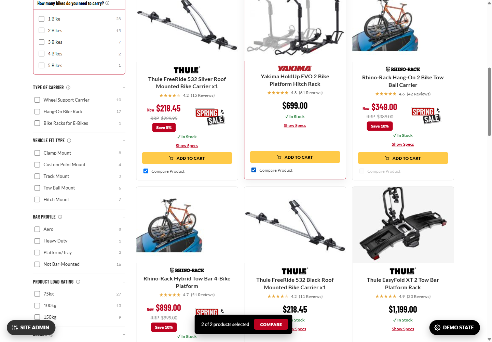
- Drawer (side-by-side spec comparison): 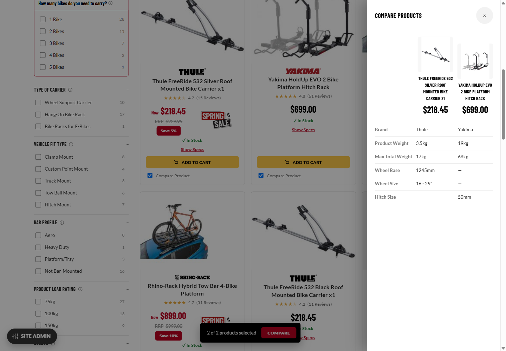

---

### 4.13 Demo State Panel

**Not part of the actual design — used to demo different states across this page family only, do not build this in Magento.** Same floating "Demo State" panel as every PDP template (`DEVELOPER-BRIEF.md` 4.36), with a PLP-specific section added: default Grid/List view, grid column count (3 or 4 per row), the 3-state hero image fallback (4.1), and the Compare Products on/off gate (4.12). The Simple/Vehicle-Set state itself is controlled by the separate Site Admin Panel's "Vehicle Set" toggle, not this panel (4.1). Mentioned here only so a developer who notices it in the prototype's source knows to leave it out of the production build.

---

## 5. SEO & Structured Data

**Location:** the page `<head>` — not a visible widget, so it doesn't follow the Name/Location/Purpose/screenshot template used above.

**What's built:** nothing beyond a dev-facing `<title>` on each template. No meta description, canonical tag, or JSON-LD exists on any of the three templates.

**Unlike the search-results page, these ARE meant to be real, indexable pages** — the whole point of the SHOP BY row's real fixed URLs (Section 4.3) is SEO indexability per subcategory. Real per-category meta description/canonical/title/`BreadcrumbList`/`Product`-list structured data all need building for the real Magento templates — same category of gap as `DEVELOPER-BRIEF.md` Section 5 flags for the PDP templates, not a genuinely open question the way search-results' indexability was.

---

## 6. Known gaps before production

1. **SHOP BY's "real fixed URL per subcategory" behaviour is simulated, not real, in this prototype** — the demo swaps content client-side against one shared in-page dataset rather than actually navigating to a distinct URL per tile. The real build needs this to be genuine per-URL server-rendered pages (or an SPA-style route change with real URLs), not a port of this prototype's JS.
2. **Bestseller vs. Staff Pick tie-break** (4.6) — assumed mutually exclusive, Staff Pick wins; not confirmed.
3. **Show Specs defaulting closed on both Grid and List** (4.6) — Brenton was lukewarm, not certain.
4. **Flat-pack/Assembled single-button vs. dual-button dispute** (4.6) — Brenton's single-button version was built first; the client's dev team may push back once he shares it, per an open disagreement about how Magento models the two as separate products/URLs.
5. **Fitment Gallery redesign** (4.7) — Brenton flagged it as unfinished/not happy with it during review but didn't specify the target; needs his direction before further work.
6. **Real per-attribute filter tooltip copy** (4.5) — currently placeholder text on every filter; blocked on a client-side attribute→tooltip-text glossary that doesn't exist yet.
7. **Real backend ribbon-flagging mechanism** (4.6) — Bestseller/Staff Pick/custom ribbon text all need a real Rackit/Magento-side source; nothing in this prototype computes them.
8. **Real icon set for SHOP BY/Level 3 tiles** (4.3/4.4) — this prototype's icons are a mix of scraped-real and reused-approximate; a real, complete icon set is a separate asset-sourcing task.
9. **Highest Rated sort's feasibility** (4.8) — depends on reviews.io data being queryable at catalogue scale, not just per-SKU the way the PDP's star-rating badge already proves it works.
10. **Category Videos aggregation across subcategories** — the spec called for the bottom carousel to aggregate every video across a category *and all its subcategories*; the prototype only renders whatever's directly configured on the active tab, not a real aggregation.
11. **Quick-add-to-cart cross-sell behaviour** — whether adding from a PLP card should still surface cross-sell products in the mini-cart is an open technical question for Mark, not something this prototype (which has no real cart) can demonstrate either way.
12. **Sibling-group card title/description sourcing** — pulling from the sibling "container" product rather than a child SKU is Graham's Magento data-model problem to solve, not something resolvable in this prototype.
13. **Schema.org multi-`Offer` markup for sibling-group products** — Mark's data-layer task, not started.
14. **Wishlist/save-to-list** — Brenton himself is unresolved on whether it's needed at all; treated as a future/separate feature, not part of this build.
15. **Store/inventory (delivery vs. local-store-stock indicator)** — explicitly kicked to phase 2 by the client, depends on a persistent-store feature that doesn't exist yet.
16. **Whether VCLP and standard PLP eventually merge into one dynamic Magento template** — Mark's technical call, not a prototype-level decision.
