# PLP / VPLP — Developer Brief

> **Updated 2026-09-29 for the cross-template consistency pass** (`spec.md` §15, steps 1–5). The text now matches the current code. Screenshots are deliberately held until final handover, so some of them may still show the pre-pass look.

## 1. Project context

**Audience:** for Marc, same as `DEVELOPER-BRIEF.md`, `HEADER-DEVELOPER-BRIEF.md`, `FOOTER-DEVELOPER-BRIEF.md`, the Vehicle Category Landing Page brief, and `SEARCH-RESULTS-DEVELOPER-BRIEF.md` — detailed information on this page family's build so implementation decisions in Magento stay consistent with the intent, even where the exact prototype code can't be lifted verbatim.

**What this covers:** category (listing) pages — the pages that sit between the header's product taxonomy and an individual PDP. Two related but distinct page types, built from one shared engine (`prototypes/_shared/plp.css`/`plp.js`), not two separate codebases:

- **PLP** — a standard category listing (e.g. Bike Racks). Works exactly like a normal ecommerce category page.
- **VPLP** — the same engine's variant for **VRS** (Vehicle Rack Set) categories: Roof Racks and backbones/spines specifically, the *only* categories RRG tracks real per-vehicle fitment data for. Not a separate template from a build standpoint — it's the "exact-fitment-locked category" branch of the same engine, with a handful of extra per-row/page elements (Fitment Gallery, a different breadcrumb pattern) layered on top.

A third template, **`prototypes/plp-camping/`**, exists alongside these two — same standard-PLP engine, different demo dataset (real scraped Camping & Offroad products), built specifically to demonstrate the nav-depth Level 3 icon-card pattern (Section 4.4) with real subcategory data. It isn't a third page type.

**Both states, both category types:** every category (VRS or standard) has two states — **Simple** (no vehicle in session) and **Vehicle-Set** (a vehicle exists in session, however it got there) — this is a binary state, not a third template. A vehicle-set *standard* category (Bike Racks, Camping) still gets full vehicle-specific hero framing ("Bike Racks for your Toyota Hilux") but no fitment badges and no Fitment Gallery — those are VRS-only. **RRG has no real fitment data for anything except Roof Racks/backbones/spines** — don't add a fitment badge to a non-VRS product card in the real build, no matter how tempting it looks structurally similar.

**Companion documents:** `docs/plp/plp-spec.md` is the full engineering spec (written 2026-09-17, before build, then updated 2026-09-18 with a design-review backlog) — read it for the *why* behind each decision and the full list of open items (Section 14) and deferred/blocked items (Section 15.C) this brief doesn't repeat. This brief is the handover summary of what was actually built. `docs/PAGE-GLOSSARY.md` is the source of truth for this page family's component names.

**Why this brief didn't exist until now:** `search-results-spec.md`/`SEARCH-RESULTS-DEVELOPER-BRIEF.md` both flagged that the search-results page reuses this same engine wholesale but had nothing beyond the spec to point to. This brief fills that gap — written 2026-09-22, well after the PLP/VPLP/Camping prototypes themselves were built and design-reviewed (2026-09-17 through 2026-09-18).

**Build status:** built as `prototypes/plp/index.html` (Bike Racks, standard), `prototypes/vplp/index.html` (Roof Racks, VRS), `prototypes/plp-camping/index.html` (Camping & Offroad, standard, Level 3 nav-depth demo). All three Playwright-verified repeatedly across the 2026-09-17/18 build and design-review rounds: desktop (1440px) and mobile (390px, zero horizontal overflow), Simple/Vehicle-Set toggle, Grid/List toggle, filter counts (including live narrowing against the query-independent product pool), mobile filter drawer + priority chips, Compare Products (2-product side-by-side drawer), Fitment Gallery inline widget + per-row slide-out (VPLP only), category videos, FAQ, sidebar merchandising carousel. Zero console errors throughout (the old favicon 404 is gone; every page now loads the real favicon, 2026-09-29). Pushed to `main` across the 2026-09-17/18 commits (see `plp-spec.md`'s own log for the exact history). All three were re-measured at 1440px and 390px during the 2026-09-29 consistency pass. Every Shop By tab and state was checked with the vehicle set and not set, and the anchored elements (breadcrumbs, H1, Shop By, toolbar) stay in place.

---

## 2. Typography & colour reference

Same type scale and colour tokens as `DEVELOPER-BRIEF.md` Section 2 — not repeated here. No page-family-specific typography deviations; every heading/label on plp/vplp/plp-camping uses the shared scale as-is, including the shared 40px italic section-heading style (Category Videos, FAQ, Related Products) and the shared button/price scales.

**Shared rules from the 2026-09-29 consistency pass** (all in `shared.css`, used by these pages as they are):
- **Page H1:** one rule for the PLP hero, the PDP and search. It is 32px / 1.1, stepping down to 28px at 640px and below.
- **Buttons:** one system. The sizes are `.btn`, `.btn-lg`, `.btn-md` (14px) and `.btn-sm` (13px, or 12px on phones so a card's "Add to Cart" stays on one line). Every Add to Cart / View Options / Set Your Vehicle is the gold `.btn-cta`, which replaced the old `.btn-gold`. Change Vehicle is the red outline `.btn-outline-red` at the small size. No inline button styles.
- **Section spacing:** every major section (Category Videos, FAQ, Related Products) sits on one 48px rhythm (`--space-section`), with 16px from heading to content. The old extra 40px of padding under the product layout is gone.
- **Tooltips:** one bubble style (`.rrg-tooltip`), shared by the filter tooltips and the card fitment tooltip. Footer charcoal `--rrg-charcoal` (#211E20), white Lato 14px, 6px radius.
- **Drawers:** one base with a width variable (`--drawer-w`): 420px standard and 600px wide. Titles are 22px, the close button is the 48px grey circle, and every drawer is `role="dialog"` and closes on Escape, the close button or a backdrop click.
- **Carousel dots:** round grey, with a red active dot (merchandising carousel and Fitment Gallery alike).

Region/currency behaviour (AU/UK/NZ price symbol swap, UK Add to Cart colour override) is inherited from the same global `applyRegionCurrency()`/region-skin mechanism documented in `DEVELOPER-BRIEF.md` 4.1. Two fixes from the 2026-09-29 pass:
- Card prices keep the region's currency on every re-render (filter, sort, page change, resize). `plpFmtMoney()` now just calls the shared `fmtAud()`; it used to hardcode `$`, so UK prices flipped back to `$`.
- Card and Related Products Add to Cart follow the region too. In the UK they are green, like the PDP's, because they are all `.btn-cta`.

---

## 3. Page Layout — PLP / VPLP / Camping

One shared section order, top to bottom, across all three templates (VRS-only rows marked):

1. Global Header + vehicle strip, Global Footer — untouched, shared. The gap above the footer is 48px, the same as every other page.
2. Breadcrumb row: the breadcrumb (category-path pattern for standard, vehicle-path pattern for VRS only), with the "Change Vehicle" button right-aligned when a vehicle is set. Always one line — Section 4.2.
3. Hero — Vehicle-Set or Simple state — Section 4.1. On the VPLP with no vehicle set, a "Set Your Vehicle" CTA banner follows the hero.
4. SHOP BY row (Level 2 subcategory tabs, real fixed URLs) — Section 4.3.
5. Toolbar, left to right: Grid/List toggle → Refine Results button (mobile only; desktop filters are in the sidebar) → result count ("Showing 1-12 of N Results"). "Sort By" is on the right. This is the same order as the search page (2026-09-29).
6. Two-column layout: **Sidebar** (Filters, Section 4.5 + Merchandising, Section 4.9, which replaced the old sidebar video slot, see 4.9's note) / **Main**, top to bottom:
   - priority-filter quick-access chips (mobile only) — Section 4.5
   - Level 3 icon-card row (only when the active Level 2 tab has configured children, e.g. Camping's subcategories) — Section 4.4
   - product grid or list — Section 4.6, with the Fitment Gallery inline widget at position 2 (VRS only) — Section 4.7
   - pagination — Section 4.8
7. Category Videos bottom carousel — Section 4.10.
8. FAQ accordion — Section 4.11.
9. Related Products — Section 4.14. On all three templates; VPLP got it in the 2026-09-29 pass.

**Screenshots:**
- PLP (Bike Racks), desktop (1440px), full page, Vehicle-Set state: 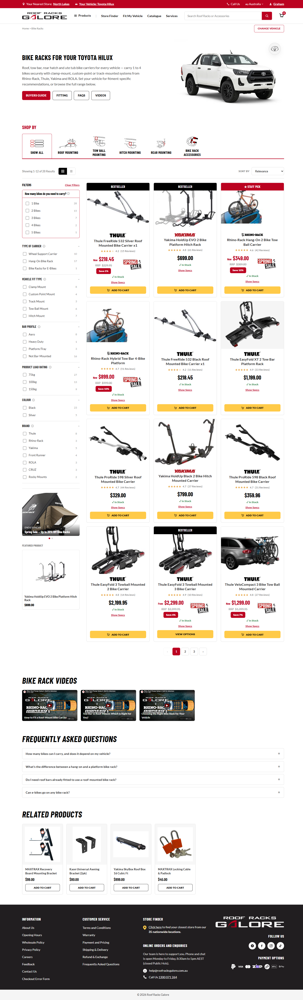
- PLP, mobile (390px), full page: 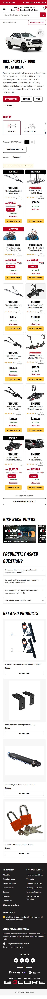
- VPLP (Roof Racks) breadcrumb + hero, showing the vehicle-path breadcrumb and full fitment-spec H1 (contrast with the PLP screenshot above): 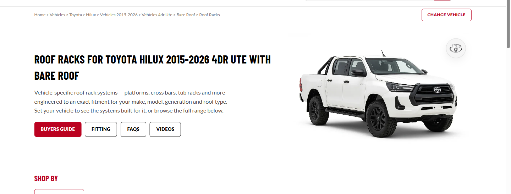

---

## 4. Component Library

### 4.1 Hero (Simple / Vehicle-Set states)

**Name:** PLP Hero

**Location:** top of page, below the breadcrumb row.

**Purpose:** communicates "you're shopping for your [vehicle]" once one is set in session, regardless of whether the category is fitment-locked — while still working as a normal, generic category page when no vehicle is set.

**Shared component (2026-09-29):** the `.plp-hero*` classes (and the breadcrumb row, 4.2) moved from `plp.css` into `shared.css`. The VCLP now uses the same hero, replacing its drifted `.vclp-hero` copy. Build it as one hero component.

**Layout:**
- **Desktop:** two columns, text (1.3fr) and photo (1fr). The text is **top-aligned**, not centred against the photo. Centring made the H1 jump by up to 38px between Shop By tabs as the description length changed. Now the H1, description and buttons always start at the same spot.
- **Desktop photo box:** a fixed **250px** tall, `object-fit: cover`. It used to be a 3:2 box (about 346px), which left about 180px of empty space above Shop By. 250px sits just above the tallest heading + description + buttons across every tab, so the hero keeps one height and Shop By never moves.
- **Mobile (900px and below):** one column, photo first. The description is **clamped to 3 lines** with a "Read more" / "Read less" link (`.link-btn.plp-hero-readmore`, `plpApplyHeroReadMore()`), shown only when the text is actually cut off. The H1 keeps a 2-line minimum height and the description a 3-line minimum. The Read more link keeps its space even when it's hidden (`visibility`, not `display`). Together these mean Shop By and the toolbar don't move under your thumb as you tap through tabs.

**Contents:**
- **Vehicle-Set:** vehicle photo + make badge, H1 copy that differs by category type, and the secondary CTA row (Buyers Guide / Fitting / FAQs / Videos), which is category-general and unchanged between states. The "Change Vehicle" button isn't in the hero. It's in the breadcrumb row (4.2) as a small red outline button, shown only when a vehicle is set.
  - **Standard (PLP, Camping):** short framing. The page config's `vehicleHeadingSuffix` is `'for your {vehicle}'`, and `{vehicle}` is filled with the session vehicle ("Shop Bike Racks for your Toyota Hilux", "…for your Ford Ranger"). The photo and make badge follow the session vehicle too (the Ranger has no badge image, so its badge is hidden).
  - **VRS (VPLP):** the full fitment spec as a fixed suffix ("Shop Roof Racks for your Toyota Hilux 2015-2026 4dr Ute with Bare Roof"). The page is one vehicle's listing, so it keeps its own photo.
- **Simple:** no vehicle photo — a 3-state image fallback applies instead (vehicle photo → category image, if one's configured → no image at all, collapsing to full width rather than leaving an empty column, 2026-09-18 resolution). H1 reverts to the category on its own ("Shop Bike Racks"). **Every hero H1 starts "Shop"** (2026-10-02, Brenton): "Shop {category} for your {vehicle}" with a vehicle, "Shop {category}" without, including every Shop By tab's heading ("Shop Roof Mounted Bike Racks for your Toyota Hilux"). A gold "Set Your Vehicle" CTA (`.btn-cta`) leads the CTA row and opens the site-wide Fit Finder drawer (not a new component).
- **VRS with no vehicle set, specifically:** never gated or empty — shows the real, unfiltered catalogue across every vehicle plus a CTA banner to open the vehicle drawer (matches a live-site reality check done 2026-09-17, replacing the live site's inline 5-field widget with the existing drawer).

**Toggle (dev/demo only):** the Vehicle-Set/Simple state isn't a PLP-specific control. It follows the Site Admin Panel's **Vehicle** select (None / Toyota Hilux / Ford Ranger; `rrgVehicle()` in `session-state.js`), the one session vehicle the header, PDPs, VCLP and search all read. It replaced the old "Vehicle Set" checkbox on 2026-09-29. The 3-state hero image fallback (vehicle/category/none) has its own "Hero image" preview in the Demo State Panel. It is independent of the vehicle, so a reviewer can see all 3 image states without changing the session vehicle. It is disabled, with a hint, when no vehicle is set.

**Screenshots:**
- Vehicle-Set: 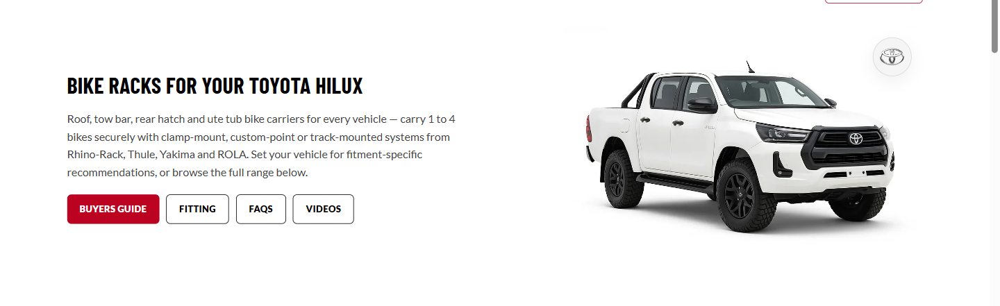
- Simple (category-image fallback): 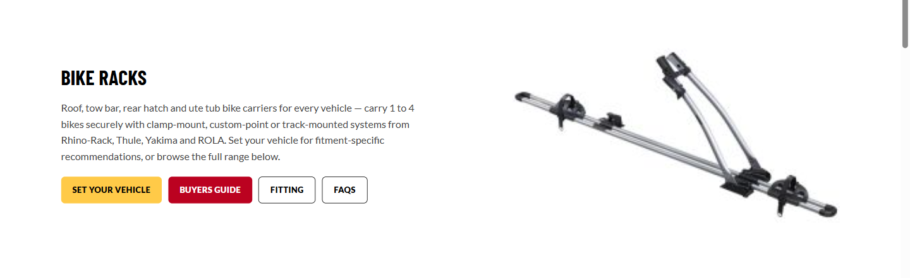

---

### 4.2 Breadcrumbs

**Name:** PLP Breadcrumb

**Location:** top of page, above the hero.

**Purpose:** driven by the page type's own taxonomy, **not** by session vehicle state — a standard category never shows the vehicle in its breadcrumb, even with one set.

**Contents:**
- **Standard PLP:** always the category path, then the active Level 2/3 tab — e.g. `Home > Bike Racks > Roof Mounting` — regardless of vehicle state. Camping: `Home > Camping & Off-Road > Camping > …`.
- **VPLP (VRS):** always the vehicle path, since the page is inherently scoped to an exact vehicle spec: `Home > Vehicles > Toyota > Hilux > Roof Racks` (then any active tab).
  - Changed 2026-09-29 (`spec.md` §15 L8). Year, body style and roof type are no longer in the trail; the H1 carries them.
  - It's one vehicle breadcrumb family built down from the VCLP (`Home > Vehicles > Toyota > Hilux`), with the vehicle-specific PDP continuing it (`… > Hilux > Platforms & Trays > <product name>`).
  - Marked provisional in the spec; it may change after team review.

**Breadcrumb row (2026-09-29, shared with the VCLP and search):** `.plp-crumbs-row` holds the trail (`.rrg-crumbs`) on the left and, when a vehicle is set, the "Change Vehicle" button on the right. That button is `.btn-outline-red` at the small size and is the one Change Vehicle style site-wide. It opens the site-wide Fit Finder drawer. The row is **always one line**: the trail truncates with an ellipsis rather than pushing the button onto a second line. That used to move the whole page down 52px on phones whenever the trail grew.

Rebuilt fully on every Level 2/3 tab change (`plpRenderBreadcrumb()`) — in the real build, each subcategory tile is its own real URL, so its breadcrumb would be server-rendered per-page rather than rebuilt client-side the way this demo does it.

**Screenshot:** see the VPLP breadcrumb in the Section 3 screenshot above (its vehicle-path pattern is the notable contrast with a standard PLP's category-path breadcrumb, which isn't separately screenshotted since it's a plain, unremarkable crumb trail).

---

### 4.3 SHOP BY row (Level 2 subcategory tabs)

**Name:** SHOP BY row

**Location:** directly below the hero, on every category, both states.

**Purpose:** real subcategory navigation — confirmed as **real, fixed, distinct URLs** per tile (not an in-place AJAX filter), deliberately for SEO so each subcategory can be indexed on its own. This is the one place this engine's demo behaviour (client-side tab switching against one shared dataset) is a **known, deliberate stand-in** for what production actually needs to be (Section 6).

**Contents:** icon + label per tile, "Show All" always first (navigates to the parent category view). The full sibling list stays visible regardless of which tile is active — selecting one never collapses the row into a further drill-down. Mobile: horizontal-scroll carousel when the row overflows one line.

**Tile alignment (2026-09-29):** the icon is pinned to the top of each tile, and the label has a fixed two-line area (`.plp-shopby-label`, `min-height: 2.4em`). A two-line label ("Tow Ball Mounting", "Bike Rack Accessories") no longer pushes its icon higher than the one-line tiles, and every label starts on the same line. Together with the top-aligned hero (4.1), Shop By never moves when you switch tabs. Shop By keeps its compact spacing (not the 48px section rhythm) because it's navigation, not a content section.

**Counts and filters (2026-10-06, Brenton):**
- **Counts:** every tile shows a count of what it holds under the active filters, e.g. `SHOW ALL (4) | ROOF MOUNTING (0) | HITCH MOUNTING (4)`, the same way the Search page's tabs do. A tile with nothing under the current filters stays clickable but is faded (`.is-zero`).
- **Switching tabs keeps the filters.** Production carries them over as filter parameters on the tab's URL, so the number on a tab is the number you land on. Until 2026-10-06, switching tabs cleared every filter.
- **Empty state:** when no products match, the grid shows "No products match these filters" with a Clear Filters button instead of an empty grid.

**Filters from the URL (2026-10-06):** a link can open the listing with its tab and filters already selected. The first user is the Buying Guide's Bike Rack Finder (`docs/buying-guide/buying-guide-spec.md`). Prototype keys (`plpApplyUrlFilters()` in `plp.js`); production maps them to the real Magento category and filter URLs:

| Key | Selects |
|---|---|
| `attachment` | One Level 2 tab key selects that tab. Two keys (`tow-ball-mounting,hitch-mounting`) select Vehicle Fit Type: Tow Ball Mount + Hitch Mount on Show All instead. |
| `type` | A Level 3 card under that tab (e.g. `ute-tub`). |
| `bikes` | How many bikes. Roof racks are 1-bike carriers ("one rack per bike"), so the Finder leaves this out for roof results. |
| `hold` | Type of Carrier: Wheel Support Carrier, only when every hold style given is a wheel hold. |
| `ebike=1` | Type of Carrier: Bike Racks for E-Bikes. |
| `brand` | Brand (case-insensitive; `rhino-rack` matches Rhino-Rack). |
| any facet key | Direct, e.g. `colour=black`. |

**Screenshot:** see Section 4.4's screenshot, which shows this row together with the Level 3 cards it can reveal. It predates the counts.

---

### 4.4 Level 3 Icon-Cards (nav-depth)

**Name:** Level 3 icon-cards

**Location:** between the toolbar and the product grid — only present when the active Level 2 tab has `children` configured (not every subcategory has them).

**Purpose:** added 2026-09-18 specifically to demonstrate a real "Camping & Off-Road" style nav-depth pattern (Level 1 Show All → Level 2 persistent subcategory tabs → Level 3+ icon cards inside the results area) — built and demoed on `prototypes/plp-camping/`, which has real scraped Camping subcategory data for it (Tents, Swags, Gazebo, Camp Site → Camp Bags & Storage/Camp Cooking & Kitchen/Camp Lighting & Fans/Camp Accessories, etc.).

**Contents:** a dedicated row of icon-card tiles, fixed at 5 columns on desktop regardless of how many children a tab has, sitting above the results grid rather than merged into it as leading grid cells (an earlier pass tried merging them into the grid; that stretched the icon cards to match a full product card's height, so they got their own row instead). Reuses the exact same `.plp-shopby-icon`/`.plp-shopby-label` styling as the Level 2 tabs, at the same size — deliberately "not shrunk."

**Counts (2026-10-06):** every card shows a live count under the active filters (e.g. "Ute Tub (3)"), on every PLP-family page. This matches the Level 2 tabs (4.3) and the search-results page (`SEARCH-RESULTS-DEVELOPER-BRIEF.md` 4.2). Until 2026-10-06, only the search page showed counts.

**Screenshot (Level 2 tabs + Level 3 icon-cards, Camping "Camp Site" tab active):** 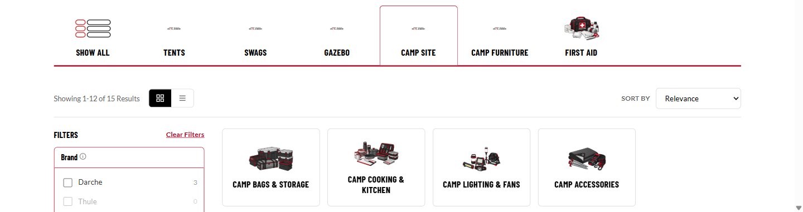

---

### 4.5 Filters (priority + standard, per-category configurable)

**Name:** Filters sidebar

**Location:** left column, alongside the product grid (desktop); a right-edge slide-out drawer behind a "Refine Results" button (mobile).

**Purpose:** **per-category/subcategory configurable facet set** — different categories show entirely different filter attributes (Bike Racks' "How many bikes"/"Type of Carrier" vs. Roof Racks' "Cross Bar Qty"/"Platform Style"). Built as a real configurable structure (an array of facet definitions in `PLP_CONFIG`), not a hardcoded one-off list.

**Contents:**
- **Priority filters** — a per-subcategory subset (soft guideline: ~4 max) promoted to a visually distinct red-outline treatment (originally solid yellow fill, changed to a red outline in the 2026-09-18 review to match the live site more closely), always above the standard list, worded as buyer-journey questions ("How many bikes do you need to carry?") rather than plain technical labels. Which filters are priority varies per subcategory, not just per top-level category.
- **Standard filters** — plain collapsible `
` groups, same live-updating option counts.
- **Tooltip icon** on every filter group (hover/focus) — `plpFilterTooltipHTML()`, using the one shared tooltip bubble (`.rrg-tooltip`, Section 2: footer charcoal #211E20, white Lato 14px, 6px radius), the same as the product-card fitment tooltip. It has shopper-facing copy for every filter (written 2026-09-29, replacing the old placeholder text — e.g. Load Rating: "The most weight the product is rated to carry. Always stay within your vehicle's own roof load limit as well."). The copy lives in one shared list (`PLP_FILTER_TOOLTIPS` in plp.js) keyed by filter, so the same filter reads the same on every page; a filter with no entry falls back to "Narrow your results by \<filter\>." Worth a product-accuracy pass by the team (Section 6).
- **Availability filter** (2026-09-29, `spec.md` §14.1) — on **every** product-listing page (PLP, VPLP, Camping, Search), always the same options, placed last in the standard filters (Search keeps its existing slot). It reads the product's `stock` directly; there is no separate availability copy of the data. Options follow Build Phase + the shopper's nearest store:
  - Phase 1, or Phase 2 with no store set: **In Stock Online** (includes Low Stock) · **Special Order** · **Out of Stock**. Phase 2 with no store set also shows "Set your store to see local stock" at the top of the group.
  - Phase 2 with a store set: **In Stock at North Lakes** · **In Stock Nearby (within 25km)** · **In Stock Online** · Special Order · Out of Stock. The first three are nested: Nearby includes the shopper's own store, and Online includes everything in stock. A store-only selection is dropped automatically if the shopper clears their store.
  - Tooltip, Phase 1: "In Stock Online means it's ready to dispatch from our warehouse the next business day. Many stores hold it too — if yours doesn't, we can have it there within 2 business days." Phase 2: "See what's on the shelf at North Lakes, at stores within 25km, or in our online warehouse (collect at North Lakes within 2 business days)."
- **Clear Filters** — the top of the sidebar and the top of the mobile drawer both say "Clear Filters". It was added 2026-09-18, since there was no way to reset a filter selection before that. The drawer's "Clear All" wording was aligned on 2026-09-29.
- **Mobile priority chips** — a row of quick-access chips above the grid (not merged with the "Refine Results" button itself, see the screenshot), one per priority filter; tapping one opens the full drawer scrolled to that filter's group, with priority filters still pinned at the top of the drawer. Since 2026-09-29 the chips are a **red outline** (`.plp-filter-chip`), filling red when active, matching the desktop priority groups. They were gold before.
- **Mobile filter drawer** — the shared drawer base (Section 2) at the standard 420px width (max 90vw). `role="dialog"`, and it closes on Escape, the close button or the backdrop.

**Engine note:** every option's count is computed live against the current query/tab/other-active-filters via one shared function (`plpMatchesFiltersExcept()`), the same choke point the search-results page's universal facets and `'range'` price mode extend (`SEARCH-RESULTS-DEVELOPER-BRIEF.md` 4.3) — this page family's facets use `'eq'`/`'atleast'` modes only, no range mode of its own.

**Screenshots:**
- Desktop sidebar (priority red-outline group with tooltip open, standard groups below): 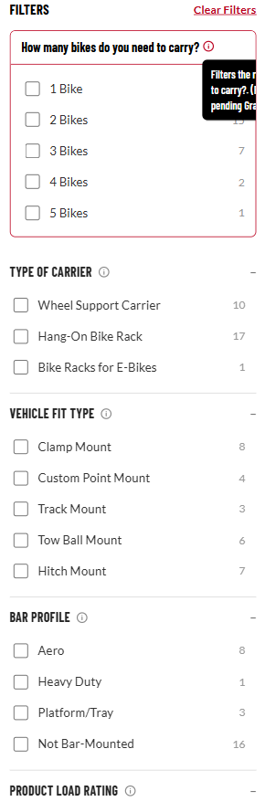
- Mobile toolbar sequence (Refine Results → Sort → priority chip): 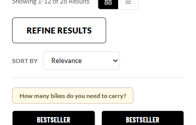
- Mobile filter drawer (priority group pinned at top): 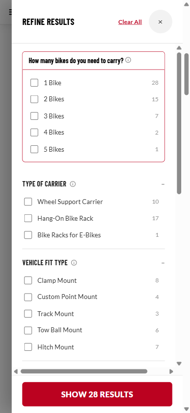

---

### 4.6 Product Grid / List / Cards

**Name:** PLP Product Card

**Location:** main content column, below the toolbar/Level 3 row.

**Purpose:** the actual product listing — same underlying card data drives both a compact Grid view and a more detailed List view via one toggle (not tied to VRS vs. standard; every category gets both). Grid is the default view. The desktop grid is **3 cards per row**, which was signed off 2026-09-18; the 4-per-row option has been removed. Mobile shows two per row.

**Contents:**
- **Ribbons** — Bestseller or Staff Pick, mutually exclusive (Staff Pick wins if a product somehow carries both — an explicitly flagged assumption, not confirmed). Any other truthy string on a product's `ribbon` field renders verbatim as a third, arbitrary ribbon style (e.g. "Spring Sale"). Don't use it for stock messages (the old "Limited Stock Left" demo ribbon was removed 2026-09-29, because it duplicated the Low Stock line) — the real backend flagging mechanism behind this doesn't exist yet (Section 6).
- **Pricing** (updated 2026-09-29) — current price; if on sale, "Now $X" with the struck-through was-price "$Y" beside it on the same line (**no "RRP" prefix on cards** since 2026-09-30, spec.md §16 item 21; the PDP keeps "RRP". Flagged for Graham: the ACCC treats an unlabelled strikethrough as the business's own previous price, and RRG keeps no "was" price history) (wraps underneath on narrow cards), and the saving shown as a "SAVE X%" corner ribbon on the product image rather than in the price block. No seasonal sale-tag graphic on cards. Sibling/variant products (`hasOptions`) read "From $X" (no "Now"), even on sale.
- **Stock line** (reworked 2026-09-29) — one short line under the price, wording from the site-wide stock status model in the PDP Developer Brief, **4.37**. Phase 1: "✓ In Stock Online" / "⚠ Low Stock Online" (amber) / "✕ Out of Stock" (**grey**, never red) / "⏱ Special Order" (amber). Phase 2 with a store set names the store that has it: "✓ In Stock at North Lakes" / "✓ In Stock at Kedron" (**no distance** since 2026-09-30, §16 item 18: the km was measured from the saved store, not the shopper), or "✓ In Stock Online" if only the warehouse has it. **Stock ⓘ on cards** (2026-09-30, spec.md §16 item 19): after the stock line, a small ⓘ button with its own 32px tap target, separate from the card link. Tap, hover or keyboard focus opens a short popover (tapping pins it; Escape or a tap elsewhere closes it). It carries the detail the one-line label leaves out, and nothing task-critical lives only there. **Phase 1:** "Stock shown is our online warehouse (Brisbane). Contact North Lakes to check shelf stock" (the store's page, or "Contact your local store" → Store Finder when none is saved). **Phase 2:** here → "On the shelf at North Lakes today. Also in stock at Kedron and Rocklea"; nearby → "Kedron is about 18km from your store (North Lakes). Also in stock at Rocklea"; warehouse → "Ships from our Brisbane warehouse. Not on the shelf at North Lakes yet: we can have it there within 2 business days." Store names in the card line and popover link to their store pages. The warehouse and the "also in stock" store are demo data until the inventory feed exists. **"Set your store" line** (§16 item 20): in Phase 2 with no store set, one slim, dismissible line above the results grid ("📍 Set your store to see what's in stock near you"), hidden once a store is set; dismissal lasts the session. The old `click_collect` card state ("In Stock — Click & Collect Available") is gone; that's what "In Stock at <your store>" now covers. Prototype demo: a product's Phase 2 store stock is `product.storeStock` if set, otherwise picked from its id to give a realistic mix. The real build needs the per-store inventory feed. **Discontinued** (2026-09-29) is treated like Out of Stock: a grey stock line and a disabled "Discontinued" button, never a live Add to Cart. The PDP hides Add to Cart for both states.
- **Two real data gaps found during the Camping re-scrape, both handled explicitly rather than papered over:** (1) **Price on Application** — some real scraped SKUs have no listed price at all (not out of stock, just no price shown) — shows "Price on Application" and swaps the primary action to a plain "View Details" link, since quick-add needs a real price to add. (2) **Out of Stock** — some real SKUs are genuinely out of stock per the live site's own schema — primary action becomes a disabled "Out of Stock" button.
- **Show Specs** — expandable row (`
`), present on every card in both Grid and List view, defaulting collapsed in both — flagged as an assumption to revisit, Brenton was lukewarm rather than certain on this default.
- **Primary action split** — simple/single-SKU products get a quick "Add to Cart" button (bumps the real header cart badge, no real cart exists behind it); sibling/variant products get "View Options" through to the PDP instead (no quick add, since an option must be picked first) and link to the cheapest sibling. Both are the gold `.btn-cta` at the small card size (13px, 12px on phones), and green in the UK region.
- **Card design update (2026-09-29, on every PLP-family page — PLP, VPLP, Camping, Search):** the seasonal sale-tag graphic is removed from cards; "Save X%" moves from the price block to a diagonal red corner ribbon in the card's top-left corner (grid: the image runs to the card edge, so it's the image corner too; list: anchored to the **card**, not the inset photo — fixed 2026-09-29); sale price and RRP sit on one line (RRP slightly larger, wraps underneath on narrow cards); rating / price / stock evenly spaced. This replaces the two-column price / Save pill / sale-tag layout described under Pricing above.
- **Build phase** (Site Admin Panel, 2026-09-29): Phase 1 = launch build, Phase 2 = agreed later features. On product cards, Phase 1 hides the Best Seller / Staff Pick ribbons and Compare Products; Phase 2 shows them (with the Save corner temporarily pushed below the ribbon bar — how ribbons and the Save corner coexist still needs designing). **Update 2026-09-29:** ribbons (Bestseller, Staff Pick and custom text like "Spring Sale") are now **off by default in Phase 2 as well**, behind a Demo State Panel "Product ribbons" toggle. They're only previewable, not part of either build, until they've been designed properly. Build Phase also switches the stock line and Availability filter between online-only and store-aware wording (4.5, 4.6).
- **Fitment status** (added 2026-09-29) — vehicle-specific products only, placed between the product name and the reviews on grid cards (above the name in list view), centre-aligned in grid view. It is the vehicle-specific PDP's fitment card in its compact size: the markup is `.fitment.fitment-compact` (plus `.plp-fitment` for placement and the tooltip). It is literally the PDP component with its coloured left border, car icon and Barlow uppercase label, not a lookalike, so the two can't drift apart. One line only (no detail line, so it stays slim): green "FITS YOUR TOYOTA HILUX", red "DOESN'T FIT YOUR TOYOTA HILUX", or amber "SUITS TOYOTA HILUX ONLY" when no vehicle is set (naming the product's vehicle). The icon is hidden at 640px and below. The state is driven by the session vehicle (Site Admin's Vehicle) vs. the product's fitment. **Hover / tap / keyboard focus shows a tooltip with the full vehicle** (added 2026-09-29 after the team pointed out "Suits Toyota Hilux only" doesn't say which Hilux): fits — "Confirmed for your Toyota Hilux N80 (4dr Ute, Bare Roof, 2015 to 2026)."; no vehicle — "This product is specific to the Toyota Hilux N80 (4dr Ute, Bare Roof, 2015 to 2026). Set your vehicle to confirm it fits."; doesn't fit — "This product is built for the Ford Ranger P703 (…) — not your Toyota Hilux N80 (…)." It drops down over the card under the label, using the same shared tooltip bubble as the filter tooltips (`.rrg-tooltip` style, Section 2). In the no-vehicle state "Set your vehicle" is a link (and "Change your vehicle" in the doesn't-fit state) that opens the site-wide **Fit Finder drawer** (`HEADER-DEVELOPER-BRIEF.md` 4.10). On the VPLP every card shows it (every product is a Hilux N80 rack set); products that aren't vehicle-specific show nothing. Quick Add to Cart on a vehicle-specific product with no/different vehicle set still adds it, then shows a "confirm this fits before ordering" pop-up. Full detail, including the search page's matching fitment strip: `SEARCH-RESULTS-DEVELOPER-BRIEF.md` 4.7.
- **Compare Products checkbox** — only rendered when Compare is enabled (Section 4.12's Build Phase 2 + Demo State Panel gate). It is red (`accent-color`), matching the filter checkboxes; it used to be browser blue.
- **Reviews** read "(N Reviews)", capitalised the same way on every card (2026-09-29).
- **List view:** the info column follows the grid card's order: **brand logo → product name → fitment status → rating** (2026-09-29, Brenton). The brand used to overlay the photo, and fitment sat above the name. List view shows 2–3 USP bullet points under the rating.
- **VRS/VPLP list rows additionally carry** a per-SKU "Fitment Gallery (N)" button under the thumbnail (Section 4.7) and always a single "View Options" CTA, never PLP's Add to Cart vs. View Options split — **open dispute, not yet resolved:** the client's dev team wants two separate buttons (Flat-pack vs. Assembled are distinct Magento URLs/products); Brenton wants one button landing on the default variant and built this version first, taking it to the team for feedback before any dual-button version gets built.

**Screenshots:**
- Grid view (ribbons, sale pricing, Show Specs expanded, quick Add to Cart): 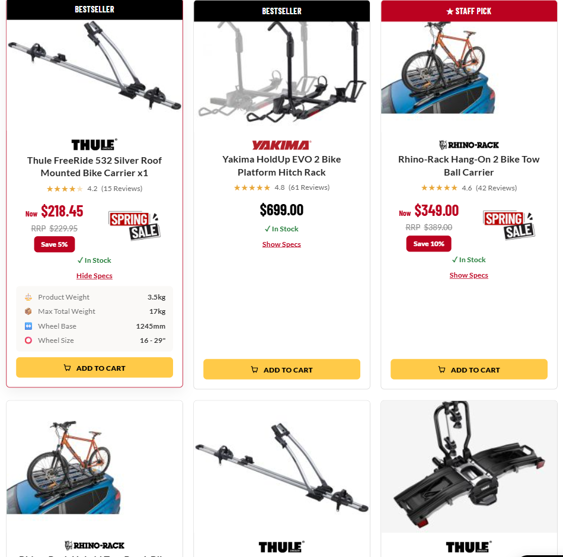
- List view, standard category (USP bullets, no Fitment Gallery button): 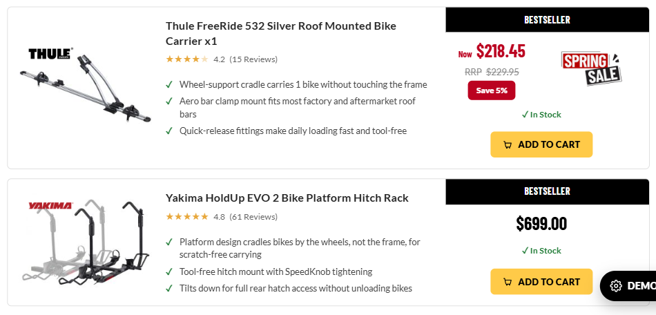
- List view, VRS/VPLP row (Fitment Gallery button + single View Options + "From" price): 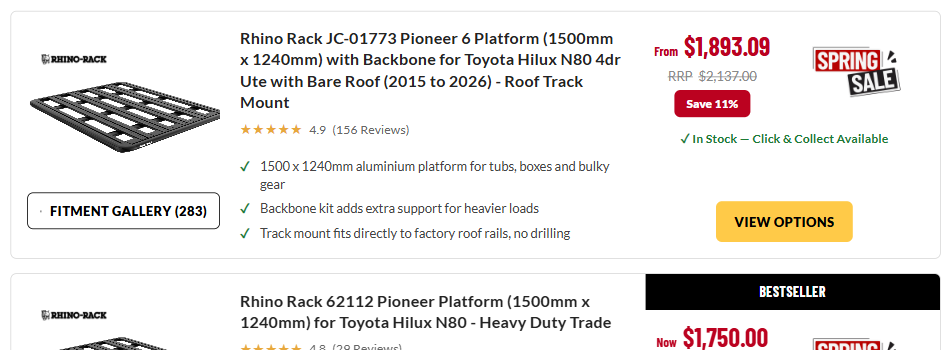

---

### 4.7 Fitment Gallery (VRS/VPLP only)

**Name:** Fitment Gallery — page-level inline widget + per-row slide-out

**Location:** page-level instance sits at position 2 in the results (the 2nd row in list view, or directly after the first full row in grid view); per-row instance is the "Fitment Gallery (N)" button under each VRS product's thumbnail (4.6).

**Purpose:** exact same widget/visual style as the PDP/VCLP version (icon-badge panel, heading, "View All In-store Fitments" link, photo carousel, slide-out with per-fitment detail view) — reused, not rebuilt. Only appears on VRS/fitment-relevant categories with a vehicle set; never on standard PLPs, never in the Simple state.

**Click action:** the per-row button opens the exact same drawer/component as the PDP's Fitment Gallery, launched inline from the PLP without navigating away. The drawer is the wide 600px size of the shared drawer base (Section 2).

**One builder (2026-09-29, `spec.md` §15 C9):** the page-level widget is generated by the same shared functions as the vehicle-specific PDP and the VCLP (`fitGalleryPanelHTML()` / `mountFitGallery()` / `renderFitGalleryTrack()` in `shared.js`). It used to be hand-written on those pages and generated separately here, and the copies differed in badge SVGs, alt text and lazy-loading. Photos are 4:3. The carousel dots are the shared round grey dots, with a red active dot.

**Known open item:** Brenton flagged this widget as "unfinished/not happy with it" during the 2026-09-18 review without specifying what's wrong — needs his direction on the actual target before further work (Section 6).

**Screenshot:** 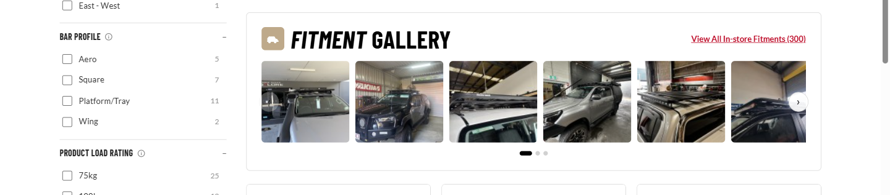

---

### 4.8 Sort & Pagination

**Name:** Sort dropdown / Pagination

**Location:** toolbar row ("Sort By" on the right; the Grid/List toggle, Refine Results and result count are on the left, Section 3); bottom of the results (Pagination).

**Purpose/contents:**
- **Sort set:** Relevance (default), Newest, Best Selling, Highest Rated, then Price: Low to High, Price: High to Low. This exact order and labelling, including "Relevance" not "Default", was a 2026-09-18 fix.
- **One option list (2026-09-29):** the options are built from one list, `PLP_PRODUCT_SORT_OPTIONS` in `plp.js`, and each page's `<select id="plpSort">` is left empty in the markup. The list used to be repeated in 5 places. The select uses the one shared select style (16px on phones so iOS doesn't zoom in).
- **Result count:** one style, `.plp-toolbar-count`, for both the toolbar count ("Showing 1-12 of N Results") and the mobile count above the grid ("Showing N of M Results").
- **Pagination:** desktop has numbered pagination (not infinite scroll). Mobile has a manual "Load More (N)" button, where N is how many more will load (up to a page of 12). It isn't triggered by scrolling. It used to read "Show More Results".

**Open item:** Highest Rated's real feasibility depends on Mark confirming reviews.io data is queryable at the catalogue level — drop the option if it isn't (Section 6).

**Screenshot:** 

---

### 4.9 Merchandising Sidebar

**Name:** Merchandising Sidebar (promo carousel + Featured Product)

**Location:** directly below the Filters panel, same column.

**Purpose:** replaces an originally-planned "sidebar video module, capped at 2 videos" (`plp-spec.md` Section 10.1) — the 2026-09-18 design review resolved that slot to a promo carousel/Featured-Product block instead (swipeable between multiple active promos, most-specific-wins inheritance intended for the real Magento build). **Only one video surface actually exists in this build** — the bottom-of-page carousel (Section 4.10) — the sidebar video slot was replaced entirely, not kept alongside this.

**Contents:** image carousel (round grey dots with a red active dot if more than one promo) + a "Featured Product" card below it. This same component, unchanged, is what `search-results` reuses for its own sidebar (`SEARCH-RESULTS-DEVELOPER-BRIEF.md` 4.4) — this page family is the original/source of it.

**Featured Product (rebuilt 2026-09-29):** it now uses the product card's own price markup (`plpPriceHTML()`), so it shows the same Now/RRP line and sale colour as a card. It has the same "SAVE X%" corner band on the image (`plpSaveCornerHTML()`). The image is `cover` in a 4:3 box, like every other card. Before this it was its own mini card, with no RRP, no sale colour, no Save corner and a `contain` image.

**Screenshot:** 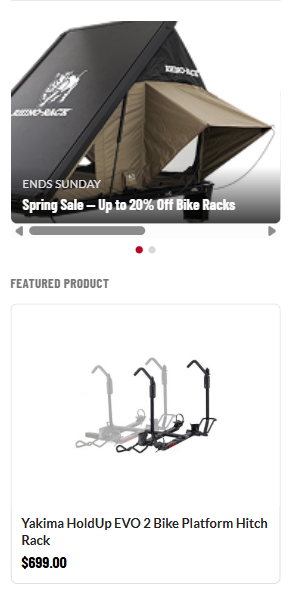

---

### 4.10 Category Videos

**Name:** Category Videos carousel

**Location:** bottom of page, above the FAQ.

**Purpose:** cross-sell/education via video, sourced from a Magento video field set on the category (or, in the real build, aggregating its subcategories too — see Section 6, this aggregation isn't actually built in the prototype).

**Contents:** horizontal carousel of video tiles (thumbnail + play icon + title), reusing the same section-heading style as Related Products/FAQ. The section sits on the shared 48px section spacing (Section 2). The old 40px layout padding above it is gone, which used to leave about 140px of white between the pagination and this heading.

**Screenshot:** 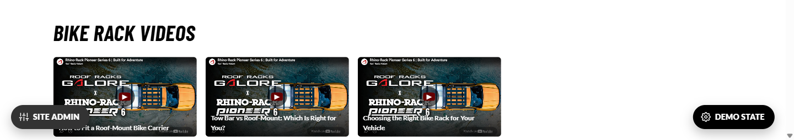

---

### 4.11 FAQ

**Name:** Category FAQ accordion

**Location:** bottom of page, below Category Videos.

**Purpose:** VRS/VPLP categories get real, vehicle-specific FAQ content (same idea as the VCLP's per-make/model FAQ); standard PLPs get generic category-based FAQ content that never references the vehicle (confirmed this doesn't scale to author per-vehicle content for every generic category).

**Contents:** reused `.faq-section`/`.faq-item` accordion component (same as the PDP's). Dynamic per Level 2/3 tab on pages that opt in via `cfg.faqByCategory` (e.g. plp-camping) — re-renders on every tab change so the section genuinely demonstrates swapping content in/out, not just an empty/non-empty toggle. Pages without that config (plain plp/vplp) show static content instead.

**Screenshot:** 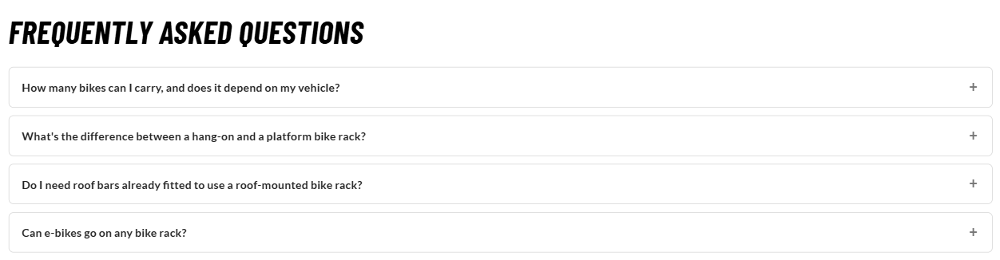

---

### 4.12 Compare Products

**Name:** Compare Products

**Location:** a checkbox on every product card (when enabled) + a sticky "N of 2 products selected / Compare" bar + a right-edge slide-out drawer.

**Purpose:** originally deferred as future-only, then brought back into scope mid-planning-session. **A Phase 2 feature, and gated behind a Demo State Panel "Compare Products" toggle (under "Phase 2 previews") that is off by default.** The toggle is disabled, with a hint, until Site Admin is switched to Build Phase 2. This is the same convention as every other reviewer-only preview in this prototype set. It isn't part of the shipped default state until the client explicitly confirms it should be.

**Contents:** checkboxes select up to 2 products (the 3rd+ checkbox disables once 2 are selected); the sticky bar shows a live "X of 2 products selected" count and a Compare action; the drawer shows the two products' thumbnails/names/prices and a full spec-by-spec comparison table (blank cells where one product lacks a given spec the other has). The drawer uses the wide 600px size of the shared drawer base (Section 2), up from 380px, where the table was cramped. It closes on Escape, the close button or the backdrop.

**Screenshots:**
- Selection state (sticky compare bar): 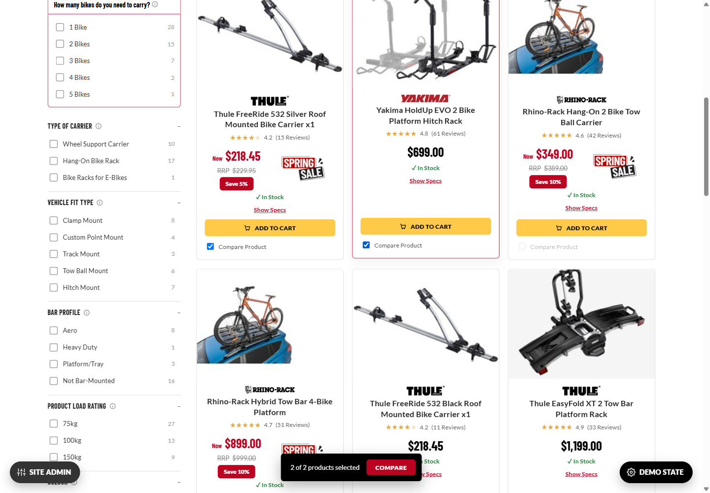
- Drawer (side-by-side spec comparison): 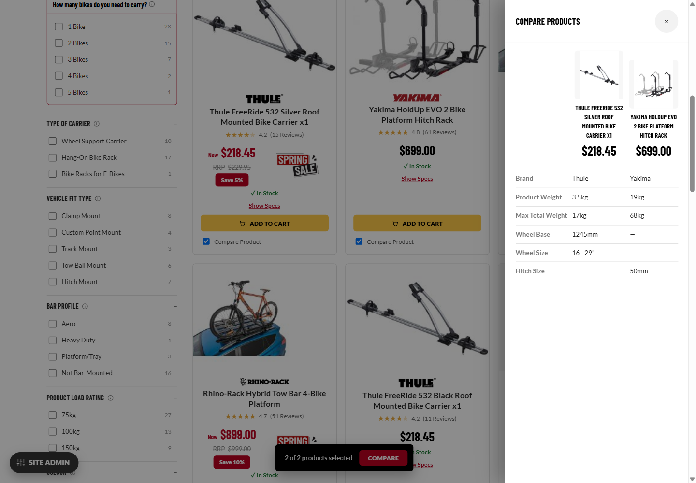

---

### 4.13 Demo State Panel

**Not part of the actual design — used to demo different states across this page family only, do not build this in Magento.** It is the same floating "Demo State" panel as the PDP templates (`DEVELOPER-BRIEF.md` 4.36). Since the 2026-09-29 pass it shows **only the controls that work on the page you're on**. On PLP, Camping and VPLP that means two sections:
- **Hero image:** Vehicle photo / Category image / No image, the 3-state fallback preview (4.1). It is disabled, with a hint, when no vehicle is set.
- **Phase 2 previews:** Compare Products (4.12) and Product ribbons (Bestseller, Staff Pick; 4.6). Both are off by default and disabled, with a hint, until Site Admin is on Build Phase 2.

The PDP-only product-state controls no longer appear here. The old "Default view" and "Grid columns" (3 or 4 per row) controls were **removed**: 3 per row is locked, and the page has its own Grid/List toggle. Choices are saved per template (`rrgDemo:<template>`) and cleared by Site Admin → "Reset all demo settings".

The **Site Admin Panel** (bottom-left) holds the global controls: templates, dev briefs, the shopper session (Logged in, **Vehicle: None / Toyota Hilux / Ford Ranger**, Nearest store set), Build Phase, Site Promotions and Prototype Tools. Its Vehicle select drives the Simple/Vehicle-Set state (4.1). On phones, both panels open from small icon-only buttons.

Mentioned here only so a developer who notices these panels in the prototype's source knows to leave them out of the production build.

---

### 4.14 Related Products

**Name:** Related Products

**Location:** bottom of page, below the FAQ. On PLP, Camping and (since 2026-09-29) VPLP.

**Purpose:** an accessory cross-sell strip. It's the same component as the PDP's Related Products (`.related-section` / `.related-grid` / `.product-card`, `DEVELOPER-BRIEF.md`), not a PLP-specific build.

**Contents:**
- The shared section heading ("Related Products"), then a row of compact product cards (image, title, price, Add to Cart).
- Card titles are the **product name only**, with no SKU.
- Add to Cart is the gold `.btn-cta` card button (small size, cart icon, full width), green in the UK. It replaced the old black-outline button on PLP and Camping on 2026-09-29.
- The card deliberately stays a smaller, compact version of the PLP product card (14px title); it isn't meant to match the PLP card exactly.
- Demo content: PLP and Camping share a generic accessory strip. The VPLP uses the vehicle-specific PDP's real Rhino-Rack / Hilux accessories (awning brackets, MAXTRAX, tie-down kit).

---

## 5. SEO & Structured Data

**Location:** the page `<head>` — not a visible widget, so it doesn't follow the Name/Location/Purpose/screenshot template used above.

**What's built (2026-09-29, `spec.md` §15 G6/G8):**
- **Every page:** `<html lang="en-AU">` and the real live favicon (`_shared/favicon.ico`).
- **`<title>`:** follows the site-wide "Page name — Roof Racks Galore" format. "Bike Racks for Toyota Hilux — Roof Racks Galore", "Camping Gear — Roof Racks Galore", "Roof Racks for Toyota Hilux — Roof Racks Galore".
- **Meta description and Open Graph / Twitter tags:** `og:type`, `og:site_name`, `og:title`, `og:description`, `og:url`, `og:image`, `twitter:card` (summary_large_image), title, description and image. They are on all three templates, built from each page's own category description and a real product image.
- **Canonical:** PLP → `https://www.roofracksgalore.com.au/bike-racks`, Camping → `https://www.roofracksgalore.com.au/camping-offroad/camping`. Both are verified live category URLs (and match `og:url`).
- **VPLP has no canonical (or `og:url`) yet,** because the live site has no vehicle-specific category URL to point at.
- **No JSON-LD** on any of the three templates.

**Unlike the search-results page, these ARE meant to be real, indexable pages** — the whole point of the SHOP BY row's real fixed URLs (Section 4.3) is SEO indexability per subcategory. In the real Magento templates, per-category meta description, canonical and title (including one per Shop By subcategory URL) and `BreadcrumbList`/`Product`-list structured data all need generating from the category data. The prototype's tags are static examples on the top-level category only. This is the same category of gap as `DEVELOPER-BRIEF.md` Section 5 flags for the PDP templates, not a genuinely open question the way search-results' indexability was.

## 6. Known gaps before production

1. **SHOP BY's "real fixed URL per subcategory" behaviour is simulated, not real, in this prototype** — the demo swaps content client-side against one shared in-page dataset rather than actually navigating to a distinct URL per tile. The real build needs this to be genuine per-URL server-rendered pages (or an SPA-style route change with real URLs), not a port of this prototype's JS.
2. **Bestseller vs. Staff Pick tie-break** (4.6) — assumed mutually exclusive, Staff Pick wins; not confirmed.
3. **Show Specs defaulting closed on both Grid and List** (4.6) — Brenton was lukewarm, not certain.
4. **Flat-pack/Assembled single-button vs. dual-button dispute** (4.6) — Brenton's single-button version was built first; the client's dev team may push back once he shares it, per an open disagreement about how Magento models the two as separate products/URLs.
5. **Fitment Gallery redesign** (4.7) — Brenton flagged it as unfinished/not happy with it during review but didn't specify the target; needs his direction before further work.
6. **Filter tooltip copy review** (4.5) — every filter now has real shopper-facing wording (2026-09-29), but it was written without an attribute glossary, so the team should check it for product accuracy. The Availability tooltip now has both Phase 1 and Phase 2 wording (4.5, 2026-09-29).
7. **Real backend ribbon-flagging mechanism** (4.6) — Bestseller/Staff Pick/custom ribbon text all need a real Rackit/Magento-side source; nothing in this prototype computes them.
8. **Real icon set for SHOP BY/Level 3 tiles** (4.3/4.4) — this prototype's icons are a mix of scraped-real and reused-approximate; a real, complete icon set is a separate asset-sourcing task.
9. **Highest Rated sort's feasibility** (4.8) — depends on reviews.io data being queryable at catalogue scale, not just per-SKU the way the PDP's star-rating badge already proves it works.
10. **Category Videos aggregation across subcategories** — the spec called for the bottom carousel to aggregate every video across a category *and all its subcategories*; the prototype only renders whatever's directly configured on the active tab, not a real aggregation.
11. **Quick-add-to-cart cross-sell behaviour** — whether adding from a PLP card should still surface cross-sell products in the mini-cart is an open technical question for Mark, not something this prototype (which has no real cart) can demonstrate either way.
12. **Sibling-group card title/description sourcing** — pulling from the sibling "container" product rather than a child SKU is Graham's Magento data-model problem to solve, not something resolvable in this prototype.
13. **Schema.org multi-`Offer` markup for sibling-group products** — Mark's data-layer task, not started.
14. **Wishlist/save-to-list** — Brenton himself is unresolved on whether it's needed at all; treated as a future/separate feature, not part of this build.
15. **Store/inventory (delivery vs. local-store-stock indicator)** — Phase 2. The wording and filter are now designed and previewable (Build Phase 2 + Nearest Store Set; 4.5, 4.6, PDP brief 4.37). The per-store inventory feed and store picker behind them still don't exist.
16. **Whether VCLP and standard PLP eventually merge into one dynamic Magento template** — Mark's technical call, not a prototype-level decision.
17. **VPLP canonical URL** (Section 5) — no live vehicle-specific category URL exists yet, so the VPLP has no canonical/`og:url`. It needs one once the real URL structure for vehicle categories is decided.
18. **Vehicle breadcrumb pattern is provisional** (4.2) — `Home > Vehicles > Toyota > Hilux > Roof Racks` was agreed 2026-09-29 but may change after team review.

---

## 7. Brand pages + Brands hub (2026-09-30, `docs/brand/brand-spec.md`)

**Templates:** `prototypes/brand/index.html?brand={slug}` (one template for all 8 built brands: thule, rhino-rack, yakima, front-runner, cruz, maxtrax, rola, rockymounts) and `prototypes/brands/index.html` (the hub). Both are built from shared components, with no page-local CSS (`shared.css` → "Brand pages + Brands hub").

**Brand page, top to bottom:**
1. **Brand banner** (`.brand-hero`): the Figma's layout. The brand's own lifestyle photo (`images.hero`: file, crop focus, alt, source), contained, with a dark left scrim and, over it, the logo as the H1 (alt = brand name): the brand's white logo file (`logoWhite`) where it has one, otherwise its logo turned white with a CSS filter (`.is-mono`). Logos are high-resolution files from the brands' own sites (`_shared/brands/logos/`). Then the tagline, the live product count (AU only) and a jump link to the grid. Phones: the photo above an accent-colour panel with the same text.
2. **Shop {brand} by category** (`.cat-tile-grid--brand`, `.cat-tile--product`): up to 6 tiles, each linking to the brand's existing department page (e.g. `/bike-racks/by-brand/thule-bike-racks`), photo = that page's first product. Hidden with fewer than 2 tiles. Per-region tile lists (`tiles[].regions`).
3. **About {brand}** (`.brand-about`): lead line, 2–3 sentences, 4–5 bullets, warranty footnote, on the brand accent, with the brand's own lifestyle photo (`images.about`) beside it. Copy researched from each brand's own site; every fact is sourced (brand-spec.md 3.4).
4. **Vehicle finder** (`[data-vehicle-finder]` with `data-vf-stay="#brandProducts"`): sets the vehicle and scrolls to this page's grid instead of going to the VLP. The known-vehicle button reads "Shop {brand} for my {model}" (`data-vf-shop-label`). Hidden for brands with nothing vehicle-specific. The page's one gold CTA.
5. **Top selling {brand} products**: `.product-carousel`. **Stand-in:** the first product of each tile's department page. Production needs a sales-ranked feed.
6. **Recent {brand} fitments**: Home's Recent Fitments panel with this brand's Rackit photos; the session vehicle's first when it has 4 or more. Hidden when the brand has none (MAXTRAX, Rockymounts).
7. **All {brand} products**: the PLP engine (`plp.js`) with a brand-scoped `PLP_CONFIG` (`vehicleFilter: true`, facets Category / Price / Availability). Grid contents and order as live. With a vehicle set, the **"Fits your {vehicle} ×" chip** (`#plpVehicleChip`, `plpRenderVehicleChip()`) is on: products with fitment (`fitsVehicle`) are narrowed to that vehicle, everything else stays in, and products that fit it sort first under Relevance. Clearing the chip shows everything; a new vehicle turns it back on.
8. **{brand} FAQs** (`.faq-section`, `renderBrandFaq()`): the brand's own questions (`faqs` in brand-data.js, each with its source URL) then three RRG questions from the live policies (fitting, local warranty, price match), AU only. `FAQPage` JSON-LD built from the same list. In Magento: a per-brand FAQ field, plus the three shared RRG answers as a CMS block.
8b. **Popular vehicles for {brand}**: pills from the vehicles in its fitment photos (demo vehicles → VLP, others → the live product page). Hidden once a vehicle is set.
9. **Shop more brands** strip (the other built brands) → trust band → footer.

**Regions:** AU and NZ show all 8. UK shows Thule, Rhino-Rack, Yakima and Cruz, with UK-only tile lists. A brand the region doesn't sell shows "{brand} isn't available from The Roof Box Company" and a link to the hub. Prices follow the prototype-wide currency swap.

**Brands hub:** the live H1 and intro (Read more), a card per built brand (logo, lead line, what it makes, live product count in AU, Shop {brand}), then an A–Z of every brand the region sells (AU: the live Brands menu; NZ: the NZ site's list; UK: roofbox.co.uk). Built brands link to their page (bold); the rest keep their live URL. `BreadcrumbList` + `ItemList` JSON-LD.

**Linking:** the header Brands panel (the L1 and "View All Product Brands" → hub, the 8 brands → their pages; `RRG_BUILT_BRANDS` in nav-data.js), every template's "Shop The Best Brands" strip (`rrgLinkBrandStrip()`), and Search Results' brand cards (`rrgBrandUrl()`).

**SEO:** indexed. `<title>` and description as live, canonical = the live brand URL (the vehicle filter never changes the URL), `BreadcrumbList` + `CollectionPage` about a `Brand` + `FAQPage`.

**Data:** `prototypes/brand/brand-data.js` (brand meta, tiles, copy, A–Z) and `brand-products.js` (product sample + fitments), generated from the live crawl of 30 Sep 2026. In Magento the accent, tagline, banner photo, About copy and tile list are fields on each brand category.

**Known gaps:** usage rights for the brand photography (from the brands' own sites; confirm with each supplier or use their media kits); a real bestseller feed (5); brand logos to be swapped for media-kit originals (the prototype's come from the brands' websites); brand colours are taken from the brands' sites and need confirming; UK Rhino-Rack (brand-spec.md Section 11).
