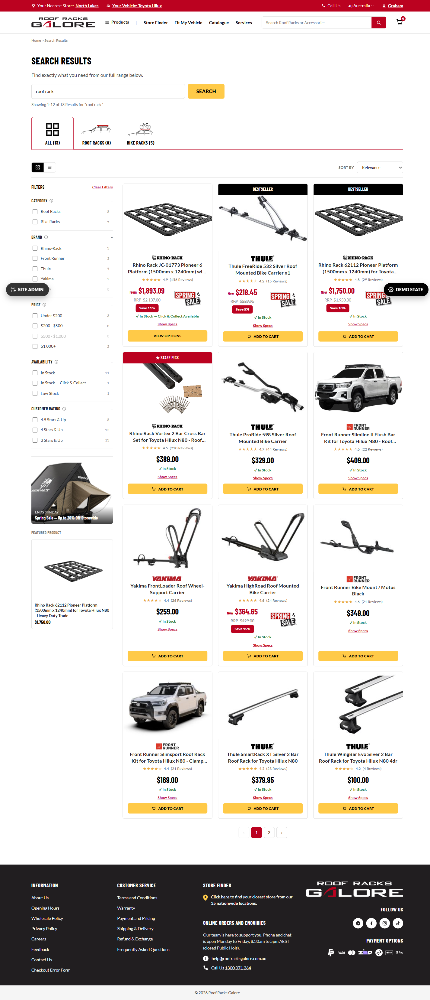
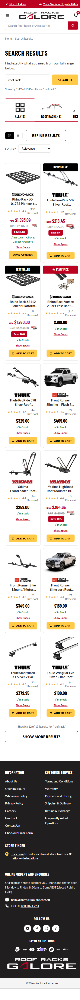
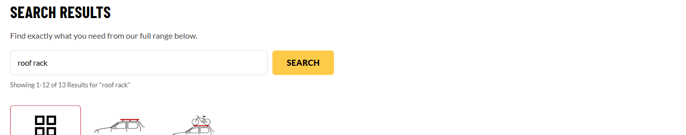
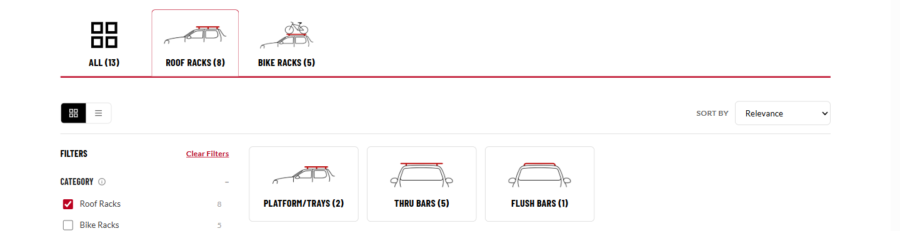
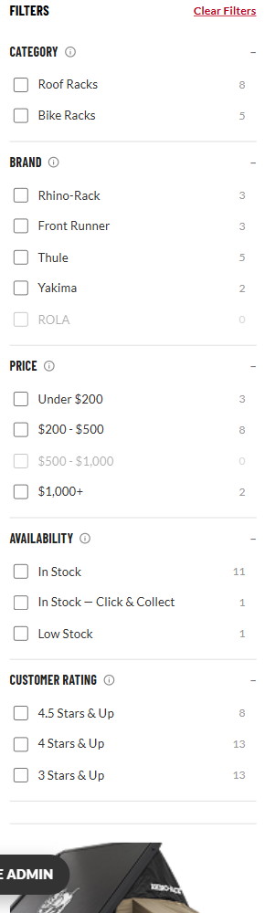
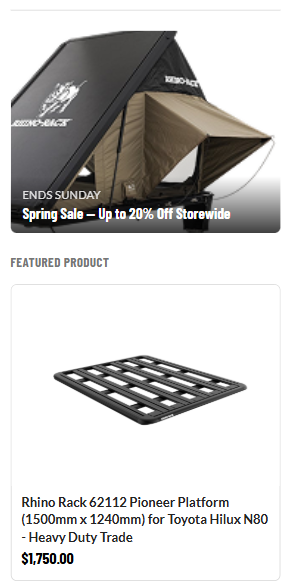
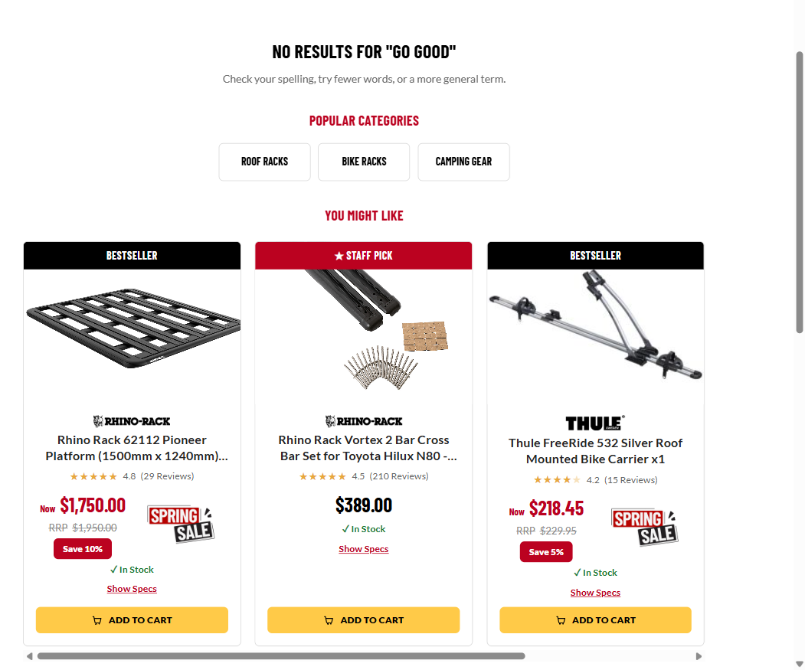
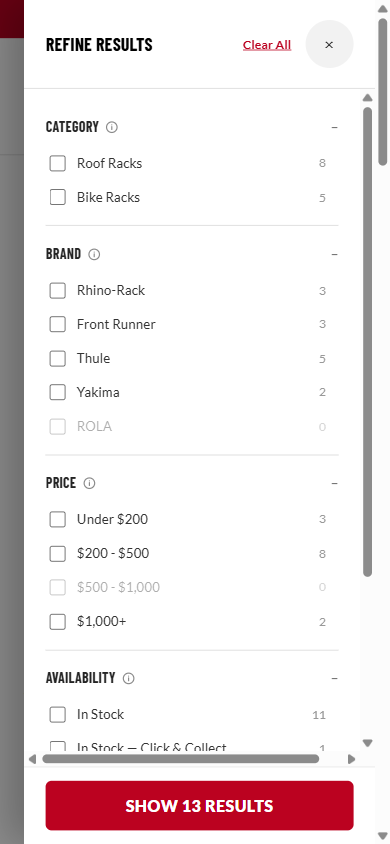

# Search Results Page — Developer Brief

## 1. Project context

**Audience:** for Marc, same as `DEVELOPER-BRIEF.md`, `HEADER-DEVELOPER-BRIEF.md`, `FOOTER-DEVELOPER-BRIEF.md` and the Vehicle Category Landing Page brief — detailed information on this page's build so implementation decisions in Magento stay consistent with the intent, even where the exact prototype code can't be lifted verbatim.

**What this page is:** the on-site search results page, reached by submitting the header search box (or clicking its "View All Results" link — Section 6) or the "You Might Like"/popular-category links on this page itself. It's a genuinely different page type from a PLP/VPLP: a PLP is always exactly one category with a fixed, known product set; a search's results can span **multiple categories at once**, or return **zero matches** — neither of which a single-category PLP is structurally built to handle. Extends the existing PLP/VPLP/Camping engine (`prototypes/_shared/plp.css`/`plp.js`) rather than forking it, so the grid/card/sort/pagination/compare machinery is identical to those pages by construction, not a lookalike copy.

**Companion documents:** `docs/search-results/search-results-spec.md` is the original engineering spec (written 2026-09-21, before build) — read it for the *why* behind each design divergence from PLP; this brief is the handover summary of what was actually built, not a replacement for it. The project memory log (`project_pdp_search_results_planning`, if you have access to it) has the full day-by-day build history including three follow-up rounds after initial sign-off. `docs/PAGE-GLOSSARY.md` doesn't yet have a Search Results section — worth adding (Section 6).

**This page reuses the PLP/VPLP/Camping engine's product grid, cards, sort, pagination, and mobile filter drawer wholesale** — those components are now fully documented in `docs/plp/PLP-DEVELOPER-BRIEF.md` (written 2026-09-22, after this brief flagged it was missing). This brief documents the **search-specific** pieces in full (Section 4) and only summarizes the reused PLP-family pieces with a pointer to that brief, rather than re-documenting card/grid/pagination behaviour it now owns properly.

**Build status:** built as `prototypes/search-results/index.html`, worked example query is "roof rack" (13 results spanning Roof Racks and Bike Racks). Playwright-verified across every round below: desktop (1440px) and mobile (390px, zero horizontal overflow), category quick-tabs + Level 3 icon-card filtering, zero-results state, mobile filter drawer, sidebar merchandising, header search entry points. Zero console errors throughout (aside from the usual harmless favicon 404). Pushed to `main` across several commits from 2026-09-21 through 2026-09-22 (`6504017` initial build, `240c273`/`af18f60`/`6b218d1`/`e450ed1` follow-ups) — see the spec doc and project memory for the exact history if needed.

---

## 2. Typography & colour reference

Same type scale and colour tokens as `DEVELOPER-BRIEF.md` Section 2 (Barlow Condensed for headings/buttons, Lato for body text, the full `--rrg-*` custom-property table) — not repeated here. No page-specific typography deviations.

The product grid/card, filter sidebar, and sort/pagination controls use the same classes and styling as the PLP/VPLP/Camping templates (`plp.css`) — again, no deviation specific to this page. The only genuinely new visual patterns this page introduces are documented with their own styling notes in Section 4 (category quick-tabs, the zero-results empty state, and the Level 3 icon-card counts).

---

## 3. Page Layout — Search Results

One page, section order top to bottom:

1. Global Header (incl. the search box that leads here — Section 6) + vehicle strip
2. Breadcrumb ("Home > Search Results", static — not a real taxonomy trail, since a search isn't a category) + "Search Results" heading
3. Results bar — inline editable search box + "Showing X of N results for '\<query\>'" (Section 4.1)
4. Category quick-tabs (Section 4.2)
5. Toolbar — grid/list toggle + Sort dropdown (reused from PLP, unchanged)
6. Two-column layout below the toolbar:
   - **Sidebar:** Filters (universal facet set, Section 4.3) + Merchandising block (Section 4.4)
   - **Main:** Level 3 icon-card row when one category is narrowed (Section 4.2) → product grid/list (reused from PLP, unchanged) → pagination (reused, unchanged)
   - **OR**, if the query matches nothing: the zero-results state entirely replaces the grid/pagination (Section 4.5)
7. Global Footer

**Screenshots:**
- Desktop (1440px), full page, default "roof rack" query: 
- Mobile (390px), full page: 

---

## 4. Component Library

### 4.1 Results Bar (inline search box)

**Name:** Results Bar

**Location:** replaces the hero/breadcrumb-CTA-row a PLP would have, directly below the static breadcrumb + heading.

**Purpose:** lets a shopper refine or completely change their search without going back to the header box — genuinely resubmittable in place, not just a link back to the header.

**Contents:** a real `<form>` (`#plpSearchForm`) with a text input (`#plpSearchInput`, pre-filled with the current query) and a Search button, plus a result-count line: `Showing 1–12 of N Results for "<query>"` (or `0 Results for "<query>"` in the zero-results state).

**Behaviour:** submitting the form sets the active query, resets any active filters (a Brand/Category selection from the old query's results may not even exist in the new one — deliberate, not a bug) and re-renders the tabs/filters/grid. No vehicle-context row is repeated here — the header's own vehicle strip already shows that globally, and nothing on this page is vehicle-scoped.

**Screenshot:**  (top of this same screenshot also shows the breadcrumb/heading above it and the first quick-tab below it)

---

### 4.2 Category Quick-Tabs + Level 3 Icon-Cards

**Name:** Category Quick-Tabs (top) / Level 3 icon-cards (below the toolbar, conditional)

**Location:** quick-tabs sit directly below the Results Bar; the icon-card row (when present) sits between the toolbar and the product grid.

**Purpose:** replaces PLP's fixed "SHOP BY" tabs with a set **dynamically built from whichever categories actually appear in this search's result set** — e.g. a "roof rack" query pulls real matches from both the Roof Racks and Bike Racks catalogues, so both appear here; a query that only matched one category would only show one tab (plus "All"). Unlike PLP's SHOP BY (deliberately real, indexable per-category URLs), these tabs are **in-page filtering only** — a search result set isn't itself a taxonomy node, so there's no SEO reason to hard-URL each one.

**Contents:** "All (N)" plus one tile per category present in the result set, each showing a live count — e.g. `ALL (13) | ROOF RACKS (8) | BIKE RACKS (5)`. Selecting a tab (or the sidebar's Category filter checkbox, Section 4.3 — both control the same underlying selection, kept in sync) narrows to one category and, if that category has sub-types configured, reveals a row of icon-cards for them directly above the grid (e.g. within Roof Racks: Platform/Trays (2), Thru Bars (5), Flush Bars (1) — counts sum back to the parent tab's 8). This icon-card pattern is reused unchanged from the Camping template's own Level 3 nav-depth cards; the only search-specific addition is that **these cards show a live result count**, added 2026-09-22 after review — on plain PLP/Camping this same component is pure navigation (no count, since the catalogue there is fixed), so don't expect this exact count behaviour if you're cross-referencing that other usage.

**Click action:** selecting a tab or icon-card is a pure client-side re-filter — no page navigation, no URL change.

**Screenshot (tabs + Level 3 cards + synced sidebar checkbox, Roof Racks selected):** 

---

### 4.3 Filters (universal facet set)

**Name:** Filters sidebar

**Location:** left column, below the Results Bar/tabs, alongside the product grid.

**Purpose:** PLP's per-category configured facets (e.g. Bike Racks' "how many bikes," Roof Racks' "cross bar quantity") can't apply here, since a mixed result set may span categories that don't share an attribute schema. This page instead shows a fixed **universal** facet set that every product in the catalogue carries regardless of category.

**Contents:** Category (same set as the quick-tabs, Section 4.2 — one shared selection, not a second independent filter), Brand, Price (range buckets, not exact-match — a new engine mode, see the note below), Availability, Customer Rating. Every option shows a live count that narrows correctly against both the active query *and* any other active filters (confirmed important during build — see the engine note below). No priority-filter "gold" treatment (that's a per-category buyer-journey concept from `plp-spec.md` that doesn't map onto an arbitrary mixed set), and no category-specific technical facets.

**Engine note for whoever maintains `plp.js`:** two additions were needed to the shared engine to support this page, both gated behind a `PLP_CONFIG.isSearch` flag so `plp`/`vplp`/`plp-camping` are unaffected: (1) a `'range'` facet mode in `plpValueMatches()` — every other facet mode reads `product.facets[key]`, but Price here reads `product.price` directly; (2) the search-query text match itself lives in the same choke point (`plpMatchesFiltersExcept()`) as every other filter check, so a query like "roof rack" narrows the pool *before* facet counts are computed — doing this later, only in the final grid render, would have left the sidebar's counts wrong (counting against the whole catalogue instead of the query's matches).

**Screenshot:** 

---

### 4.4 Merchandising Sidebar

**Name:** Merchandising Sidebar (promo carousel + Featured Product)

**Location:** directly below the Filters panel, same column.

**Purpose:** added 2026-09-22 — this page was missing the same sidebar merchandising slot every PLP/VPLP/Camping page already has. No engine change was needed at all; the shared `plpRenderMerchSidebar()` function already supported any page generically, this page's markup and config just hadn't been wired up to it yet.

**Contents:** a promo image carousel (dots if more than one slide) + a "Featured Product" card below it. **Because this page has no single category to draw a "real" category-level promo from, it uses a cross-category promo instead** (a storewide sale tile) rather than PLP's per-category promo — same reasoning as Section 4.3's dropped priority-filter treatment. The featured product is a single hardcoded pick from the demo dataset; in production this would presumably follow whatever merchandising rule Magento applies (same open question as the equivalent PLP component, not specific to this page).

**Screenshot:** 

---

### 4.5 Zero-Results State

**Name:** Zero-Results State

**Location:** replaces the entire product grid + pagination area when the active query matches nothing.

**Purpose:** genuinely new — every PLP/VPLP/Camping template has products by construction, so this is the first page type in this project that needs a real empty state.

**Contents, top to bottom:**
1. `No results for "<query>"` heading + a short hint to check spelling, try fewer words, or a more general term. (Spelling correction / "did you mean" was explicitly scoped out for this round — see the spec doc Section 8 — this is a static hint line only, not a real suggestion engine.)
2. **Popular Categories** — three links to the real Roof Racks/Bike Racks/Camping Gear category pages (not `href="#"` placeholders).
3. **"You Might Like"** — a small featured-product row reusing the exact same product card component as the main grid. **Built as a genuine horizontal-scroll carousel** (not a wrapping grid) — exactly 3 cards visible on desktop with the 4th+ reachable by scroll; this was a real regression caught and fixed 2026-09-22 (an in-progress edit had briefly turned it into a 3-column grid, which wrapped the 4th card onto a visible second row instead of scrolling).

**Screenshot:** 

---

### 4.6 Product Grid/Cards, Sort, Pagination, Mobile Filter Drawer (reused, not re-documented)

**Location:** main content column; mobile filter drawer is a right-edge slide-out triggered by a "Refine Results" button, mobile only.

**Purpose/contents:** identical to the PLP/VPLP/Camping templates — grid/list toggle, ribbons, sale pricing (Save X%), Add to Cart vs. View Options split, Show Specs expandable row, Compare Products checkboxes/drawer, Sort dropdown (Relevance/Newest/Best Selling/Highest Rated/Price Low→High/Price High→Low), desktop numbered pagination + mobile "Show More," and the mobile filter drawer pattern. **None of this is re-documented here** — see `docs/plp/PLP-DEVELOPER-BRIEF.md` Section 4 (4.6, 4.8, 4.12) for the real component-level detail (Name/Purpose/States/screenshots per widget). This brief only confirms that search-results uses these components completely unchanged.

**Screenshot (mobile filter drawer, showing the same universal facet set as 4.3):** 

---

## 5. SEO & Structured Data

**Location:** the page `<head>` — not a visible widget, so it doesn't follow the Name/Location/Purpose/screenshot template used above.

**Decided (Brenton, 2026-09-22): this page is not indexable.** It doesn't need to be findable by Google at all — query-dependent, unstable content is exactly the case a search-results page is normally kept out of the index for, and RRG doesn't need it discoverable via search regardless.

**What's built:** the prototype now carries `<meta name="robots" content="noindex, nofollow">` in its `<head>`, matching that decision. No meta description, canonical tag, or `BreadcrumbList`/`ItemList` JSON-LD exists on this page, and **none of that needs building** — it would only matter for a page meant to be indexed. The prototype's `<title>` is still a dev-facing label (`"Search Results — Roof Racks Galore"`); give it a real title in the Magento build regardless of noindex status, since the tab/window title and any internal tooling that reads it still benefit from a real one.

**For the real Magento build:** carry the same `noindex, nofollow` directive through (or an equivalent robots.txt/canonical-based exclusion, whichever fits the site's existing SEO tooling) — this is a one-line implementation once the decision itself was the only open question.

---

## 6. Known gaps before production

1. ~~No PLP Developer Brief exists yet~~ — **resolved 2026-09-22**, see `docs/plp/PLP-DEVELOPER-BRIEF.md`.
2. ~~SEO strategy for this page type is a genuinely open decision~~ — **resolved 2026-09-22**: not indexable, see Section 5.
3. ~~The header search box now has real functionality feeding into this page, not yet documented in `HEADER-DEVELOPER-BRIEF.md`~~ — **resolved 2026-09-22**, see that brief's new Component Library entry for the search typeahead/focus-state dropdown/View All Results link.
4. **Universal filter set (Brand/Price/Availability/Rating) is this project's own proposed minimum**, not a client-confirmed list (spec doc Section 8, item 4) — flag for review.
5. **Compare Products / VRS-adjacent card behaviour in a mixed result set** was assumed to need no special-casing (card behaviour is card-level, not page-level) but hasn't been specifically visually verified with a VRS product sitting next to non-VRS products in the same grid (spec doc Section 8, item 3).
6. **Category quick-tabs vs. sidebar Category filter showing the same categories in two places** was a deliberate design call (one shared selection, two surfaces), but is worth confirming with Brenton/the client that it doesn't read as redundant now that it's actually visible and built (spec doc Section 8, item 2).
