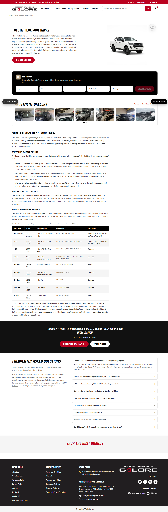
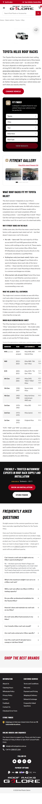
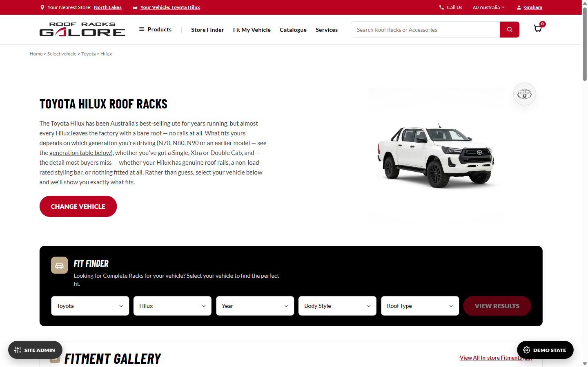
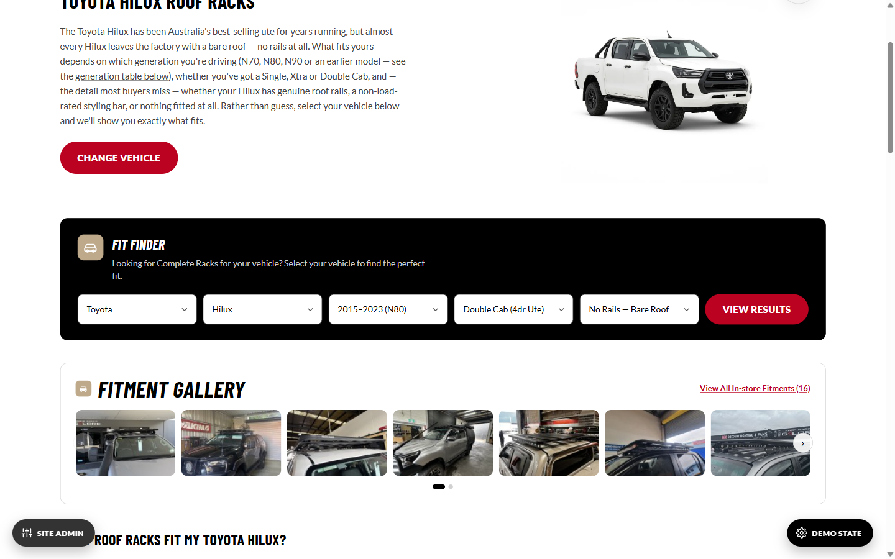
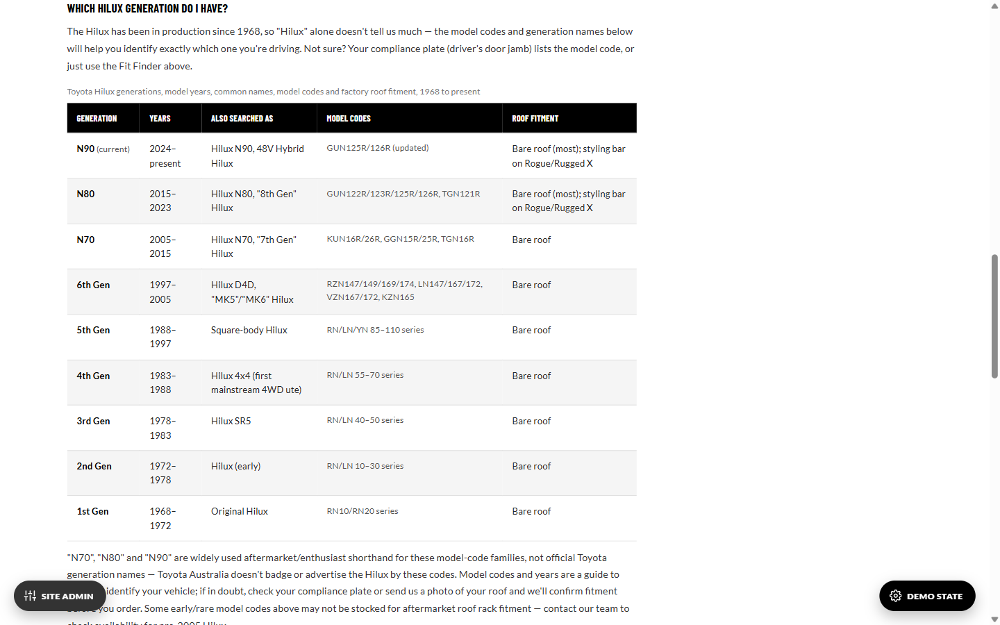
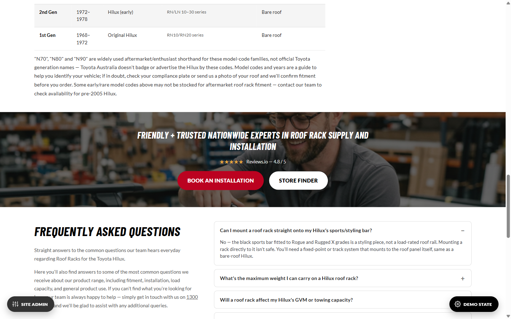
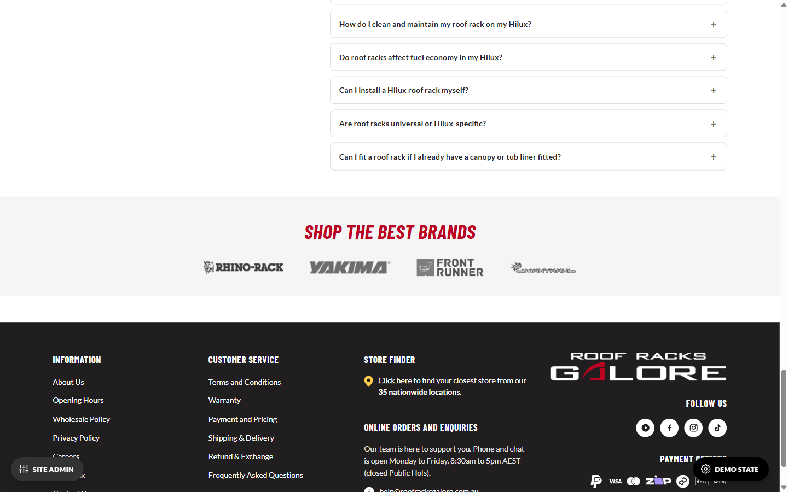

# Vehicle Category Landing Page — Developer Brief

## 1. Project context

**Audience:** for Marc, same as `DEVELOPER-BRIEF.md`, `HEADER-DEVELOPER-BRIEF.md` and `FOOTER-DEVELOPER-BRIEF.md` — detailed information on this page's build so implementation decisions in Magento stay consistent with the intent, even where the exact prototype code can't be lifted verbatim.

**What this page is:** a genuinely new page type, not a PDP — one page per **make/model** (e.g. "Toyota Hilux"), not per exact vehicle variant like the 5 PDP templates and not per SKU. Built to capture proven make/model search terms ("Toyota Hilux Roof Racks") and, within that, generation-specific searches ("N70 Roof Racks"). Its Fit Finder widget is meant to hand off to a category/PLP page filtered to the visitor's exact fitment — **that PLP doesn't exist yet anywhere in this prototype set**, so every hand-off from this page stubs out rather than linking somewhere real (Section 6).

**Scope:** this brief covers `prototypes/vehicle-category-landing/index.html` only. It reuses the global Header/Footer (`HEADER-DEVELOPER-BRIEF.md` / `FOOTER-DEVELOPER-BRIEF.md` — not repeated here) and two PDP components verbatim (the FAQ accordion and the Fitment Gallery widget — both already fully documented in `DEVELOPER-BRIEF.md` Section 4, not repeated here either). Everything in Section 4 below is genuinely new to this page.

**Companion documents:** `spec.md` Section 12 and the project memory log this page's build history in full chronological detail (including a same-day re-theme from an initial Ford Ranger worked example to Toyota Hilux, and a correction where a first-pass bespoke "Recent Fits" carousel was thrown out in favour of reusing the real Fitment Gallery widget) — this brief is the handover summary, not the history. `docs/PAGE-GLOSSARY.md`'s "Vehicle Category Landing Page" section is the source of truth for this page's component names.

**Build status:** built as `prototypes/vehicle-category-landing/index.html`, worked example is Toyota Hilux. Playwright-verified: desktop (1440px) and mobile (390px, zero horizontal overflow), Fit Finder validation gating, FAQ accordion, Fitment Gallery carousel + slideout + detail view, zero console errors (aside from an expected favicon 404). Not yet pushed — gated on Brenton's sign-off, same as the other three briefs.

---

## 2. Typography & colour reference

Same type scale and colour tokens as `DEVELOPER-BRIEF.md` Section 2 (Barlow Condensed for headings/buttons, Lato for body text, the full `--rrg-*` custom-property table) — not repeated here. No page-specific typography deviations; every heading/label on this page uses the shared scale as-is.

The Fitment Education Content section (Section 3, item 5) uses `.content-block` — a shared h3/p/li sub-heading tier in `shared.css` (21px Barlow Condensed h3, e.g. "Why fitment varies on the Hilux," between body copy and the 40px section-heading scale). This was originally a VCLP-only `.vclp-content` rule defined in this page's own `<style>` block; renamed and promoted into `shared.css` 2026-09-16 so it's genuinely reusable by any future PDP content needing the same tier, per the standing rule that heading/body typography lives in `shared.css` unless a page has an explicit, stated reason to deviate (see `DEVELOPER-BRIEF.md` Section 2 for the full rationale). The one exception left deliberately page-specific: `.ff-badge` (the Fit Finder icon badge) stays hardcoded to `37px` rather than following the shared section heading's `40px`, since Brenton's call was to decouple the two rather than have the badge track the heading size.

---

## 3. Page Layout — Vehicle Category Landing Page

One page, section order top to bottom:

1. Breadcrumbs (Home > Select vehicle > Toyota > Hilux — shorter than a PDP's trail since there's no Year/Body/Roof chain yet at this stage of the journey)
2. Hero (vehicle photo + make badge + intro copy + "Change Vehicle" CTA)
3. Fit Finder widget (Section 4.1)
4. Fitment Gallery (reused PDP widget, see `DEVELOPER-BRIEF.md`)
5. Fitment education content, ending in the Generation Table (Section 4.2)
6. Trust/install banner (Section 4.3)
7. FAQ (reused PDP component, see `DEVELOPER-BRIEF.md`)
8. Shop The Best Brands logo strip (Section 4.4)
9. Global Footer

**Screenshots:**
- Desktop (1440px), full page: 
- Mobile (390px), full page: 

---

## 4. Component Library

### 4.1 Fit Finder

**Name:** Fit Finder

**Location:** dark full-width widget directly below the hero.

**Purpose:** progressive vehicle-detail capture that's meant to hand off to a filtered PLP once one exists. On this single make/model page, Make and Model are pre-locked (there's only one vehicle this page is about) — the widget's real job here is narrowing Year/Body/Roof Type.

**Contents:** 5 selects (Make, Model, Year, Body Style, Roof Type) + a "View Results" button.

- **Make/Model:** locked, single option each (Toyota / Hilux).
- **Year:** 2024 Onwards (N90) / 2015–2023 (N80) / 2005–2015 (N70) / Pre-2005 — kept in sync with the Generation Table (Section 4.2) so the two never disagree about where the generation boundaries fall.
- **Body Style:** Double Cab (4dr Ute) / Xtra Cab / Single Cab.
- **Roof Type:** No Rails — Bare Roof / Styling Bars Only (Non Load-Rated) / Aftermarket Rails Fitted.

**Validation:** "View Results" stays disabled until Year, Body Style and Roof Type all have a value (Make/Model don't count — they're pre-set). Not a real cascade (nothing narrows the options in a later select based on an earlier one) — this is progressive-validation only, appropriate for a single-vehicle page.

**Click action:** both "View Results" and the hero's "Change Vehicle" button are `data-vclp-cta` stubs — they `preventDefault()` and show an alert explaining there's no category/PLP page yet for them to go to (Section 6). **This is the one hand-off every other piece of this page's SEO/content work points toward** — the Generation Table, the Fit Finder's own Year select, and the fitment-education copy all exist to get a visitor to a confident answer here, which currently has nowhere real to go.

**States:**
- Empty (default): 
- All fields filled, "View Results" enabled: 

---

### 4.2 Generation Table

**Name:** Generation Table ("Which Hilux Generation Do I Have?")

**Location:** bottom of the fitment-education content section, directly above the Trust Banner.

**Purpose:** the Hilux has been sold in Australia since 1968, so "Hilux" alone doesn't identify what a visitor's roof rack needs to fit — this table lets a visitor confirm their exact generation from whatever they already know (a year, a nickname, a model code off their compliance plate), which is also exactly the ambiguity a search like "N80 Roof Racks" is trying to resolve. Added 2026-09-15 specifically to give that kind of query a real, structured answer on-page rather than only the Fit Finder's Year dropdown.

**Contents:** a 5-column, 9-row data table — Generation, Years, Also Searched As, Model Codes, Roof Fitment — covering 1st Gen (1968–1972) through the current N90 (2024–present). A `<caption>` states the table's full scope for assistive tech and crawlers; every `<th>` has `scope="col"`.

**Data notes for whoever owns this content going forward:**
- **"N70"/"N80"/"N90" are aftermarket/enthusiast shorthand, not official Toyota generation names** — Toyota Australia doesn't badge or advertise the Hilux by these codes. Footnoted directly under the table rather than presented as Toyota's own terminology, since asserting that confidently and wrongly is worse for trust (with visitors and with AI answer engines reading this page) than not having the table at all.
- Model codes and years are a **guide**, not a warranted-accurate parts-fitment reference — the footnote also tells visitors to check their compliance plate or send a roof photo if unsure, and flags that pre-2005 codes may not be stocked for aftermarket fitment at all.
- **This table should be reviewed by someone with real Toyota model-code references before launch.** It was compiled from general automotive knowledge, not from Toyota's own documentation or this project's existing fitment data — treat it as a strong first draft, not a verified source.

**Screenshot:** 

---

### 4.3 Trust/Install Banner

**Name:** VCLP Trust Banner

**Location:** full-bleed dark band between the fitment-education content and the FAQ.

**Purpose:** trust-building + install conversion, adapted from the PDP's existing `.install-cta-panel` "no-video" pattern (`DEVELOPER-BRIEF.md`) but reshaped into a full-width band with **two** CTAs (Book An Installation / Store Finder) instead of one, and a Reviews.io star badge instead of the fitment-count link the PDP version uses.

**Contents:** installer photo background (40% opacity dark overlay) + heading + Reviews.io badge ("★★★★★ Reviews.io — 4.8 / 5") + the two CTAs.

**Click actions:** "Book An Installation" opens in a new tab (`target="_blank"`, real URL pending); "Store Finder" is a placeholder link, both pending Section 6.

**Screenshot:** 

---

### 4.4 Shop The Best Brands

**Name:** Shop The Best Brands logo strip

**Location:** full-width light-grey band between the FAQ and the Footer.

**Purpose:** brand-trust logo strip, same pattern as elsewhere on the site.

**Contents:** grayscale, opacity-reduced logos for Rhino Rack, Yakima, Front Runner, MAXTRAX — every brand that already has a real asset in `prototypes/_shared/`. Thule/Wedgetail/Cruiz appear in the client's Figma reference but have no asset in this project yet, so they're omitted rather than fabricated.

**Known asset issue, not introduced by this page:** the MAXTRAX logo renders visibly smaller/blurrier than the other three at any size — `brand-maxtrax.webp` itself is low-resolution (confirmed by opening the raw file). Pre-existing project-wide asset limitation, also present wherever else this logo is used.

**Screenshot:** 

---

## 5. SEO & Structured Data

**Location:** the page `<head>` and inline `<script type="application/ld+json">` blocks. Same "not a visible widget" note as `DEVELOPER-BRIEF.md` Section 5 — no Name/Location/Purpose/screenshot template here.

**Purpose:** this page exists specifically to capture make/model and generation-code search intent, so its SEO/AEO ("answer engine optimization") surface got a full pass on 2026-09-15, immediately after the Generation Table was built — unlike the 5 PDP templates' Section 5, most of this **is** built into the prototype, not just scoped as notes, since it was addressed directly rather than deferred.

**What's built:**

1. **`<title>`:** `Toyota Hilux Roof Racks - N70, N80 & N90 Fitment | Roof Racks Galore` — real customer-facing title, not a dev-facing label (unlike the PDP prototypes' titles, which `DEVELOPER-BRIEF.md` Section 5 flags as needing real production titles).
2. **Meta description:** written, keyword-targeted, ~155 characters.
3. **Canonical URL, Open Graph, Twitter Card tags** — all present. **The exact URL (`https://www.roofracksgalore.com.au/toyota-hilux-roof-racks`) is this prototype's best-guess slug, not confirmed against the real Magento URL structure — check with Marc before launch.** The `og:image`/`twitter:image` currently reuse the hero vehicle cutout as a stand-in; that's a transparent-background product photo, not a proper 1200×630 social share image, so social link previews will look poor until a real one is supplied (Section 6).
4. **`BreadcrumbList` structured data**, mirroring the visible breadcrumb trail exactly (Home > Select vehicle > Toyota > Hilux). The trail's `#` link placeholders are carried into the JSON-LD's `item` URLs too, for the same reason every other link on this page is a placeholder (Section 6) — swap for real URLs together.
5. **`FAQPage` structured data**, mirroring all 9 visible FAQ answers verbatim. **Keep these two in sync** if the FAQ copy ever changes — nothing generates one from the other.
6. **`Vehicle` entity data (`ItemList` of `Vehicle`)** — one entry per row of the Generation Table (Section 4.2), giving the same generation/years/model-code facts to search/AI answer engines in a structured form, not just as prose + an HTML table.
   - **Deliberately conservative schema choice:** plain `schema.org/Vehicle` entities, not `VehicleListing` (that type — and its rich-result eligibility — is for an actual vehicle-for-sale listing, which this isn't) and not wrapped in `Product`/`isAccessoryOrSparePartFor` (premature — this page has no single roof-rack SKU yet; it hands off to a PLP that doesn't exist, Section 6).
   - **Worth a second look from whoever owns SEO before real launch** — Vehicle structured data is unusual territory for a roof-rack accessories site rather than a used-car one, and this wasn't reviewed by an SEO specialist, only built to be technically valid and reasonably conservative.
7. **Table semantics:** the Generation Table has a `<caption>` and `scope="col"` on every header cell (Section 4.2) — both help screen readers and give crawlers/AI answer engines an explicit, unambiguous read of the table's structure.
8. **Image dimensions + lazy-loading:** every image specific to this page's own content (hero vehicle photo, Toyota make badge, trust banner photo, brand logos, Fitment Gallery thumbnails) has explicit `width`/`height` attributes (real intrinsic pixel dimensions, not guessed) to reduce layout shift, and `loading="lazy"` on everything below the fold. The hero vehicle photo instead gets `fetchpriority="high"` as the page's likely LCP (largest contentful paint) element. **Deliberately not extended to the shared Header/Footer's own images** (logos) — those are identical shared markup across every template in this project; fixing them only here would leave the other 5 PDP templates inconsistent. That's a separate, global cleanup if wanted.

**What's still open — deferred deliberately, not an oversight:**

- **Real page copy is genuinely unique per make/model.** This page's entire SEO value depends on that staying true for every future VCLP the client builds — a second VCLP (Ford Ranger, etc.) needs its own real hero/FAQ/education copy and its own Generation Table, not a find-and-replace of this one's Hilux facts (this project's own history has one near-miss of exactly that, corrected same-day — see `project_pdp_vehicle_landing_page` memory).
- Everything in Section 6 below.

---

## 6. Known gaps before production

1. **Every link on this page is a placeholder** (`href="#"`) — header/footer nav (documented separately), breadcrumbs, both hero/Fit Finder CTAs (which show a "no PLP exists yet" alert instead of navigating), and both Trust Banner CTAs. **This is the single hard blocker on this page having real SEO/AEO value**, not just a content gap: a page with no real internal links in or out is effectively orphaned regardless of how solid its on-page content and structured data are. Needs the category/PLP page (Section 1) to exist before any of these can point somewhere real.
2. **Canonical/OG/Twitter URL slug** (Section 5, item 3) is an educated guess, not confirmed against the real Magento URL structure.
3. **Social share image** (Section 5, item 3) — the hero vehicle cutout is standing in for a proper 1200×630 `og:image`/`twitter:image` asset.
4. **Generation Table content** (Section 4.2) needs review against real Toyota model-code references, and the `Vehicle` structured data built from it (Section 5, item 6) needs a second look from whoever owns this project's SEO before launch.
5. **Fitment Gallery photos** are real Toyota Hilux N80 fitment-centre photos (genuine content for this page, not a placeholder mismatch) — same asset/data gaps as documented for this widget in `DEVELOPER-BRIEF.md` otherwise apply identically here.
6. **MAXTRAX logo** (Section 4.4) is a pre-existing low-resolution asset, not something introduced by this page.
