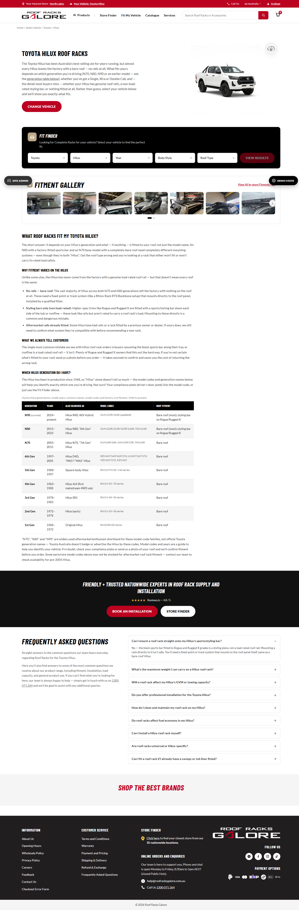
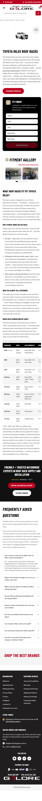
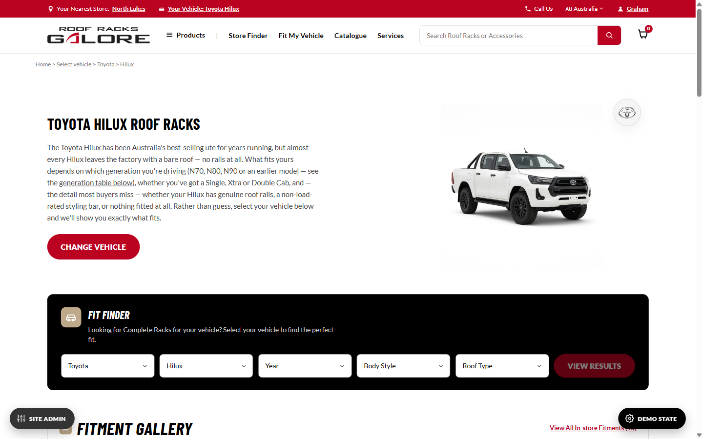
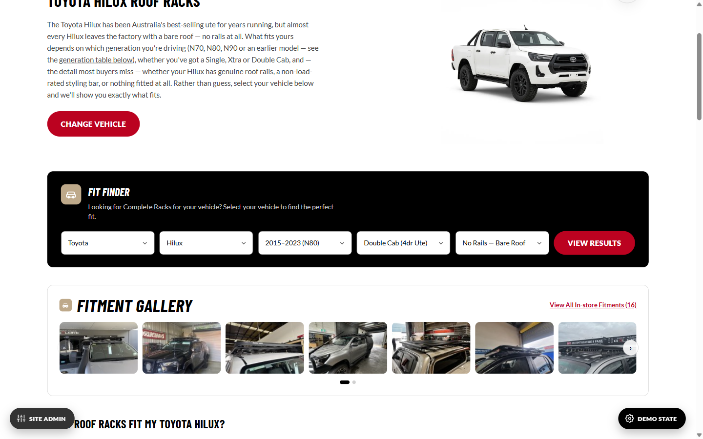
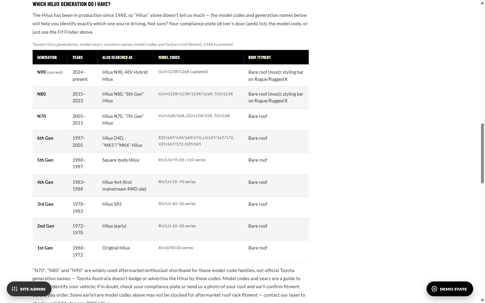
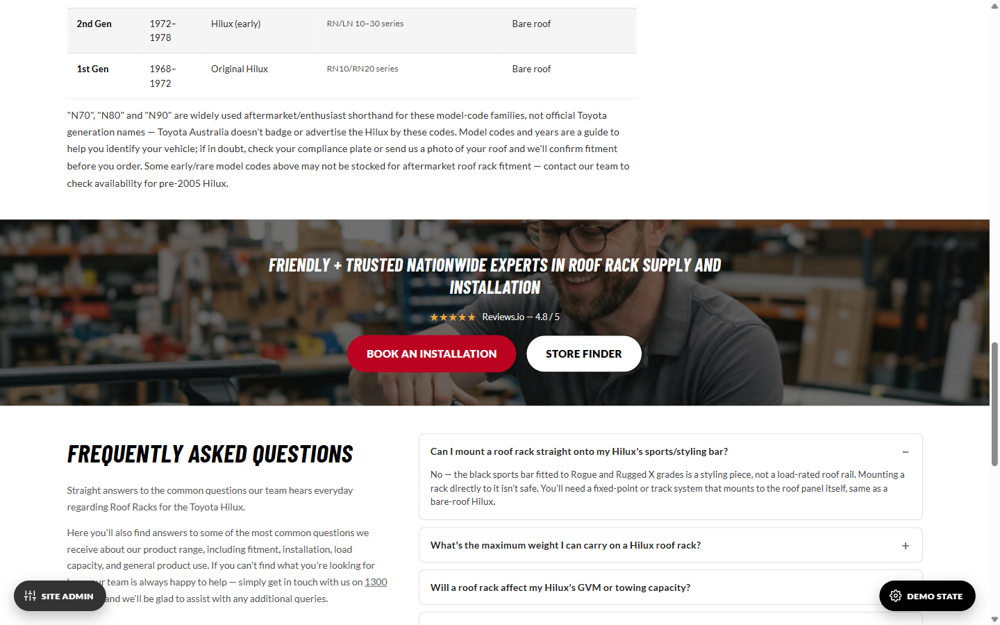
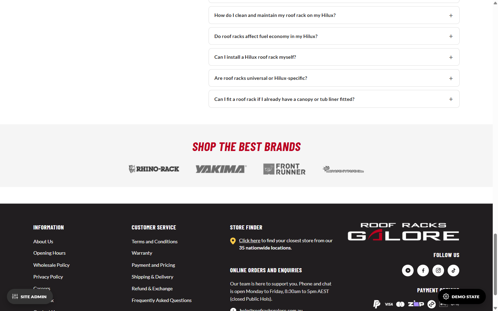

# Vehicle Category Landing Page — Developer Brief

*Text updated for the 2026-09-29 cross-template consistency pass (`spec.md` §15 — V1–V7, C9, L8, G5/G6, P9). Screenshots are deliberately held until final handover, so the images below still show the pre-pass page (gold Change Vehicle button in the hero, red brands heading, 2-column FAQ, 4 brand logos). Text also updated 2026-10-02 for the shared Vehicle Finder (Section 4.1); the screenshots still show the old dark Fit Finder.*

## 1. Project context

**Audience:** for Marc, same as `DEVELOPER-BRIEF.md`, `HEADER-DEVELOPER-BRIEF.md` and `FOOTER-DEVELOPER-BRIEF.md` — detailed information on this page's build so implementation decisions in Magento stay consistent with the intent, even where the exact prototype code can't be lifted verbatim.

**What this page is:** a genuinely new page type, not a PDP — one page per **make/model** (e.g. "Toyota Hilux"), not per exact vehicle variant like the 5 PDP templates and not per SKU. Built to capture proven make/model search terms ("Toyota Hilux Roof Racks") and, within that, generation-specific searches ("N70 Roof Racks"). Its Fit Finder widget hands off to the vehicle's roof rack listing — the **VPLP** (`prototypes/vplp/index.html`, documented in `PLP-DEVELOPER-BRIEF.md`), which now exists in this prototype set. The Fit Finder's "View Results" is the one hand-off wired to a real prototype page; every other link on this page is still a `#` placeholder (Section 6).

**Scope:** this brief covers `prototypes/vehicle-category-landing/index.html` only. It reuses the global Header/Footer (`HEADER-DEVELOPER-BRIEF.md` / `FOOTER-DEVELOPER-BRIEF.md` — not repeated here), the category-page hero and breadcrumb row shared with the PLP family (`.plp-hero*`, `.plp-crumbs-row` — `PLP-DEVELOPER-BRIEF.md`), and two PDP components verbatim (the FAQ accordion and the Fitment Gallery widget — both already fully documented in `DEVELOPER-BRIEF.md` Section 4, not repeated here either). Everything in Section 4 below is specific to this page.

**Companion documents:** `spec.md` Section 12 and the project memory log this page's build history in full chronological detail (including a same-day re-theme from an initial Ford Ranger worked example to Toyota Hilux, and a correction where a first-pass bespoke "Recent Fits" carousel was thrown out in favour of reusing the real Fitment Gallery widget) — this brief is the handover summary, not the history. `docs/PAGE-GLOSSARY.md`'s "Vehicle Category Landing Page" section is the source of truth for this page's component names.

**Build status:** built as `prototypes/vehicle-category-landing/index.html`, worked example is Toyota Hilux. Playwright-verified: desktop (1440px) and mobile (390px, zero horizontal overflow), Fit Finder validation gating, FAQ accordion, Fitment Gallery carousel + slideout + detail view, zero console errors. Brought in line with the rest of the site in the 2026-09-29 consistency pass (shared hero, breadcrumb-row Change Vehicle, shared Fitment Gallery builder, single-column FAQ, full brands band, one `<main>`, real favicon) — see the note at the top. Not yet pushed — gated on Brenton's sign-off, same as the other briefs.

**Prototype-only controls:** the global Site Admin panel (templates, briefs, shopper session incl. the one Vehicle select, Build Phase, Site Promotions, Prototype Tools) appears on this page as on every page. The page's own Demo State panel shows **only the Fitment Gallery controls** ("Has customer fitment photos" and "Number of fitments") — the PDP product-state controls no longer appear here since they did nothing on this page. Demo choices are saved per template (`rrgDemo:vehicle-category-landing`). Neither panel is part of the shipped design.

---

## 2. Typography & colour reference

Same type scale and colour tokens as `DEVELOPER-BRIEF.md` Section 2 (Barlow Condensed for headings/buttons, Lato for body text, the full `--rrg-*` custom-property table) — not repeated here. No page-specific typography deviations; every heading/label on this page uses the shared scale as-is:

- **Page H1** ("Shop Toyota Hilux Roof Racks" — "Shop" added 2026-10-02 to match every category hero; the `<title>` keeps "Toyota Hilux Roof Racks" for search) uses the one site-wide H1 rule — 32px / 1.1, 28px on phones (`.plp-hero h1`, shared with the PDP and PLP-family H1s).
- **Section H2s** (Fit Finder, Fitment Gallery, the education content's H2, Trust Banner, FAQ, Shop The Best Brands) all use the shared 40px Barlow Condensed italic section-heading rule, stepping down to 32px on phones. "Shop The Best Brands" uses `.related-heading` and is **black**, like every other section heading (it was red before the consistency pass).
- **Buttons** use the shared button system (`DEVELOPER-BRIEF.md`): `.btn-cta` (gold, UK green in the UK region) for the Fit Finder's "View Results", `.btn-outline-red` compact for Change Vehicle, `.btn-primary`/`.btn-outline` for the Trust Banner. No inline button styles remain.
- **Colours** come from the shared `shared.css :root` tokens (greys, charcoal, CTA gold, overlay) rather than hardcoded hex values (only white/near-white text on the dark Trust Banner is still literal).

The Fitment Education Content section (Section 3, item 5) uses `.content-block` — a shared h3/p/li sub-heading tier in `shared.css` (22px Barlow Condensed h3, e.g. "Why fitment varies on the Hilux," between body copy and the 40px section-heading scale). This was originally a VCLP-only `.vclp-content` rule defined in this page's own `<style>` block; renamed and promoted into `shared.css` 2026-09-16 so it's genuinely reusable by any future PDP content needing the same tier, per the standing rule that heading/body typography lives in `shared.css` unless a page has an explicit, stated reason to deviate (see `DEVELOPER-BRIEF.md` Section 2 for the full rationale). The one exception left deliberately page-specific: `.ff-badge` (the Fit Finder icon badge) stays hardcoded to `37px` rather than following the shared section heading's `40px`, since Brenton's call was to decouple the two rather than have the badge track the heading size.

---

## 3. Page Layout — Vehicle Category Landing Page

One page, section order top to bottom:

1. Breadcrumb row (`.plp-crumbs-row`, the same component as the PLP pages): trail `Home › Vehicles › Toyota › Hilux` on the left, **Change Vehicle** button on the right (Section 4.0). The trail is the root of the one vehicle breadcrumb family agreed 2026-09-29 (provisional, may change after team review): VPLP continues it as `… › Hilux › Roof Racks`, and the Vehicle-Specific PDP as `… › Hilux › Platforms & Trays › <product name>`. The row is always one line — the trail truncates with an ellipsis rather than pushing the button onto a second line.
2. Hero — the shared category hero (`.plp-hero` / `.plp-hero-media` / `.plp-hero-make-badge` in `shared.css`, same as the PLP family): H1 + intro copy on the left, Hilux photo with the round Toyota make badge on the right. No button in the hero. Text is top-aligned; on desktop the photo box is a fixed 250px tall (cover-cropped), on phones the photo sits above the text.
3. Fit Finder widget (Section 4.1)
4. Fitment Gallery (reused PDP widget, see `DEVELOPER-BRIEF.md`). The page only carries an empty `<section class="fit-gallery-section" data-fit-gallery data-count="16">` plus its `FIT_GALLERY_PHOTOS` array; the panel markup is built by the one shared builder in `shared.js` that Vehicle-Specific and VPLP also use — `fitGalleryPanelHTML()` / `mountFitGallery()` for the panel, `renderFitGalleryTrack()` for the photo track (alt text "Roof rack fitted to a customer's Toyota Hilux — view fitment detail", lazy-loaded). Photos are 4:3. Carousel dots are round grey with a red active dot, arrows 32px, and the "View All" slide-out is the shared 600px drawer.
5. Fitment education content, ending in the Generation Table (Section 4.2)
6. Trust/install banner (Section 4.3)
7. FAQ — the standard single-column `.faq-section` used on every other page (heading, then the list), with this page's two-paragraph intro copy kept directly under the heading (`.faq-intro`). Was the site's only 2-column FAQ until 2026-09-29 (`spec.md` §15 V7).
8. Shop The Best Brands logo strip (Section 4.4)
9. Global Footer — sits flush against the grey brands band (no white gap); every other page has the standard 48px gap above the footer.

Everything from the hero to the brands band sits inside **one `<main>`** element (the page previously had three, which is invalid HTML); the Trust Banner and brands band are full-bleed sections inside it. The shared sections (Fitment Gallery, FAQ) use the site-wide 48px section margin (`--space-section`), with 16px from the FAQ heading to its content.

**Screenshots:**
- Desktop (1440px), full page: 
- Mobile (390px), full page: 

---

## 4. Component Library

### 4.0 Change Vehicle button (breadcrumb row)

**Name:** Change Vehicle

**Location:** right-hand end of the breadcrumb row (`.plp-crumbs-row`), above the hero. Moved here from the hero on 2026-09-29 (`spec.md` §15 V1).

**Purpose:** lets a visitor who landed on the wrong make/model switch vehicle. It's a secondary action, not a purchase action, so it's the small red outline button rather than the gold CTA.

**Contents:** `<a class="btn btn-outline-red plp-crumbs-cta" data-open-fit-finder>` — `.btn-outline-red` at the compact `.btn-sm` size (13px, 12px on phones; `.plp-crumbs-cta` is in the shared `.btn-sm` size group). This is **the one Change Vehicle button style site-wide** — the PLP family and Search use the same component.

**Click action:** opens the site-wide Fit Finder drawer (`buildFitFinderDrawer()` in `shared.js`, "Set Your Vehicle"), the same drawer the header's vehicle link opens on every page.

---

### 4.1 Fit Finder

**Name:** Fit Finder

**Location:** full-width widget directly below the hero.

**Since 2026-10-02 this is the one shared Vehicle Finder widget** (`rrgWidgetVehicleFinderHTML()` in `_shared/widgets.js`), the same component as Home, Fit My Vehicle, Cart and the Brand page — the page only places `
` with its options (below). It replaced this page's old bespoke dark block (Make/Model locked to single options, its own inline progressive-validation script); that script is gone. Like every other page it follows the session vehicle and the Site Admin → Design options light/dark setting (default light). (2026-10-02, Brenton)

**Purpose:** vehicle-detail capture that hands off to the vehicle's roof rack listing (VPLP). On this single make/model page, Make and Model are **pre-filled to Toyota / Hilux but still changeable** (`data-vf-preset="hilux"`), so the shopper starts at Year — the widget's real job here is narrowing Year/Body/Roof Type.

**Contents (no vehicle known):** car-and-rack icon badge (`.ff-badge`) + "Fit Finder" heading + intro line ("Looking for Complete Racks for your vehicle? Select your vehicle to find the perfect fit.", `data-intro`), then 5 selects (Make, Model, Year, Body Style, Roof Type) + a gold "View Results" button (`.btn-cta`), and a "Shop without a vehicle ›" link (→ VPLP, `data-vf-browse-href`). The widget's CSS (`.fit-finder-widget`, `.ff-head`, `.ff-badge`, `.ff-row`) lives in `shared.css`. The selects use the one shared select style (same chevron and padding as the PLP Sort select), 16px on phones so iOS doesn't zoom on tap.

- **Make/Model:** real Make → Model cascade (Toyota Hilux / Ford Ranger in the demo, `FIT_FINDER_VEHICLES`), pre-filled to Toyota / Hilux.
- **Year:** 2024 Onwards (N90) / 2015–2023 (N80) / 2005–2015 (N70) / Pre-2005 — kept in sync with the Generation Table (Section 4.2) so the two never disagree about where the generation boundaries fall.
- **Body Style:** Double Cab (4dr Ute) / Xtra Cab / Single Cab.
- **Roof Type:** No Rails — Bare Roof / Styling Bars Only (Non Load-Rated) / Aftermarket Rails Fitted.

**Contents (vehicle known):** the shared vehicle bar — vehicle photo, "Shopping for your Toyota Hilux?", the picked Year/Body/Roof summary, a gold "Shop Hilux roof racks" button (`data-vf-shop-label="Shop {model} roof racks"`, → VPLP via `data-vf-shop-href`) and "Change vehicle", which resets the cascade to Make in place. On phones (≤600px) the photo sits on top full width, then the text, then a full-width button with Change vehicle centred under it.

**Validation:** "View Results" stays disabled until Model, Year, Body Style and Roof Type all have a value; changing Make or Model resets the later selects (the shared cascade, `initFitFinderCascade()` in `shared.js`).

**Click action:** "View Results" (`[data-ff-submit]`) sets the session vehicle and navigates to the VPLP (`data-vf-submit-href="../vplp/index.html"`). In production this should go to the real vehicle roof rack listing filtered to the selected Year/Body/Roof. **This is the one hand-off every other piece of this page's SEO/content work points toward** — the Generation Table, the Fit Finder's own Year select, and the fitment-education copy all exist to get a visitor to a confident answer here.

**States:**

*These screenshots predate 2026-10-02 — they show the old bespoke dark widget with Make/Model locked, not the shared Vehicle Finder.*

- Empty (default): 
- All fields filled, "View Results" enabled: 

---

### 4.2 Generation Table

**Name:** Generation Table ("Which Hilux Generation Do I Have?")

**Location:** bottom of the fitment-education content section, directly above the Trust Banner.

**Purpose:** the Hilux has been sold in Australia since 1968, so "Hilux" alone doesn't identify what a visitor's roof rack needs to fit — this table lets a visitor confirm their exact generation from whatever they already know (a year, a nickname, a model code off their compliance plate), which is also exactly the ambiguity a search like "N80 Roof Racks" is trying to resolve. Added 2026-09-15 specifically to give that kind of query a real, structured answer on-page rather than only the Fit Finder's Year dropdown.

**Contents:** a 6-column, 9-row data table — Generation, Years, Also Searched As, Model Codes, Roof Fitment, Shop — covering 1st Gen (1968–1972) through the current N90 (2024–present). A `<caption>` states the table's full scope for assistive tech and crawlers; every `<th>` has `scope="col"`.

**Click action (added 2026-10-07, Graham/Tim):** every row links to the roof rack VPLP for **that generation** of the vehicle (e.g. N70 row → Toyota Hilux N70 roof racks) — not back to a category picker, since the visitor is already on the roof racks page for this vehicle. The last column holds one real link per row ("Shop Hilux N80 racks →", `.vclp-gen-shop-link`), stretched over the whole row with a `::after` overlay, so the entire row is clickable with no JavaScript and screen readers hear one named link per row. Hover/keyboard focus tints the row gold (`--rrg-gold-bg`), turns the link red and nudges the arrow — so it's obvious the rows are clickable. In the prototype every row goes to the same demo VPLP (`../vplp/index.html`, preset to Hilux N80); in production each row's `href` is that generation's own VPLP URL, with the vehicle pre-set. Rows for generations we don't stock racks for (see the pre-2005 note in the footnote) should either link to the VPLP's empty/"contact us" state or drop the link — confirm with the team before launch.

**Data notes for whoever owns this content going forward:**
- **"N70"/"N80"/"N90" are aftermarket/enthusiast shorthand, not official Toyota generation names** — Toyota Australia doesn't badge or advertise the Hilux by these codes. Footnoted directly under the table rather than presented as Toyota's own terminology, since asserting that confidently and wrongly is worse for trust (with visitors and with AI answer engines reading this page) than not having the table at all.
- Model codes and years are a **guide**, not a warranted-accurate parts-fitment reference — the footnote also tells visitors to check their compliance plate or send a roof photo if unsure, and flags that pre-2005 codes may not be stocked for aftermarket fitment at all.
- **This table should be reviewed by someone with real Toyota model-code references before launch.** It was compiled from general automotive knowledge, not from Toyota's own documentation or this project's existing fitment data — treat it as a strong first draft, not a verified source.

**Screenshot:** 

---

### 4.3 Trust/Install Banner

**Name:** VCLP Trust Banner

**Location:** full-bleed dark band (charcoal token) between the fitment-education content and the FAQ, inside the page's single `<main>`.

**Purpose:** trust-building + install conversion, adapted from the PDP's existing `.install-cta-panel` "no-video" pattern (`DEVELOPER-BRIEF.md`) but reshaped into a full-width band with **two** CTAs (Book An Installation / Store Finder) instead of one, and a Reviews.io star badge instead of the fitment-count link the PDP version uses.

**Contents:** installer photo background (40% opacity dark overlay) + heading + Reviews.io badge ("★★★★☆ Reviews.io — 4.3 / 5 from 1,914 reviews": the real score, corrected 2026-09-30 from a hard-coded 4.8; read it from the Reviews.io API rather than hard-coding it) + the two CTAs: "Book An Installation" (`.btn-primary`, red) and "Store Finder" (`.btn-outline`).

**Click actions:** both are `href="#"` placeholders pending real URLs (Section 6). "Book An Installation" no longer carries `target="_blank"` on its `#` placeholder (fixed 2026-09-29, `spec.md` §15 V6). Add `target="_blank" rel="noopener"` back only if the real booking URL is off-site.

**Screenshot:** 

---

### 4.4 Shop The Best Brands

**Name:** Shop The Best Brands logo strip

**Location:** full-width light-grey band between the FAQ and the Footer — the last section in `<main>`. The footer sits flush against it (no white gap), the one exception to the site-wide 48px gap above the footer.

**Purpose:** brand-trust logo strip, same pattern as elsewhere on the site.

**Contents:** "Shop The Best Brands" heading (`.related-heading`, the standard black section heading) + grayscale, opacity-reduced logos for all 8 brands with a real asset in `prototypes/_shared/`: Rhino Rack, Yakima, Front Runner, MAXTRAX, Thule, Cruz, ROLA and Rocky Mounts. Wedgetail appears in the client's Figma reference but still has no asset, so it's omitted rather than fabricated. Logos are sized against a bounding box (`max-width:150px; max-height:32px`), not a fixed height.

**Known asset issue, not introduced by this page:** the MAXTRAX logo renders visibly smaller/blurrier than the others at any size — `brand-maxtrax.webp` itself is low-resolution (confirmed by opening the raw file). Pre-existing project-wide asset limitation, also present wherever else this logo is used.

**Screenshot:** 

---

## 5. SEO & Structured Data

**Location:** the page `<head>` and inline `<script type="application/ld+json">` blocks. Same "not a visible widget" note as `DEVELOPER-BRIEF.md` Section 5 — no Name/Location/Purpose/screenshot template here.

**Purpose:** this page exists specifically to capture make/model and generation-code search intent, so its SEO/AEO ("answer engine optimization") surface got a full pass on 2026-09-15, immediately after the Generation Table was built — most of this **is** built into the prototype, not just scoped as notes, since it was addressed directly rather than deferred. This page was the example the rest of the site followed: since the 2026-09-29 consistency pass (`spec.md` §15 G8) every PDP, PLP and Camping page also carries a description, canonical and OG/Twitter meta; the structured data below (BreadcrumbList, FAQPage, Vehicle list) is still specific to this page.

**What's built:**

1. **`<title>`:** `Toyota Hilux Roof Racks (N70, N80 & N90) — Roof Racks Galore` — real customer-facing title in the site-wide "Page name — Roof Racks Galore" format every template now uses (2026-09-29, `spec.md` §15 G6). `<html lang="en-AU">` and the real live favicon (`_shared/favicon.ico`) are set, as on every page.
2. **Meta description:** written, keyword-targeted, ~155 characters.
3. **Canonical URL, Open Graph, Twitter Card tags** — all present. **The exact URL (`https://www.roofracksgalore.com.au/toyota-hilux-roof-racks`) is this prototype's best-guess slug, not confirmed against the real Magento URL structure — check with Marc before launch.** The `og:image`/`twitter:image` currently reuse the hero vehicle cutout as a stand-in; that's a transparent-background product photo, not a proper 1200×630 social share image, so social link previews will look poor until a real one is supplied (Section 6).
4. **`BreadcrumbList` structured data**, mirroring the visible breadcrumb trail exactly (Home › Vehicles › Toyota › Hilux — position 2 is "Vehicles", matching the vehicle breadcrumb family in Section 3). The trail's `#` link placeholders are carried into the JSON-LD's `item` URLs too, for the same reason every other link on this page is a placeholder (Section 6) — swap for real URLs together.
5. **`FAQPage` structured data**, mirroring all 9 visible FAQ answers verbatim. **Keep these two in sync** if the FAQ copy ever changes — nothing generates one from the other.
6. **`Vehicle` entity data (`ItemList` of `Vehicle`)** — one entry per row of the Generation Table (Section 4.2), giving the same generation/years/model-code facts to search/AI answer engines in a structured form, not just as prose + an HTML table.
   - **Deliberately conservative schema choice:** plain `schema.org/Vehicle` entities, not `VehicleListing` (that type — and its rich-result eligibility — is for an actual vehicle-for-sale listing, which this isn't) and not wrapped in `Product`/`isAccessoryOrSparePartFor` (premature — this page has no single roof-rack SKU; it hands off to the vehicle's listing page, the VPLP).
   - **Worth a second look from whoever owns SEO before real launch** — Vehicle structured data is unusual territory for a roof-rack accessories site rather than a used-car one, and this wasn't reviewed by an SEO specialist, only built to be technically valid and reasonably conservative.
7. **Table semantics:** the Generation Table has a `<caption>` and `scope="col"` on every header cell (Section 4.2) — both help screen readers and give crawlers/AI answer engines an explicit, unambiguous read of the table's structure.
8. **Image dimensions + lazy-loading:** every image specific to this page's own content (hero vehicle photo, Toyota make badge, trust banner photo, brand logos, Fitment Gallery thumbnails) has explicit `width`/`height` attributes (real intrinsic pixel dimensions, not guessed) to reduce layout shift, and `loading="lazy"` on everything below the fold. The hero vehicle photo instead gets `fetchpriority="high"` as the page's likely LCP (largest contentful paint) element. **Deliberately not extended to the shared Header/Footer's own images** (logos) — those are identical shared markup across every template in this project; fixing them only here would leave the other 5 PDP templates inconsistent. That's a separate, global cleanup if wanted.

**What's still open — deferred deliberately, not an oversight:**

- **Real page copy is genuinely unique per make/model.** This page's entire SEO value depends on that staying true for every future VCLP the client builds — a second VCLP (Ford Ranger, etc.) needs its own real hero/FAQ/education copy and its own Generation Table, not a find-and-replace of this one's Hilux facts (this project's own history has one near-miss of exactly that, corrected same-day — see `project_pdp_vehicle_landing_page` memory).
- Everything in Section 6 below.

---

## 6. Known gaps before production

1. **Almost every link on this page is a placeholder** (`href="#"`) — header/footer nav (documented separately), breadcrumbs, and both Trust Banner CTAs. The exceptions are the Fit Finder's "View Results" (and, since 2026-10-02, its "Shop without a vehicle ›" link and the vehicle-known "Shop Hilux roof racks" button), which goes to the prototype VPLP (`../vplp/index.html`), and Change Vehicle, which opens the Fit Finder drawer. **This is the single hard blocker on this page having real SEO/AEO value**, not just a content gap: a page with no real internal links in or out is effectively orphaned regardless of how solid its on-page content and structured data are. In production, "View Results" must point at the real vehicle listing URL (there's no live vehicle-category URL yet, which is also why the VPLP has no canonical), and the breadcrumb/JSON-LD `#` items need real URLs.
2. **Canonical/OG/Twitter URL slug** (Section 5, item 3) is an educated guess, not confirmed against the real Magento URL structure.
3. **Social share image** (Section 5, item 3) — the hero vehicle cutout is standing in for a proper 1200×630 `og:image`/`twitter:image` asset.
4. **Generation Table content** (Section 4.2) needs review against real Toyota model-code references, and the `Vehicle` structured data built from it (Section 5, item 6) needs a second look from whoever owns this project's SEO before launch.
5. **Fitment Gallery photos** are real Toyota Hilux N80 fitment-centre photos (genuine content for this page, not a placeholder mismatch) — same asset/data gaps as documented for this widget in `DEVELOPER-BRIEF.md` otherwise apply identically here.
6. **MAXTRAX logo** (Section 4.4) is a pre-existing low-resolution asset, not something introduced by this page.
